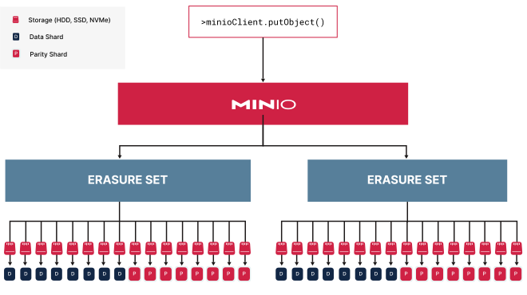

## 单节点-单驱动安装 MinIO

SNSD(Single-Node Single-Drive) 只适用于本地和测试环境，不适用于生产环境。因为它是zero-parity的，没有数据冗余。

### Pre-Existing Data

MinIO 是否可以启动成功，取决于是否存在 pre-existing data。

The following table lists the possible storage volume states and MinIO behavior:

| Storage Volume State                                         | Behavior                                                     |
| :----------------------------------------------------------- | :----------------------------------------------------------- |
| Empty with **no** files, folders, or MinIO backend data      | MinIO starts in SNSD mode and creates the zero-parity backend |
| Existing SNSD zero-parity objects and MinIO backend data     | MinIO resumes in SNSD mode                                   |
| Existing filesystem folders, files, but **no** MinIO backend data | MinIO returns an error and does not start                    |
| Existing filesystem folders, files, and legacy “FS-mode” backend data | MinIO returns an error and does not start*Changed in version RELEASE.2022-10-29T06-21-33Z.* |

### Storage Requirements

* Use Local Storage

* Use XFS-Formatting for Drives

    MinIO strongly recommends provisioning XFS formatted drives for storage. 

* Persist Drive Mounting and Mapping Across Reboots

    Use `/etc/fstab` to ensure consistent drive-to-mount mapping across node reboots.

:::danger

**Exclusive access to drives**

MinIO requires exclusive access to the drives or volumes provided for object storage. No other processes, software, scripts, or persons should perform any actions directly on the drives or volumes provided to MinIO or the objects or files MinIO places on them.

:::

### Memory Requirements

*Changed in version RELEASE.2024-01-28T22-35-53Z:* MinIO pre-allocates 2GiB of system memory at startup.

MinIO recommends a *minimum* of 32GiB of memory per host. See [Memory](https://min.io/docs/minio/linux/operations/checklists/hardware.html#minio-hardware-checklist-memory) for more guidance on memory allocation in MinIO.

### Deploy MinIO

#### 1. 下载 MinIO (Debian/Ubuntu)

```bash
wget https://dl.min.io/server/minio/release/linux-amd64/archive/minio_20250207232109.0.0_amd64.deb -O minio.deb
sudo dpkg -i minio.deb
```

> The RPM and DEB packages automatically install MinIO to the necessary system paths and create a minio service for systemctl. 


#### 2. Create the Environment Variable File

Create an environment variable file at `/etc/default/minio`. The MinIO Server container can use this file as the source of all [environment variables](https://min.io/docs/minio/linux/reference/minio-server/settings.html#minio-server-environment-variables).

The following example provides a starting environment file:

```bash
# MINIO_ROOT_USER and MINIO_ROOT_PASSWORD sets the root account for the MinIO server.
# This user has unrestricted permissions to perform S3 and administrative API operations on any resource in the deployment.
# Omit to use the default values 'minioadmin:minioadmin'.
# MinIO recommends setting non-default values as a best practice, regardless of environment

MINIO_ROOT_USER=myminioadmin
MINIO_ROOT_PASSWORD=minio-secret-key-change-me

# MINIO_VOLUMES sets the storage volume or path to use for the MinIO server.

MINIO_VOLUMES="/mnt/data"

# MINIO_OPTS sets any additional commandline options to pass to the MinIO server.
# For example, `--console-address :9001` sets the MinIO Console listen port
MINIO_OPTS="--console-address :9001"
```

#### 3. Start the MinIO Service

```bash
sudo systemctl start minio.service
```

Use the following commands to confirm the service is online and functional:

```bash
sudo systemctl status minio.service
journalctl -f -u minio.service
```

设置自启动

```bash
sudo systemctl enable minio.service
```

The `journalctl` output should resemble the following:

```bash
Status:         1 Online, 0 Offline.
API: http://192.168.2.100:9000  http://127.0.0.1:9000
RootUser: myminioadmin
RootPass: minio-secret-key-change-me
Console: http://192.168.2.100:9001 http://127.0.0.1:9001
RootUser: myminioadmin
RootPass: minio-secret-key-change-me

Command-line: https://min.io/docs/minio/linux/reference/minio-mc.html
   $ mc alias set myminio http://10.0.2.100:9000 myminioadmin minio-secret-key-change-me

Documentation: https://min.io/docs/minio/linux/index.html
```

#### 4. Connect to the MinIO Service

* Console

访问 `http://192.168.2.100:9001`

账号密码为环境变量文件中设置的 `MINIO_ROOT_USER` 和 `MINIO_ROOT_PASSWORD`

* Command-line

    1. 安装 `mc` 命令行工具

    ```bash
    curl https://dl.min.io/client/mc/release/linux-amd64/mc \
    --create-dirs \
    -o $HOME/minio-binaries/mc
    
    chmod +x $HOME/minio-binaries/mc
    export PATH=$PATH:$HOME/minio-binaries/
    
    mc --help
    ```
    > 要注意下载相应处理器平台的 `mc` 命令行工具

    2. 设置别名

    ```bash
    mc alias set myminio http://192.168.2.100:9000 myminioadmin minio-secret-key-change-me
    ```
    > 设置好对应的账号与密码

    3. 测试alias是否设置成功

    ```bash
    mc ls myminio/mybucket
    ```

## 集群安装 MinIO

A cluster refers to an entire MinIO deployment consisting of one or more Server Pools.

Consider the command below that creates a cluster consisting of two Server Pools, each with 4 minio server nodes and 4 drives per node for a total of 32 drives.

```bash
minio server https://minio{1...4}.example.net/mnt/disk{1...4} \
             https://minio{5...8}.example.net/mnt/disk{1...4}

             |                    Server Pool                |

```

:::note
Once you create a server pool you cannot change its size, but you can add or remove capacity at any time by adding or decommissioning pools.
:::

## Core concepts

### 什么是纠删码（Erasure Coding）？

纠删码是一种数据保护技术，用于在分布式存储系统中确保数据的可靠性和可用性。它将数据分割成多个片段（称为数据分片，data shards），并生成额外的校验分片（parity shards），这些校验分片可以用来恢复丢失的数据。MinIO 使用 Reed-Solomon 纠删码算法来实现这一点。在 MinIO 中，纠删码的配置通常以“EC:N”的形式表示，其中：

EC 是“Erasure Coding”（纠删码）的缩写。
N 表示校验分片（parity shards）的数量。

在 MinIO 的分布式部署中，所有的驱动器会被分成一个或多个纠删集。一个纠删集通常包含多个驱动器（例如 16 个驱动器）。


> This small one-node deployment has 16 drives in one erasure set. Assuming default [parity](https://min.io/docs/minio/linux/operations/concepts/erasure-coding.html#minio-ec-parity) *of* `EC:4`, MinIO partitions the object into 4 (four) parity shards and 12 (twelve) data shards. MinIO distributes these shards evenly across each drive in the erasure set.

MinIO 的默认纠删码配置是 **EC:4**，也就是说，对于存储的每个对象，MinIO 会将其分割成若干数据分片，并额外生成 4 个校验分片。纠删集的大小决定了数据分片和校验分片的总和。例如，一个有 16 个驱动器的纠删集，在 EC:4 配置下，会有 12 个数据分片（16 - 4 = 12）和 4 个校验分片。

### Deployment Architecture



> With the maximum parity of `EC:8`, MinIO shards the object into 8 data and 8 parity blocks, distributing them across the drives in the erasure set. All erasure sets in this pool have the same stripe size and shard distribution.
