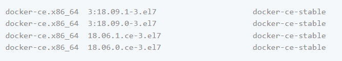
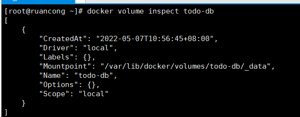
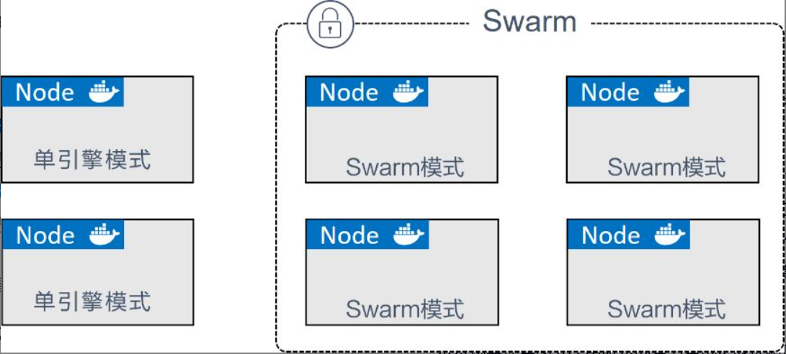
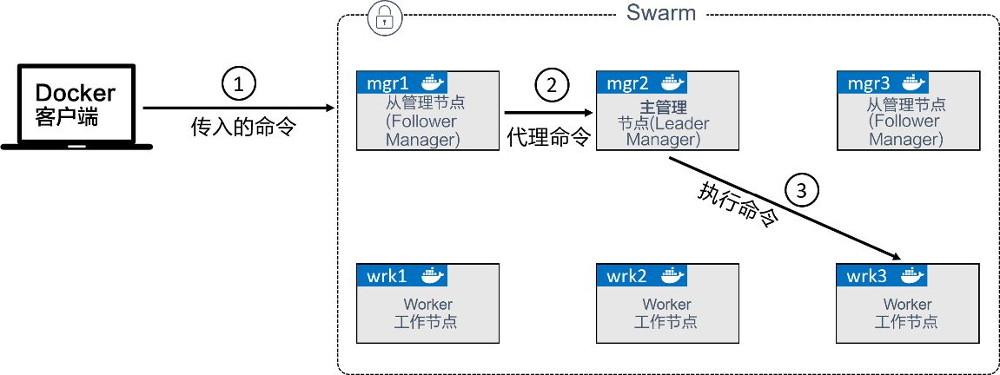

## 安装docker engine [CentOS]

**卸载老版本的docker**

```shell
yum remove docker \
                  docker-client \
                  docker-client-latest \
                  docker-common \
                  docker-latest \
                  docker-latest-logrotate \
                  docker-logrotate \
                  docker-engine
```

和docker相关的内容存储在 `/var/lib/docker/`, 包括镜像（`images`）, 容器(`containers`), 卷(`volumes`）,网络(`networks`)等。 这些Docker相关的包统称为 `docker-ce`


**使用repository安装**

**安装仓库**

* 安装yum-utils (包含 `yum-config-manager`)
    ```shell
    sudo yum install -y yum-utils
    ```
* 安装 reposityory 
   ```shell
    yum-config-manager \
    --add-repo \
    https://download.docker.com/linux/centos/docker-ce.repo
   ```

**安装docker engine**

* 最新版本的安装
    ```shell
    yum install docker-ce docker-ce-cli containerd.io docker-compose-plugin
    ```

* 安装某个版本
  

​	查询版本号

```shell
yum list docker-ce --showduplicates | sort -r
```


例如：版本号就是  `docker-ce-18.09.1`

```shell
yum install \
docker-ce-<VERSION_STRING> \
docker-ce-cli-<VERSION_STRING> \
containerd.io \
docker-compose-plugin
```

***

**启动docker**

```shell
 sudo systemctl start docker
```

**Hello-world**

```shell
sudo docker run hello-world
```

***

## 启动  docker/getting-started 教程

```shell
 docker run -d -p 80:80 docker/getting-started
```

参数说明

- `-d` - run the container in detached mode (in the background)
- `-p 80:80` - map port 80 of the host to port 80 in the container
- `docker/getting-started` - the image to use

******

## 检查Docker daemon与版本

```shell
docker version
###
docker info
```

## 创建示例工程

**代码编写**

<span id="code">https://github.com/docker/getting-started/tree/master/app</span>

**构建镜像**

* 创建Dockerfile文件。Dockerfile文件不能有任何的后缀。（此例在package.json所在目录下创建Dockerfile文件）

```dockerfile
# syntax=docker/dockerfile:1
FROM node:12-alpine
RUN apk add --no-cache python2 g++ make
WORKDIR /app
COPY . .
RUN yarn install --production
CMD ["node", "src/index.js"]
EXPOSE 3000
```

​	`CMD` 命令表示当容器从镜像启动时运行的默认命令

* 构建镜像

```shell
docker build -t getting-started .
```

​	`-t` flag tags our image； 最后的 . 表示Dockerfile文件所在的目录是当前目录

**启动容器**

```shell
docker run -dp 3000:3000 getting-started
```

http://ip:3000 就可以启动应用了  （防火墙注意放开3000的端口号）

***

## 更新示例工程

**更新代码**

...

**重新构建**

```shell
## 可以在最后增加:tagName
docker build -t getting-started .
```

**停止旧版本**

```shell
## 查找正在运行的旧版本的container id
docker ps
```

```shell
## 停止旧版本
docker stop <the-container-id>
```

```shell
## 删除旧版本
docker rm <the-container-id>
```

**重新启动**

```shell
docker run -dp 3000:3000 getting-started
```

***

## 重启策略

`docker run -it <command> --restart <policy>` 

`<policy>` : 容器支持的重启策略包括always 、unless-stopped 和on- failed 

> always 和unless-stopped 的最大区别，就是那些指定了--restartunless-stopped 并处于Stopped (Exited) 状态的容器，不会在Dockerdaemon重启的时候被重启

## 推送镜像到远程仓库

* 操作Docker Hub
  1. 注册登陆 [Docker Hub](https://hub.docker.com/).
  2. 创建仓库，仓库名与需要推送的image名需要一致

* 本地操作
  1. 登陆上一步创建的账号
    ```shell
    docker login -u YOUR-USER-NAME
    ```

  2. 确保image名字与上一步的仓库名一致，如果有需要可以重命名
    ```shell
    ## 其中 :TAG_NAME 可以省略，则为 latest
    docker tag getting-started YOUR-USER-NAME/getting-started:TAG_NAME
    ```

  3. 推送
    ```shell
    docker push YOUR-USER-NAME/getting-started
    ```

## 在线运行镜像 

Open your browser to [Play with Docker](https://labs.play-with-docker.com/).

***

## 容器持久化数据 

### **Named Volumes**

每个容器的文件是系统是相互独立的，即使是由同一个镜像启动的容器的文件也是相互隔离的。可以通过挂载volume 来实现

1. 创建volume

   ```shell
   docker volume create todo-db
   ```

2. 启动时挂载

   ```shell
	docker run -dp 3000:3000 -v todo-db:/etc/todos getting-started
	```

操作完以，重新停止，删除容器，用相同的命令启动docker时，数据就不会丢失。

查询volume挂载后，数据实际存在的位置

```shell
docker volume inspect todo-db
```



### **Bind Mounts**

用的代码是上述[示例工程的代码](#code)

```shell
docker run -dp 3000:3000 -w /code/app -v "$(pwd):/code/app" node:12-alpine sh -c "yarn install && yarn run dev"
docker run -w /app -v "$(pwd):/app" node:16-alpine sh -c "npm config set registry https://mirrors.huaweicloud.com/repository/npm/ && npm install && npm run build:testing"

```

- `-dp 3000:3000` - same as before. Run in detached (background) mode and create a port mapping
- `-w /app` - sets the “working directory” or the current directory that the command will run from
- `-v "$(pwd):/app"` - bind mount the current directory from the host in the container into the `/app` directory （主机地址与容器地址的映射关系`:`前是本机地址，`:`后是容器里的工作目录）
- `node:12-alpine` - the image to use. Note that this is the base image for our app from the Dockerfile
- `sh -c "yarn install && yarn run dev"` - the command. We’re starting a shell using `sh` (alpine doesn’t have `bash`) and running `yarn install` to install *all* dependencies and then running `yarn run dev`. If we look in the `package.json`, we’ll see that the `dev` script is starting `nodemon`.

***

## 看容器日志

```shell
docker logs [CONTAINER]
```

## 基于多个容器的app

如果想把示例app的数据存储到mysql中。这时的app像这样。


因为容器之间是相互隔离的，两个容器之间要进行信息交互就得通过网络（两个容器需要在同一个网络一起）。There are two ways to put a container on a network: 1) Assign it at start or 2) connect an existing container.

**创建网络**

```shell
 docker network create todo-app
```
**启动mysql**

启动mysql并连接到上一步创建的网络中

```shell
docker run -d  --network todo-app --network-alias mysql  -v todo-mysql-data:/var/lib/mysql  -e MYSQL_ROOT_PASSWORD=root   -e MYSQL_DATABASE=todos  mysql:5.7
```
其中`--network` 表示运行的网络是 `todo-app` 

其中的 `--network-alias` 对网络起了一个别名，后续可以直接使用这个别名。

验证mysql是否启动成功

```shell
docker exec -it <mysql-container-id> mysql -u root -p
```

**寻找mysql容器的ip地址**

mysql容器已经运行起来了，怎么找到mysql容器的ip地址呢（每个容器都有它自己的ip地址）？

我们可以运用 [nicolaka/netshoot](https://github.com/nicolaka/netshoot) 这个容器来寻址。 

* 启动netshoot

  ```shell
  docker run -it --network todo-app nicolaka/netshoot
  ```

* 进入容器后，可以使用  `dig` 这个命令来查询`mysql`的ip地址。(`dig`是一个很有用的DNS工具）

  ```shell
  dig mysql
  ```
  运行结果：
  ```
  ;; ANSWER SECTION:
   mysql.			600	IN	A	172.23.0.2
  ```
  
  这条记录就是ip解析结果。虽然mysql不是一个正常的主机名，之所以能解析到是因为上一步的`--network-alias`设置了mysql。这使我们的app如果想连到mysql的话，这需要运用这个主机名`mysql`就可以。

**启动基于mysql的app**

```shell
docker run -dp 3000:3000 \
   -w /app -v "$(pwd):/app" \
   --network todo-app \
   -e MYSQL_HOST=mysql \
   -e MYSQL_USER=root \
   -e MYSQL_PASSWORD=root \
   -e MYSQL_DB=todos \
   node:12-alpine \
   sh -c "yarn install && yarn run dev"
```

打开浏览器增加一些纪录时，这时候的数据会存到mysql中。

也可以直接启动上面章节构建的镜像

```shell
docker run -dp 3000:3000 --network todo-app -e MYSQL_HOST=mysql -e MYSQL_USER=root -e MYSQL_PASSWORD=root  -e MYSQL_DB=todos   getting-started
```


***

## 使用docker-compose启动app 

**安装docker-compose**

* 下载可执行文件 [release page](https://github.com/docker/compose/releases) 
* 下载的文件重命名为docker-compose
* 移动到`/usr/bin/docker-compose`目录
* 赋予可执行权限 `chmod +x /usr/bin/docker-compose`
* 验证版本号 `docker-compose version`

**创建docker-compose.yml文件**

* 默认情况下，这个工程的名字是这个文件所在文件夹的名字

* 在项目的根目录下创建docker-compose.yml文件

  > 在最新版本中，Docker Compose relies on a YAML configuration file, usually named `compose.yaml`.

* Version top-level element (optional)，不同版本号的兼容情况可以查看[compose version](https://docs.docker.com/compose/compose-file/compose-versioning/)

  ```yaml
   version: "3.7"
  ```

  > 这个`version` 只是起到提供信息的作用，并不会用相应的版本去检验docker-compose文件。

* Name top-level element

  ```yaml
  ### 定义项目的名称，不写的话，默认会以文件夹的名字相关的名字当作项目名。还可以${COMPOSE_PROJECT_NAME}变量来访问
  name: 'my-app'
  
* 接下来定义启动app需要的不同的services (or containers) 

  ```yaml
   version: "3.7"
  
   services:
  ```

**定义自己应用的 service**

* 定义第一个service名字(app)和镜像，其中service名字任意取，这个名字会自动成为一个network alias。这对我们定义mysql服务很有效

  ```yaml
   version: "3.7"
  
   services:
     app:
       image: node:12-alpine
  ```

* 通常来说，紧接着image下面会设置command，但是对它们出现的先后顺序并没有要求

  ```yaml
  version: "3.7"
  
   services:
     app:
       image: node:12-alpine
       command: sh -c "yarn install && yarn run dev"
  ```

* 设置端口号，设置端口号有两种方式：一种是[短语法](https://docs.docker.com/compose/compose-file/compose-file-v3/#short-syntax-1)；一种是[长语法](https://docs.docker.com/compose/compose-file/compose-file-v3/#long-syntax-1)

  ```yaml
   version: "3.7"
  
   services:
     app:
       image: node:12-alpine
       command: sh -c "yarn install && yarn run dev"
       ports:
         - 3000:3000
  ```

* 定义工作目录与volume ,volume的定义也有两种方式：[short](https://docs.docker.com/compose/compose-file/compose-file-v3/#short-syntax-3) 和 [long](https://docs.docker.com/compose/compose-file/compose-file-v3/#long-syntax-3)。在这里定义volumes时可以直接运用相对路径

  ```yaml
   version: "3.7"
  
   services:
     app:
       image: node:12-alpine
       command: sh -c "yarn install && yarn run dev"
       ports:
         - 3000:3000
       working_dir: /app
       volumes:
         - ./:/app
  ```

* 定义镜像的环境变量

  ```yaml
   version: "3.7"
  
   services:
     app:
       image: node:12-alpine
       command: sh -c "yarn install && yarn run dev"
       ports:
         - 3000:3000
       working_dir: /app
       volumes:
         - ./:/app
       environment:
         MYSQL_HOST: mysql
         MYSQL_USER: root
         MYSQL_PASSWORD: root
         MYSQL_DB: todos
  ```

**定义mysql service**

* 将mysql service 服务命名为mysql，这样自动生成的network alias也是mysql；指定mysql服务的镜像为mysql:5.7

  ```yaml
   version: "3.7"
  
   services:
     app:
       # The app service definition
     mysql:
       image: mysql:5.7
  ```

* 定义mysql service 的named volumes。

  基于Compose的volumes并不像使用docker run 会自动创建named volumes。当在使用Compose时需要在配置文件顶层中申明`volumes: `。而在具体的服务下的`volumes: `是用来指定这个服务的挂载点的。

  ```yaml
   version: "3.7"
  
   services:
     app:
       # The app service definition
     mysql:
       image: mysql:5.7
       volumes:
         - todo-mysql-data:/var/lib/mysql
  
   volumes:
     todo-mysql-data:
  ```

* 定义mysql的环境变量

  ```yaml
   version: "3.7"
  
   services:
     app:
       # The app service definition
     mysql:
       image: mysql:5.7
       volumes:
         - todo-mysql-data:/var/lib/mysql
       environment:
         MYSQL_ROOT_PASSWORD: secret
         MYSQL_DATABASE: todos
  
   volumes:
     todo-mysql-data:
  ```

**完整的docker-compose.yml文件**

```yaml
version: "3.7"

services:
  app:
    image: node:12-alpine
    command: sh -c "yarn install && yarn run dev"
    ports:
      - 3000:3000
    working_dir: /app
    volumes:
      - ./:/app
    environment:
      MYSQL_HOST: mysql
      MYSQL_USER: root
      MYSQL_PASSWORD: secret
      MYSQL_DB: todos

  mysql:
    image: mysql:5.7
    volumes:
      - todo-mysql-data:/var/lib/mysql
    environment:
      MYSQL_ROOT_PASSWORD: root
      MYSQL_DATABASE: todos

volumes:
  todo-mysql-data:
```

***

## 使用docker-compose关闭app

进入docker-compose.yml文件所在的目录，运行

```shell
docker-compose down
```

默认情况下容器(containers)与网络(network)会被停止与删除。但是创建的volumes不会被删除，如果想要删除的话加入`--volumes`参数。

后台运行

```shell
docker-compose up d
```

停止compse里的某一个应用

```shell
docker-compose stop xiaozhi
```

启动【升级】某一个应用

```
docker-compose up -d xiaozhi
```

> up 是升级启动一个服务，start只是启动一个服务，并不升级

## docker-compose 启动中间件

```yaml
name: 'middleware-services'
services:
  mysql:
    image: mysql:5.7  # 使用MySQL 5.7的官方镜像
    restart: always
    environment:
      MYSQL_ROOT_PASSWORD: root  # 设置MySQL的root用户的密码
      MYSQL_DATABASE: xiaozhi_health_cloud  # 创建一个初始数据库
      TZ: Asia/Shanghai  # 设置时区
    volumes:
      - xiaozhi-mysql-data:/var/lib/mysql  # 数据持久化到命名卷
    ports:
      - "3306:3306"  # 将容器的3306端口映射到宿主机的3306端口

  redis:
    image: redis:5.0.14
    restart: always
    ports:
      - "6379:6379"
    volumes:
      - ./redis-data:/data
      - ./redis-conf:/etc/redis
    command: redis-server --requirepass root
  emqx:
    image: emqx/emqx:latest
    restart: always
    ports:
      - 1883:1883   # MQTT 协议端口
      - 8084:8081   # Dashboard 管理界面端口
      - 8083:8083   # WebSocket 端口
      - 8883:8883   # MQTT SSL 端口
      - 18083:18083 # Dashboard HTTP API 端口
  rabbitmq:
    image: rabbitmq:3.13-management
    ports:
      - "5672:5672"
      - "15672:15672"
    restart: always
    environment:
      RABBITMQ_DEFAULT_USER: admin
      RABBITMQ_DEFAULT_PASS: admin
volumes:
  xiaozhi-mysql-data:  # 定义一个用于持久化数据的卷
  redis-data:

```

> mysql 默认字符，表名不区分大小写
>
> ```yaml
> version: '3.1'
> 
> services:
>   mysql:
>     image: mysql:5.7
>     command: --character-set-server=utf8mb4 --collation-server=utf8mb4_general_ci
>     environment:
>       MYSQL_ROOT_PASSWORD: root
>       MYSQL_DATABASE: area_oa
>       TZ: Asia/Shanghai
>     volumes:
>       - local-mysql-data:/var/lib/mysql
>       - ./mycustom.cnf:/etc/mysql/conf.d/custom.cnf
>     ports:
>       - "3306:3306"
> 
> volumes:
>   local-mysql-data:
> 
> ```
>
> [mysqld]
> lower_case_table_names=1

## docker 启动nexus

```yaml
services:
  nexus:
    image: sonatype/nexus3
    ports:
      - '8081:8081'
      - '18081:18081'
    volumes:
      - './nexus-data:/nexus-data'
    restart: always
```


## 构建镜像的最佳实践

**安全扫描**

```shell
docker scan getting-started
```

**镜像分层查看**

```shell
docker image history getting-started
```

**使镜像大小尽量小**

* 选用合适的base image.

  >  If you need a JDK, consider basing your image on the official `openjdk` image, rather than starting with a generic `ubuntu` image and installing `openjdk` as part of the Dockerfile.

* 分层缓存，某层没有发生变化是，会运用到缓存。只要某一层发生变化，这层的下面部分层次就会重新创建

* 可以新建 .dockerignore 里面存放不复制到镜像里的文件

* 分多阶段构建

  > * Separate build-time dependencies from runtime dependencies
  >
  > - Reduce overall image size by shipping *only* what your app needs to run
  >
  >   例如: 
  >
  > ```dockerfile
  > # syntax=docker/dockerfile:1
  > FROM node:16.14.2 AS build
  > WORKDIR /app
  > COPY package* yarn.lock ./
  > RUN yarn install
  > COPY . .
  > RUN yarn run build
  > 
  > FROM nginx:alpine
  > COPY --from=build /app/dist /usr/share/nginx/html
  > ```

  > java的例子
  >
  > ```dockerfile
  > FROM eclipse-temurin:21.0.2_13-jdk-jammy as builder
  > WORKDIR /opt/app
  > COPY .mvn/ .mvn
  > COPY mvnw pom.xml ./
  > ## 先安装包到本地
  > RUN ./mvnw dependency:go-offline
  > COPY ./src ./src
  > RUN ./mvnw clean install 
  > 
  > FROM eclipse-temurin:21.0.2_13-jre-jammy as final
  > WORKDIR /opt/app
  > EXPOSE 8080
  > COPY --from=builder /opt/app/target/*.jar /opt/app/*.jar
  > ENTRYPOINT ["java", "-jar", "/opt/app/*.jar"]
  > ```
  >
  > 

* 如果没有使用到多阶段构建，为了能够减少镜像的层数，尽量减少 `RUN` 命令的行数，可以考虑将多个命令合并到一行

  >  例如：
  >
  >  ```dockerfile
  >  RUN apt-get -y update
  >  RUN apt-get install -y python
  >  ```
  >  ```dockerfile
  >  RUN apt-get -y update && apt-get install -y python
  >  ```

* 如果自己的创建的镜像有很多相似之处，可以创建自己的base image，其它的基于这个base image构建

**镜像tag**

一次可以打多个标签

```shell
 docker tag node-docker:latest node-docker:v1.0.0
```

镜像的:latest 并不一定是镜像最新的版本

**如何持久化应用数据**

* 避免将应用数据存入容器中，这样会使容器大小不断增加；降低I/O效率；
* 存储数据用volumes
* One case where it is appropriate to use [bind mounts](https://docs.docker.com/storage/bind-mounts/) is during development, when you may want to mount your source directory or a binary you just built into your container. For production, use a volume instead, mounting it into the same location as you mounted a bind mount during development.
* For production, use [secrets](https://docs.docker.com/engine/swarm/secrets/) to store sensitive application data used by services, and use [configs](https://docs.docker.com/engine/swarm/configs/) for non-sensitive data such as configuration files. 


## 镜像相关

悬虚(dangling)镜像： 没有标签的镜像。

当构建一个新的镜像的tag,是一个已经存在的tag，就会使老的旧镜像变成悬虚镜像

**单步骤构建**

```dockerfile
FROM node:16.14.2

RUN apt-get update && \
    apt-get install -y nginx && \
    rm -rf /var/lib/apt/lists/*

WORKDIR /app
COPY package.json ./
RUN npm config set registry https://mirrors.huaweicloud.com/repository/npm/ && \
    npm install
COPY . . 
RUN npm run build && \
    rm -f /etc/nginx/conf.d/default.conf && \
    cp default.conf /etc/nginx/conf.d/ && \
    rm -rf /usr/share/nginx/html/* 
RUN cp -r dist/* /usr/share/nginx/html/
CMD ["nginx", "-g", "daemon off;"]
```

## Dockerfile 最佳实践

**build context**

运行`docker build`命令的当前目录，默认情况下Dockerfile文件应该就在此目录下，也可以使用`-f` 参数来指定Dockerfile文件的位置，该目录及子目录都会被发送到Docker的daemon 来作为构建的上下文。

例1： 

```shell
$ mkdir myproject && cd myproject
$ echo "hello" > hello
$ echo -e "FROM busybox\nCOPY /hello /\nRUN cat /hello" > Dockerfile
$ docker build -t helloapp:v1 .
```

上述的Dockerfile所在的当前目录`.`就是build context。

例2：

```shell
$ mkdir -p dockerfiles context
$ mv Dockerfile dockerfiles && mv hello context
$ docker build --no-cache -t helloapp:v2 -f dockerfiles/Dockerfile context
```

上述的Dockerfile所在的目录是`dockerfiles`，`context`是build context。

**Pipe Dockerfile through `stdin`**

```shell
echo -e 'FROM busybox\nRUN echo "hello world"' | docker build -
```

```shell
docker build -<<EOF
FROM busybox
RUN echo "hello world"
EOF
```

**Build an image using a Dockerfile from stdin, without sending build context**

```shell
docker build [OPTIONS] -
```

The hyphen (`-`) takes the position of the `PATH`. 将不会发送build context 到 docker daemon. 

```shell
docker build -t myimage:latest -<<EOF
FROM busybox
RUN echo "hello world"
EOF
```

如果用这种方式，`COPY` **or** `ADD`不可使用，会发生异常

```shell
# create a directory to work in
mkdir example
cd example

# create an example file
touch somefile.txt

docker build -t myimage:latest -<<EOF
FROM busybox
COPY somefile.txt ./
RUN cat /somefile.txt
EOF

# observe that the build fails
...
Step 2/3 : COPY somefile.txt ./
COPY failed: stat /var/lib/docker/tmp/docker-builder249218248/somefile.txt: no such file or directory
```

**Build from a local build context, using a Dockerfile from stdin**

```shell
docker build [OPTIONS] -f- PATH
```

```shell
# create a directory to work in
mkdir example
cd example

# create an example file
touch somefile.txt

# build an image using the current directory as context, and a Dockerfile passed through stdin
docker build -t myimage:latest -f- . <<EOF
FROM busybox
COPY somefile.txt ./
RUN cat /somefile.txt
EOF
```

**Build from a remote build context, using a Dockerfile from stdin**

```shell
docker build [OPTIONS] -f- PATH
```

```shell
docker build -t myimage:latest -f- https://github.com/docker-library/hello-world.git <<EOF
FROM busybox
COPY hello.c ./
EOF
```

> When building an image using a remote Git repository as build context, Docker performs a `git clone` of the repository on the local machine, and sends those files as build context to the daemon. This feature requires `git` to be installed on the host where you run the `docker build` command.

**Exclude with .dockerignore**

将在build context内但不想发送到daemon 的文件可写在`.dockerignore`文件内

This file supports exclusion patterns similar to `.gitignore` files. For information on creating one, see the [.dockerignore file](https://docs.docker.com/engine/reference/builder/#dockerignore-file).

**Minimize the number of layers**

In older versions of Docker, it was important that you minimized the number of layers in your images to ensure they were performant. The following features were added to reduce this limitation:

- Only the instructions `RUN`, `COPY`, `ADD` create layers. Other instructions create temporary intermediate images, and do not increase the size of the build.
- Where possible, use [multi-stage builds](https://docs.docker.com/develop/develop-images/multistage-build/), and only copy the artifacts you need into the final image. This allows you to include tools and debug information in your intermediate build stages without increasing the size of the final image.

**Sort multi-line arguments**

Whenever possible, ease later changes by sorting multi-line arguments alphanumerically. （按字母顺序将命令排序）

```shell
RUN apt-get update && apt-get install -y \
  bzr \
  cvs \
  git \
  mercurial \
  subversion \
  && rm -rf /var/lib/apt/lists/*
```

## Dockerfile instructions

**FROM**

Whenever possible, use current official images as the basis for your images.

**LABEL**

For each label, add a line beginning with `LABEL` and with one or more key-value pairs.

> Strings with spaces must be quoted **or** the spaces must be escaped. Inner quote characters (`"`), must also be escaped.

```dockerfile
# Set one or more individual labels
LABEL com.example.version="0.0.1-beta"
LABEL vendor1="ACME Incorporated"
LABEL vendor2=ZENITH\ Incorporated
LABEL com.example.release-date="2015-02-12"
LABEL com.example.version.is-production=""
```

> An image can have more than one label. Prior to Docker 1.10, it was recommended to combine all labels into a single `LABEL` instruction, to prevent extra layers from being created. This is no longer necessary, but combining labels is still supported.

```dockerfile
# Set multiple labels on one line
LABEL com.example.version="0.0.1-beta" com.example.release-date="2015-02-12"
```

The above can also be written as:

```dockerfile
# Set multiple labels at once, using line-continuation characters to break long lines
LABEL vendor=ACME\ Incorporated \
      com.example.is-beta= \
      com.example.is-production="" \
      com.example.version="0.0.1-beta" \
      com.example.release-date="2015-02-12"
```

**RUN**

使用`\`把命令分成多行，便于阅读管理。RUN命令有些陷阱的地方

**apt-get**

Always combine `RUN apt-get update` with `apt-get install` in the same `RUN` statement.

```dockerfile
RUN apt-get update && apt-get install -y \
    package-bar \
    package-baz \
    package-foo  \
    && rm -rf /var/lib/apt/lists/*
```

如果分开使用，会导致缓存问题。这使得`install `命令安装的软件可能是过期的问题。解决这个问题，要么像上面一样把这两个命令联合使用，要么指定`package`的版本号。如：`package-foo=1.3.*`。

```dockerfile
# syntax=docker/dockerfile:1
FROM ubuntu:18.04
RUN apt-get update
RUN apt-get install -y curl nginx
```

Below is a well-formed `RUN` instruction that demonstrates all the `apt-get` recommendations.

```dockerfile
RUN apt-get update && apt-get install -y \
    aufs-tools \
    automake \
    build-essential \
    curl \
    dpkg-sig \
    libcap-dev \
    libsqlite3-dev \
    mercurial \
    reprepro \
    ruby1.9.1 \
    ruby1.9.1-dev \
    s3cmd=1.1.* \
 && rm -rf /var/lib/apt/lists/*
```

**Using pipes**

```dockerfile
RUN wget -O - https://some.site | wc -l > /number
```

上述命令只需要 `wc -l > /number`运行成功就能成功构建镜像，而不管`wget -O - https://some.sit` 是否成功与否。如果想要其中一个失败了，就阻止构建，可加命令`set -o pipefail &&` 。例如：

```dockerfile
RUN set -o pipefail && wget -O - https://some.site | wc -l > /number
```

> **Not all shells support the** `-o pipefail` **option.**
>
> In cases such as the `dash` shell on Debian-based images, consider using the *exec* form of `RUN` to explicitly choose a shell that does support the `pipefail` option. For example:
>
> ```
> RUN ["/bin/bash", "-c", "set -o pipefail && wget -O - https://some.site | wc -l > /number"]
> ```

**CMD**

The `CMD` instruction should be used to run the software contained in your image, along with any arguments. 

`CMD ["executable", "param1", "param2"…]`. Thus, if the image is for a service, such as Apache and Rails, you would run something like `CMD ["apache2","-DFOREGROUND"]`. Indeed, this form of the instruction is recommended for any service-based image.

`CMD` should rarely be used in the manner of `CMD ["param", "param"]` in conjunction with [`ENTRYPOINT`](https://docs.docker.com/engine/reference/builder/#entrypoint), unless you and your expected users are already quite familiar with how `ENTRYPOINT` works.

**EXPOSE**

For example, an image containing the Apache web server would use `EXPOSE 80`, while an image containing MongoDB would use `EXPOSE 27017` and so on.

**ENV**

You can use `ENV` to update the `PATH` environment variable for the software your container installs. For example, `ENV PATH=/usr/local/nginx/bin:$PATH` ensures that `CMD ["nginx"]` just works.

也可以简单地用于申明变量

```dockerfile
ENV PG_MAJOR=9.3
ENV PG_VERSION=9.3.4
RUN curl -SL https://example.com/postgres-$PG_VERSION.tar.xz | tar -xJC /usr/src/postgres && …
ENV PATH=/usr/local/postgres-$PG_MAJOR/bin:$PATH
```

每一行的`ENV` 会创建一个中间层，即使在下面的层`unset `了这个变量，这个变量也一直存在。

```dockerfile
# syntax=docker/dockerfile:1
FROM alpine
ENV ADMIN_USER="mark"
RUN echo $ADMIN_USER > ./mark
RUN unset ADMIN_USER
```

```shell
 docker run --rm test sh -c 'echo $ADMIN_USER' ## 将输出mark
```

为了能够正确删除这个变量，`set`, `use`, and `unset`放在同一层。You can separate your commands with `;` or `&&`。 If you use `&&`, and one of the commands fails, the `docker build` also fails.

```dockerfile
# syntax=docker/dockerfile:1
FROM alpine
RUN export ADMIN_USER="mark" \
    && echo $ADMIN_USER > ./mark \
    && unset ADMIN_USER
CMD sh
```

```shell
docker run --rm test sh -c 'echo $ADMIN_USER'  ## 将不会输出什么
```

**ENV vs ARG**

 Dockerfile 中的 ARG 和 ENV 变量,主要的区别有:

- ARG 是构建参数,只在构建 imagen 阶段有效。构建完成后,ARG 设置的值不会保留在镜像中。
- ENV 是环境变量,它可以在构建阶段和运行阶段使用。ENV 设置的值会被保留在镜像中,以便在容器启动时使用。
- ARG 的值可以在构建过程中通过 docker build 使用 --build-arg 来覆盖,而 ENV 的值如果在构建过程中被 --build-arg 覆盖,那只在构建过程生效,不会对最终镜像产生影响。
- 在 Dockerfile 中,ENV 可以引用 ARG 设置的值,但 ARG 不能引用 ENV 的值。
- 在构建过程中,ARG 的默认值可以没有,但 ENV 的默认值必须有。

例子：

```dockerfile
# 构建参数
ARG VERSION=latest
ARG DEBUG=off

# 构建镜像
FROM nginx:$VERSION

# 环境变量  
ENV APP_HOME /app
ENV DEBUG $DEBUG

# 将代码复制到镜像中
COPY . $APP_HOME

# 暴露端口
EXPOSE 80

# 启动命令
CMD ["nginx", "-g", "daemon off;"]
```

构建：

```shell
docker build --build-arg VERSION=1.19.8 -t myimage .
```

**ADD or COPY**

`ADD`与`COPY`的功能基本相同，但首选`COPY`. `COPY` 只有简单的复制文件或文件夹到镜像的功能，`ADD`除些之外，还有自动解压tar文件，与下载远程文件的功能。除了你需要用到这些特性的情况下才使用`ADD`,不然一般都是选用`COPY`. 

<span style="color:red">**不鼓励**</span>这个使用：

```dockerfile
ADD https://example.com/big.tar.xz /usr/src/things/
RUN tar -xJf /usr/src/things/big.tar.xz -C /usr/src/things
RUN make -C /usr/src/things all
```

用这个取代

```dockerfile
RUN mkdir -p /usr/src/things \
    && curl -SL https://example.com/big.tar.xz \
    | tar -xJC /usr/src/things \
    && make -C /usr/src/things all
```

**ENTRYPOINT**

The best use for `ENTRYPOINT` is to set the image’s main command, allowing that image to be run as though it was that command (and then use `CMD` as the default flags). `ENTRYPOINT`的值将做为主命令，`CMD` 的值将做为参数传入

example: 

```dockerfile
ENTRYPOINT ["s3cmd"]
CMD ["--help"]
```

还可以运行脚本文件，创建`docker-entrypoint.sh`文件

```shell
#!/bin/bash
set -e

if [ "$1" = 'postgres' ]; then
    chown -R postgres "$PGDATA"

    if [ -z "$(ls -A "$PGDATA")" ]; then
        gosu postgres initdb
    fi

    exec gosu postgres "$@"
fi

exec "$@"
```

```dockerfile
COPY ./docker-entrypoint.sh /
ENTRYPOINT ["/docker-entrypoint.sh"]
CMD ["postgres"]
```

可以简单地运行镜像

```shell
 docker run postgres
```

```shell
## 这个命令中最后的 postgres --help 将被当作参数传入docker-entrypoint.sh脚本中
docker run postgres postgres --help
```

```shell
## bash 将被当作参数传入docker-entrypoint.sh脚本中
docker run --rm -it postgres bash
```

**VOLUME**

The `VOLUME` instruction should be used to expose any database storage area, configuration storage, or files/folders created by your docker container. You are strongly encouraged to use `VOLUME` for any mutable and/or user-serviceable parts of your image.

**WORKDIR**

For clarity and reliability, you should always use absolute paths for your `WORKDIR`. Also, you should use `WORKDIR` instead of proliferating instructions like `RUN cd … && do-something`, which are hard to read, troubleshoot, and maintain.

**ONBUILD**

## Build images with BuildKit

**To enable BuildKit builds**

Easiest way from a fresh install of docker is to set the `DOCKER_BUILDKIT=1` environment variable when invoking the `docker build` command, such as:

```shell
$ DOCKER_BUILDKIT=1 docker build .
```

To enable docker BuildKit by default, set daemon configuration in `/etc/docker/daemon.json` feature to true and restart the daemon:

```json
{ "features": { "buildkit": true } }
```

## 运行镜像

-p (--publish); --name 命令容器名字

```
docker run -d -p 8000:8000 --name rest-server node-docker
```

## 部署tomcat应用

tomcat:9 和 tomcat:9-jdk8 这两个镜像的区别在于:- tomcat:9:只包含 Tomcat 9,没有包含 JDK。
tomcat:9-jdk8:包含 Tomcat 9 和 JDK 8,可以直接运行 Java 应用。所以,如果你的应用是:1. 纯 Tomcat 应用,不依赖 JDK,可以使用 tomcat:9 。这是一个更轻量的镜像,体积更小。2. 基于 Java 的应用,需要 JDK 运行环境,应选择 tomcat:9-jdk8。这个镜像直接内置了 JDK,十分方便。

## 配置http的docker register

在`/etc/docker/daemon.json`配置

```json
{
  "insecure-registries" : ["leite-dev:8081"]
}
```

## Nexus 配置成私有docker register

 在Nexus上配置私有的Docker registry主要涉及到在Nexus端创建存储库，并在Docker端进行相应的配置以便能够推送和拉取镜像。以下是详细步骤：

**Nexus端配置**

1. **启动Nexus**: 使用Docker运行Nexus的命令如下：

   ```bash
   docker run -d --net host --name nexus sonatype/nexus3
   ```

   启动后，可以通过`http://localhost:8081`访问Nexus界面。

2. **创建Docker repository**: 登录Nexus后，找到创建repository的选项，选择`docker (hosted)`类型，输入名称和HTTP端口【如：18081】地址【后续docker login要用这个端口】。

   > A configured context-path for the user interface does not affect the repository connector URLs used by Docker. E.g. if your repository manager instance is configured to be available at `http://localhost:8081/nexus` instead of the default root context `http://localhost:8081/`, the URLs for your Docker repositories will still only use the configured port for the repository and omit the context path in the URL. This is a side-effect of the the fact that Docker does not support context paths in the registry API.

3. **配置代理Docker repository** (如果需要): 由于安全原因，Docker push/pull时必须使用HTTPS协议。可以选择使用Nginx代理Nexus构建的Docker repository，配置SSL证书。

   > 不然的话，增加这个配置
   >
   > 在`/etc/docker/daemon.json`配置
   >
   > ```json
   > {
   >   "insecure-registries" : ["leite-dev:8081"]
   > }
   > ```
   > `systemctl daemon-reload; systemctl restart docker`

4. **需要将18081透露出来**

**Docker端配置**

1. **处理自签名证书问题**【http时忽略此步骤】: 如果使用自签名证书，Docker客户端默认不会信任它。解决方法是将证书添加到Docker的信任列表中：

   ```bash
   mkdir -p /etc/docker/certs.d/your-nexus-domain:port
   cp your-nexus-domain.crt /etc/docker/certs.d/your-nexus-domain:port/
   ```

2. **登录Nexus Docker registry**: 使用`docker login`命令登录你的Nexus Docker registry：

   ```bash
   docker login leite-dev:18081
   ```

3. **推送和拉取镜像**: 标记你的镜像并推送到Nexus：

   ```bash
   docker tag your-image leite-dev:18081/your-image
   docker push leite-dev:18081/your-image
   ```

   拉取镜像时，直接使用pull命令：

   ```bash
   docker pull leite-dev:18081/your-image
   ```

## 配置阿里云docker 镜像

`https://cr.console.aliyun.com/cn-shanghai/instances`   

密码：le130     

## 删除所有容器的日志文件

```shell
sh -c "truncate -s 0 /var/lib/docker/containers/*/*-json.log"
```

## mysql以容器运行时，增量备份

```shell
 #!/bin/bash

FULL_BACKUP_DIR="/backup/full_backup"
# 备份目录
BACKUP_DIR="/backup/incremental"
# 位置信息文件
POSITION_FILE="/backup/last_position.txt"
DATE=$(date +%Y%m%d_%H%M%S)

# 创建备份目录（如果不存在）
mkdir -p /backup

# 先创建目录
docker exec local-oa-base-services-mysql-1 bash -c "mkdir -p $BACKUP_DIR && mkdir -p $FULL_BACKUP_DIR"

# 如果是第一次运行，需要先进行全量备份并记录位置
if [ ! -f $POSITION_FILE ]; then
    # 进行全量备份
    docker exec local-oa-base-services-mysql-1 bash -c "mysqldump -u root -proot \
        --single-transaction \
        --master-data=2 \
        --databases area_oa > $FULL_BACKUP_DIR/full_$DATE.sql"
    
    # 记录当前位置
    docker exec local-oa-base-services-mysql-1 mysql -u root -proot \
        -e "SHOW MASTER STATUS\G" | grep "File\|Position" > $POSITION_FILE
else
    # 读取上次备份的位置信息
    LAST_FILE=$(grep "File:" $POSITION_FILE | awk '{print $2}')
    LAST_POS=$(grep "Position:" $POSITION_FILE | awk '{print $2}')
    
    # 获取当前位置
    docker exec local-oa-base-services-mysql-1 mysql -u root -proot \
        -e "SHOW MASTER STATUS\G" | grep "File\|Position" > /tmp/current_position.txt
    
    CURRENT_FILE=$(grep "File:" /tmp/current_position.txt | awk '{print $2}')
    CURRENT_POS=$(grep "Position:" /tmp/current_position.txt | awk '{print $2}')
    
    # 执行增量备份
    docker exec local-oa-base-services-mysql-1 bash -c "mysqlbinlog \
        --start-position=$LAST_POS \
        --stop-position=$CURRENT_POS \
        /var/lib/mysql/$LAST_FILE > $BACKUP_DIR/incremental_$DATE.sql"
    
    # 更新位置信息
    cp /tmp/current_position.txt $POSITION_FILE
fi

```

> 注意分清是主机的目录，还是窗器内的目录
>
> 恢复备份：
>
> ```shell
> # 恢复全量备份
> mysql -u root -proot < full_backup.sql
> 
> # 恢复增量备份
> mysql -u root -proot < incremental_backup.sql
> ```
>
> 

## Docker Swarm

### Docker Swarm 简介

Docker Swarm 是实现Docker 规模化的关键方案。其核心包含一个安全集群组件和一个编排组件。

- 从集群角度来说，Swarm将一个或多个Docker节点组织起来，使得用户能够以集群方式管理它们。
- 从编排角度来说，Swarm提供了一套丰富的API使得部署和管理复杂的微服务应用变得易如反掌。

### Docker Swarm 详解

#### Swarm 的基本架构

Swarm 由一个或多个Docker节点组成，这些节点可以是物理服务器、虚拟机、树莓派（Raspberry Pi）或云实例。

- 节点类型：
  - 管理节点（Manager）：负责集群控制面（Control Plane），进行诸如监控集群状态、分发任务至工作节点等操作。
  - 工作节点（Worker）：接收来自管理节点的任务并执行。
- Swarm的配置和状态信息保存在一套位于所有管理节点上的分布式etcd数据库中。
- Swarm 使用TLS进行通信加密、节点认证和角色授权，并支持自动密钥轮换。

#### 搭建安全 Swarm 集群

搭建Swarm集群的过程也被称为初始化Swarm，大体流程包括初始化第一个管理节点>加入额外的管理节点>加入工作节点>完成。

1. **初始化一个全新的Swarm**：不包含在任何Swarm中的Docker节点，称为运行于单引擎（Single-Engine）模式。一旦被加入Swarm集群，则切换为Swarm模式。

   

   (1) 初始化 Swarm 集群命令：

   ```shell
   docker swarm init \
     --advertise-addr 10.0.0.1:2377 \
     --listen-addr 10.0.0.1:2377
   ```

   > `--advertise-addr` 指定其他节点用来连接到当前管理节点的IP和端口。这一属性是可选的，当节点上有多个IP时，可以用于指定使用哪个IP。
   >
   > `--listen-addr` 指定用于承载Swarm流量的IP和端口。其设置通常与--advertise-addr 相匹配，但是当节点上有多个IP的时候，可用于指定具体某个IP。
   >
   > Swarm模式下的操作默认运行于2337端口，虽然可配，但2377/tcp 是用于客户端与Swarm进行安全（HTTPS）通信的约定俗成的端口配置。

   执行完命令以后，并将自身设置为第一个管理节点。同时也会使该节点开启Swarm模式。

   (2) 列出Swarm中的节点

   ```shell
   docker node ls
   ```

   (3) 生成其它节点加入swarm需要的token

   ```shell
   ## 工作节点
   docker swarm join-token worker
   ## 管理节点
   docker swarm join-token manager
   
   ```

   > 一个节点是作为工作节点还是管理节点接入，完全依赖于使用了哪个Token.

   (4) 加入节点

   ```shell
   docker swarm join --token <token> <manager-ip>:<port> \
     --advertise-addr <node-ip> \
     --listen-addr <node-ip>:<port>
   ```
   > * `<manager-ip>` 为管理节点的IP，其中--advertise-addr 和 --listen-addr 是可选的，当节点上有多个IP时，可以用于指定使用哪个IP，`<node-ip>` 为当前节点的IP。
   >
   > * 当token为工作节点时，则加入工作节点，当token为管理节点时，则加入管理节点。
   >
   > * 每次将节点加入Swarm都指定--advertise-addr 与--listen-addr 属性是痛苦的。然而，一旦Swarm中的网络配置出现问题将会更加痛苦。况且，手动将节点加入Swarm也不是一种日常操作，所以在执行该命令时额外指定这两个属性是值得的。

   (5) 列出Swarm中的节点
   在任意管理节点上执行

   ```shell
   docker node ls
   ```

2. **Swarm 管理器高可用性（HA）**：Swarm 的管理节点内置有对HA的支持，这意味着即使一个或多个节点发生故障，剩余管理节点也会继续保证Swarm的运转。

   - Swarm 实现了一种主从方式的多管理节点的HA。这意味着，有多个管理节点，也总是仅有一个节点处于活动状态。通常处于活动状态的管理节点被称为“主节点”​（leader）​，而主节点也是唯一一个会对Swarm发送控制命令的节点。如果一个备用（非活动）管理节点接收到了Swarm命令，则它会将其转发给主节点。Swarm使用了[Raft共识算法](./raft.md)的一种具体实现来支持管理节点的HA

   

   - 最佳实践原则：
     - 部署奇数个管理节点。
     - 不要部署太多管理节点（建议3个或5个）。
     > 部署奇数个管理节点有利于减少[脑裂（Split-Brain）](./split-brain.md)的风险。
   - 建议将管理节点分布到不同的可用域（Availability Zone）中。

3. **内置的 Swarm 安全机制**：Swarm 集群内置有繁多的安全机制，并提供了开箱即用的合理的默认配置，例如 CA 设置、接入Token、公用TLS、加密集群存储、加密网络、加密节点 ID 等。

4. **锁定 Swarm**：Docker 提供了自动锁机制来锁定 Swarm，强制要求重启的管理节点在提供一个集群解锁码之后才有权从新接入集群。如果没有锁定机制，重启一个旧的管理节点或进行备份恢复仍有可能对集群造成影响。一个旧的管理节点重新接入Swarm会自动解密并获得Raft数据库中长时间序列的访问权，这会带来安全隐患。进行备份恢复可能会抹掉最新的Swarm配置。

   - 在执行`docker swarm init`命令时，传入`--auto-lock`选项，Swarm 会自动启用锁定机制。
   - 如果前面已经启用了一个Swarm集群，则可以使用`docker swarm update --autolock=true`命令来启用锁定机制。
   - 请确保将解锁码妥善保管在安全的地方[忘记解锁码](./forget-lock-psw.md)
   - 如果管理节点重启，则需要使用`docker swarm unlock`命令为重启的管理节点解锁Swarm

### Swarm 服务

Swarm 中的最小调度单元是服务，它是随 Swarm 引入的，在API中是一个新的对象元素，它基于容器封装了一些高级特性。服务仅适用于Swarm模式。
 
1. **创建服务**

使用服务仍能够配置大多数熟悉的容器属性，比如容器名、端口映射、接入网络和镜像。`--replicas` 选项用于指定服务需要运行的副本数量。

```shell
docker service create --name my_service --replicas 3 --publish 8080:80 nginx
```
 
2. **查看服务**

查看Swarm中的所有的服务
```shell
docker service ls
```

查看某个服务的副本及状态
```shell
docker service ps <service_name or id>
```

查看某个服务的更详细的信息
```shell
docker service inspect <service_name or id>
``` 
> 可以使用`--pretty`选项来格式化输出

3. **副本服务VS全局服务**

- 副本服务：
服务的默认是副本模式（replicated ）​。这种模式会部署期望数量的服务副本，并尽可能均匀地将各个副本分布在整个集群中。

- 全局服务：
全局模式（global ）​，在这种模式下，每个节点上仅运行一个副本。可以通过给`docker service create`命令传递`--mode global`参数来部署一个全局服务。

:::note
默认模式下，是在Swarm中的所有节点开放端口——即使节点上没有服务的副本——称为入站模式（Ingress Mode）​。此外还有主机模式（Host Mode）​，即仅在运行有容器副本的节点上开放端口。声明为主机模式，需要较长的命令。
```shell
docker service create --name uber-svc \
   --network uber-net \
   --publish published=80,target=80,mode=host \
   --replicas 12 \
   nigelpoulton/tu-demo:v1
```
:::

4. **服务的扩缩容**

```shell
docker service scale <service_name or id>=<number_of_replicas>
```
通过这个命令可以扩展或缩减服务。

> 在底层实现上，Swarm执行了一个调度算法，默认将副本尽量均衡分配给Swarm中的所有节点

5. **删除服务**

```shell
docker service rm <service_name or id>
```

> 谨慎使用docker service rm 命令，因为它在删除所有服务副本时并不会进行确认。

6. **滚动更新**

```shell
docker service update --image <new_image> \
    --update-delay 10s \
    --update-parallelism 2 \
    <service_name or id>
```

> `--update-delay` 选项用于指定更新延迟时间，`--update-parallelism` 选项用于指定更新并行度。对服务执行`docker inspect <service_name or id> --pretty` 命令，会发现更新时对并行和延迟的设置已经成为服务定义的一部分了。这意味着，之后的更新操作将会自动使用这些设置，直到再次使用`docker service update` 命令覆盖它们。

### Swarm日志查询

可以通过查看日志来定位问题。

```shell
docker service logs <service_name or id>
```

输出日志`svc1.1.zhc3cjeti9d4@wrk-2 | [emerg] 1#1: host not found...`

每一行开头为副本名称，其中包括服务名称、副本编号、副本ID以及所在的主机。如果服务没有启动成功，副本编号可能一直是1，直到服务成功启动。

### Docker Swarm 命令

以下是一些常用的 Docker Swarm 命令：


**Swarm集群管理**
```shell
# 初始化Swarm集群
docker swarm init --advertise-addr <MANAGER-IP>

# 获取工作节点的加入命令
docker swarm join-token worker

# 获取管理节点的加入命令
docker swarm join-token manager

# 加入Swarm集群
docker swarm join --token <TOKEN> <MANAGER-IP>:2377

# 列出集群中的节点
docker node ls
```

**服务管理**
```shell
# 创建服务
docker service create --name <SERVICE-NAME> --replicas <N> <IMAGE>

# 列出所有服务
docker service ls

# 查看服务详情
docker service inspect <SERVICE-NAME> --pretty

# 查看服务的任务/容器列表
docker service ps <SERVICE-NAME>

# 查看服务日志
docker service logs <SERVICE-NAME>
```

**服务扩缩容和更新**
```shell
# 扩缩容服务
docker service scale <SERVICE-NAME>=<NUMBER>

# 更新服务
docker service update \
  --image <NEW-IMAGE> \
  --update-delay 10s \
  --update-parallelism 2 \
  <SERVICE-NAME>

# 删除服务
docker service rm <SERVICE-NAME>
```

**节点管理**
```shell
# 将节点设置为维护模式
docker node update --availability drain <NODE-ID>

# 将节点恢复为活动状态
docker node update --availability active <NODE-ID>

# 从Swarm中删除节点
docker node rm <NODE-ID>

# 提升工作节点为管理节点
docker node promote <NODE-ID>

# 降级管理节点为工作节点
docker node demote <NODE-ID>
```

## Docker 网络

