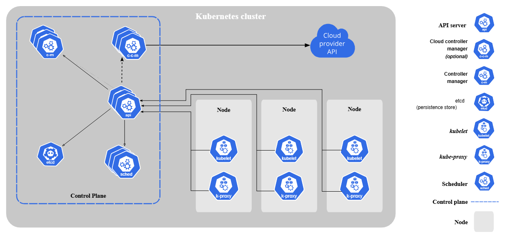
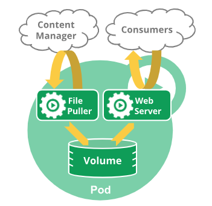

## 测试工具安装

1. 安装kubectl

   ```shell 
   # 第一步
   curl -LO "https://dl.k8s.io/release/$(curl -L -s https://dl.k8s.io/release/stable.txt)/bin/linux/amd64/kubectl"
   # 第二步
   sudo install -o root -g root -m 0755 kubectl /usr/local/bin/kubectl
   # 验证版本号
   kubectl version --client
   ```

2. 安装k3d

   参数 `https://k3d.io/stable/#releases`

## Kubernetes Components

The components of a Kubernetes cluster:



## Pod

* Pods are the smallest deployable units of computing that you can create and manage in Kubernetes

* You don't need to run multiple containers to provide replication (for resilience or capacity)

* Restarting a container in a Pod should not be confused with restarting a Pod. A Pod is not a process, but an
  environment for running container(s). A Pod persists until it is deleted.

* Modifying the pod template or switching to a new pod template has no direct effect on the Pods that already exist.
  > 只会根据新的更新的模板重新创建一个pod

* The name of a Pod must be a valid DNS subdomain value, but this can produce unexpected results for the Pod hostname.
  For best compatibility, the name should follow the more restrictive rules for a DNS label
  
* `kubectl describe pod` 命令。它会告诉你 Pod 启动过程中发生的详细事件记录。

* 怎么知道我的pod有没有启动成功？

  > 1. 宏观检查：`kubectl get pods`
  > 2. 详细诊断：`kubectl describe pod [pod-name]`
  > 3. 深入应用内部：`kubectl logs [pod-name]` 【可以用--previous选择来查看上一次的日志，还可以用-f】


* 确认 Pod 内的应用是否真的正常工作

  > 运行以下命令，它会在你的本地 `8084` 端口和 Deployment 中的一个 Pod 的 `8084` 端口之间建立一个临时的、直接的通道：
  >
  > ```shell
  > kubectl port-forward deployment/springboot3-deployment 8084:8084
  > ```
  >
  > > 在你的**本地计算机**和集群内的 **Pod** 之间，通过 Kubernetes API Server 建立了一条**临时的、加密的、点对点的通信隧道**。
  > >
  > > **没有负载均衡**：`port-forward` 不会在多个副本（replicas）之间轮询或分发流量。所有请求都会被送到同一个 Pod 实例上。
  > >
  > > **会话是“粘性”的**：在你按下 `Ctrl+C` 结束 `port-forward` 命令之前，这个隧道会一直连接到最初选定的那个 Pod。
  > >
  > > **没有自动故障转移**：如果在 `port-forward` 运行期间，它连接的那个 Pod 恰好“坏了”并被 Kubernetes 重启，你的 `port-forward` 连接会**中断**，命令会报错并退出。
  >
  > 还可以在在集群内部测试 ：
  >
  > **启动一个临时的测试 Pod**：我们可以运行一个包含 `curl` 等网络工具的临时 Pod。
  >
  > ```shell
  > # 运行一个临时的 busybox Pod，并在结束后自动删除
  > kubectl run my-test-pod --image=busybox -it --rm -- sh
  > ## kubectl run my-debug-pod --image=curlimages/curl -i --tty --rm -- /bin/sh 这个也可以
  > ```
  >
  > **在临时 Pod 内通过 Service 名称访问**：Kubernetes 自带了 DNS 服务，你可以直接通过 Service 的名称来访问它。
  >
  > ```shell
  > # 假设你已经在 my-test-pod 的 shell 中
  > # 语法: wget -qO- http://[service-name]:[service-port]
  > wget -qO- http://springboot3-service:80
  > ```
  >
  > 如果返回了应用的正确响应，说明 Service 的服务发现和端口转发都是正常的。

* 什么时候会单独定义和使用 Pod

  > **场景示例**：你想测试一下集群内部的网络是否通畅，或者想看某个 `Service` 是否能被访问到。
  >
  > **操作**：你可以快速创建一个包含网络工具（如 `curl`, `ping`, `dig`）的 Pod，然后通过 `kubectl exec` 进入这个 Pod 进行调试。调试结束后，直接删除这个 Pod 即可，不留任何痕迹。
  >
  > **示例 YAML (**`debug-pod.yaml`**)：**
  >
  > ```yaml
  > apiVersion: v1
  > kind: Pod
  > metadata:
  > name: curl-pod
  > spec:
  >  containers:
  >       - name: my-curl # 我们用一个包含 curl 的镜像，并让它一直运行，以便我们能 exec 进去
  >         image: curlimages/curl:latest
  >     command: ["sleep", "3600"] # 让容器保持运行，否则它会立即退出
  > ```
  >
  > **使用命令**:
  >
  >   ```shell
  >   # 创建 Pod
  >   kubectl apply -f debug-pod.yaml
  > 
  >   # 进入 Pod 内部执行命令
  >   kubectl exec -it curl-pod -- sh
  > 
  >   # (在 Pod 内部)
  >   # curl [your-service-name].[namespace].svc.cluster.local
  >   # exit
  > 
  >   # 调试完毕后删除 Pod
  >   kubectl delete pod curl-pod 
  >   ```

* Pods that are part of a DaemonSet tolerate being run on an unschedulable Node. DaemonSets typically provide node-local
  services that should run on the Node even if it is being drained of workload applications.

  > 在 Kubernetes 中，这些“必须安装在每个节点上”的后台服务，就是通过 DaemonSet 来部署的。常见的例子有：日志收集器，节点监控器，网络插件，存储插件

##  Deployment

* Deployment：负责管理和维护你的应用实例（Pod）。它会确保指定数量的 Nginx Pod 正在运行。如果某个 Pod 挂掉了，Deployment
  会自动创建一个新的来替代它
* 在 Deployment（以及 ReplicaSet, StatefulSet, Job, CronJob 等这类控制器）的 Pod 模板（spec.template）中，metadata.name 这个字段是不能设置的。如果你尝试设置它，Kubernetes API Server 会拒绝你的请求。
* Deployment 要能够正常工作（特别是运行多个副本、进行滚动更新和自我修复），其底层的 Pod 必须通过类似 `generateName` 的机制来创建，以保证每个 Pod 名称的唯一性
* The server may generate a name when generateName is provided instead of name in a resource create request. When generateName is used, the provided value is used as a name prefix, which server appends a generated suffix to.

  > Kubernetes v1.31以后会重试8次以使生成唯一的名字
* 在 Deployment（以及 ReplicaSet, StatefulSet, Job, CronJob 等这类控制器）的 Pod 模板（`spec.template`）中，`metadata.name` 这个字段是**不能设置**的。如果你尝试设置它，Kubernetes API Server 会拒绝你的请求。

* 一个 Deployment 实际上并不直接管理 Pod，它的工作流程是这样的：

  1. **Deployment**: 你创建了一个 Deployment 资源，它的名称是固定的（比如 `nginx-deployment`）。这个 Deployment 负责管理“版本”。
  2. **ReplicaSet**: Deployment 会根据自己的 Pod 模板，创建一个 **ReplicaSet** 资源。这个 ReplicaSet 的名称是**动态生成的**，通常是 `[Deployment名称]-[Pod模板的哈希值]`，例如 `nginx-deployment-66b6c48dd5`。这个哈希值确保了每次你更新 Deployment 的 Pod 模板时（比如更换镜像版本），都会创建一个全新的、不同名称的 ReplicaSet。
  3. **Pod**: ReplicaSet 的任务很简单，就是确保有指定数量的、符合其模板的 Pod 正在运行。它会根据自己的名称作为**前缀**，去创建 Pod。所以，最终 Pod 的名称也是**动态生成的**，格式通常是 `[ReplicaSet名称]-[随机后缀]`，例如 `nginx-deployment-66b6c48dd5-x7p9m`。

## Servcie

* Service：负责为一组 Pod 提供一个稳定、统一的访问入口。因为 Pod 是“短暂”的，它们的 IP 地址会变化。Service 提供了一个固定的
  IP 地址和 DNS 名称，使得其他应用或外部用户可以方便地访问到你的 Nginx 服务，而无需关心后端具体是哪个 Pod 在提供服务。

  > Service 的 IP 地址 (`ClusterIP`) 和 DNS 名称的“固定”，是相对于 **Service 这个 API 对象的生命周期** 而言的。
  >
  > 简单来说，只要你不删除这个 Service 对象（`kubectl delete service my-service`），它的 `ClusterIP` 和 DNS 名称就**不会改变**。
  >
  >  FQDN (Fully Qualified Domain Name)： [service-name].[namespace-name].svc.[cluster-domain].
  >
  > * `[cluster-domain]` 集群域名是集群级别的配置，通常是固定的。最可靠的查找方法是进入任意一个正在运行的 Pod，查看它的 DNS 配置文件 `/etc/resolv.conf`
  >
  >   ```shell
  >   # 1. 首先，随便找一个正在运行的 Pod
  >   kubectl get pods
  >   
  >   # 假设我们找到了一个叫 nginx-deployment-6bcfd6f857-klmno 的 Pod
  >   
  >   # 2. 使用 kubectl exec 进入该 Pod 并查看 resolv.conf 文件
  >   kubectl exec -it nginx-deployment-6bcfd6f857-klmno -- cat /etc/resolv.conf
  >   ## 在上面这个命令中，cat 前面的`--` 起到分隔的作用，告诉kubectl的命令已经结束。与docker exec不同，docker exec 不需要这个                                   
  >   ```
  >
  >   输出中`search default.svc.cluster.local svc.cluster.local cluster.local`  最后这个`cluster.local` 就是这个值
  >
  > * 还可以在集群内直接查询
  >
  >   启动一个临时的调试 Pod
  >
  >   ```shell
  >   # 运行一个临时的 busybox Pod，并进入其 shell 环境
  >   kubectl run dns-test -it --rm --image=busybox:1.28 -- sh
  >   ```
  >
  >   在 Pod 内部使用 `nslookup` 进行查询
  >
  >   ```shell
  >   # (因为我们在 default 命名空间里)
  >   nslookup springboot3-service
  >   ```

* 你可以把 app: nginx 理解为你和 Kubernetes 的一个约定：你给一组 Pod 贴上这个独特的“名牌”，然后告诉 Deployment 和 Service
  按照这个“名牌”去认领和查找它们
  
* Service `type` 是 `ClusterIP`【默认值】时ip不直接暴露到集群外部，只能被集群内的 Ingress 控制器找到。type为loadBalancer时, 端口会暴露到集群外。【在k3d中测试时，把service的type设置为loadBalance并不生效】
  
  > `LoadBalancer` 类型是 `NodePort` 的扩展。它会向底层云平台（如 AWS, GCP, Azure）请求一个外部负载均衡器，并将这个负载均衡器的 IP 地址作为 Service 的外部访问入口。
  >
  > - **作用**：这是将服务暴露到公网的 **标准方式**。云服务提供商会为你创建一个负载均衡器，并将流量导向你所有节点的 `NodePort`。
  > - **使用场景**：适用于生产环境，当你需要一个稳定、高可用的公网 IP 来暴露你的服务时。

## Config file

* kubectl 默认会在你的用户主目录下的 .kube 文件夹中寻找名为 config 的文件。

  > 在 Linux 和 macOS 上，路径通常是 ~/.kube/config。

* Most often, you provide the information to kubectl in a file known as a manifest. By convention, manifests are YAML (you could also use JSON format).

* YAML 文件在两种模式下的“角色”
    * 在 kubectl create -f (命令式) 中：YAML 文件是一个一次性的模板。你命令 Kubernetes：“按照这个模板，给我创建一个对象”。创建完成后，这个
      YAML 文件和集群中的那个对象之间，就没有必然的联系了。Kubernetes 不会“记住”你是用哪个文件创建的它。
    * 在 kubectl apply -f (声明式) 中：YAML 文件是对象的**“期望状态”的声明**。你告诉 Kubernetes：“请确保集群中有一个与这个
      YAML 文件描述的状态相匹配的对象”。Kubernetes 不仅会创建这个对象，还会记录下这个“期望状态”，以便于未来的比较和更新。

* 仅仅修改并保存在本地 configs/ 目录下的 YAML 文件，并不会对集群产生任何影响。 Kubernetes 集群完全不知道你本地文件的变化。你必须通过
  kubectl apply 这个动作，明确地告诉 Kubernetes：“请按照我最新的配置文件，去同步集群的状态。”

* 仅仅修改并保存在本地 configs/ 目录下的 YAML 文件，并不会对集群产生任何影响。 Kubernetes 集群完全不知道你本地文件的变化。你必须通过
  kubectl apply 这个动作，明确地告诉 Kubernetes：“请按照我最新的配置文件，去同步集群的状态。”

  ```shell
   kubectl diff -f configs/
  ```

  Our previous example (replicas): The change from kubectl scale was NOT retained because the replicas field was "owned"
  by your YAML file. apply enforced your file's value.

* The note's meaning (LoadBalancer example): Changes from other controllers (like adding a clusterIP) ARE retained, because those fields are not "owned" by your YAML file. The patch mechanism surgically updates only the fields you explicitly manage in your file.

* Starting with Kubernetes v1.25, the API server offers server side field validation that detects unrecognized or duplicate fields in an object. It provides all the functionality of kubectl --validate on the server side.

  > **服务端试运行 (Server-side Dry Run)**
  >
  > ```shell
  > kubectl apply -f [your-manifest].yaml --dry-run=server
  > ```
  >
  > 如果文件有错误，它会像上面的例子一样报错。如果文件格式正确，它会返回一个成功的提示（但不会真的创建资源）。**总之，--dry-run=server 是一个非常安全的验证工具。** 它的设计初衷就是为了让您在真正部署到集群之前，百分之百确认您的配置清单是有效且被集群所接受的，而无需担心会意外创建或修改任何东西。

## Object

Kubernetes objects are persistent entities in the Kubernetes system. Kubernetes uses these entities to represent the state of your cluster. Learn about the Kubernetes object model and how to work with these objects.

* Keep in mind that label Key must be unique for a given object
  
* Names of resources need to be unique within a namespace, but not across namespaces.
  
* When you create an object in Kubernetes, you must provide the object spec that describes its desired state, as well as
  some basic information about the object (such as a name).

* Almost every Kubernetes object includes two nested object fields that govern the object's configuration: the object spec and the object status.

* The status describes the current state of the object, supplied and updated by the Kubernetes system and its components.

  > status可以理解为“看起来是什么样”，而state是“实际是什么样子的”

* Each object in your cluster has a Name that is unique for that type of resource. Every Kubernetes object also has a UID that is unique across your whole cluster.

  > For example, you can only have one Pod named `myapp-1234` within the same namespace, but you can have one Pod and one Deployment that are each named `myapp-1234`.

* **Kubernetes 的世界观是建立在它自己的 API 对象上的**。它通过 Kubelet 等组件来观测外部物理世界的状态，并尽力使其与内部的声明式状态保持一致。但如果外部世界发生了它无法观测到的剧烈变化（比如一个节点被偷偷替换了），而内部的逻辑对象没有被相应更新，就会导致这种“身份混淆”和状态不一致，从而引发各种难以排查的诡异问题。

  > 在物理/虚拟层面销毁一个节点之前，**务必先在 Kubernetes 中将其删除**。
  >
  > 正确的操作流程应该是：
  >
  > 1. **标记节点不可调度**：
  >
  >    ```shell
  >    kubectl cordon worker-01
  >    ```
  >
  >    这能防止新的 Pod 被调度到该节点上。
  >
  > 2. **驱逐节点上的所有 Pod**：
  >
  >    ```shell
  >    kubectl drain worker-01 --ignore-daemonsets
  >    ```
  >
  >    这会安全地将该节点上现有的 Pod 迁移到其他节点。`--ignore-daemonsets` 是因为 DaemonSet 管理的 Pod 不需要被驱逐。
  >
  > 3. **从 Kubernetes 中删除节点对象**：
  >
  >    ```shell
  >    kubectl delete node worker-01
  >    ```
  >
  >    这一步就是“销毁学籍卡”，彻底清除它在 Kubernetes 中的所有记录。
  >
  > 4. **销毁物理/虚拟机**： 现在，你可以安全地去你的云平台或虚拟化平台删除这台服务器了。

* A client-provided string that refers to an object in a [resource](https://kubernetes.io/docs/reference/using-api/api-concepts/#standard-api-terminology) URL, such as `/api/v1/pods/some-name`.

  Only one object of a given kind can have a given name at a time.  Names must be unique across **all API versions** of the same resource. API resources are distinguished by their API group, resource type, namespace (for namespaced resources), and name. In other words, API version is irrelevant in this context.

* In cases when objects represent a physical entity, like a Node representing a physical host, when the host is re-created under the same name without deleting and re-creating the Node, Kubernetes treats the new host as the old one, which may lead to inconsistencies.

  > 1. 标记节点不可调度
  >
  >    kubectl cordon worker-01
  >
  > 2. **驱逐节点上的所有 Pod**
  >
  >    kubectl drain worker-01 --ignore-daemonsets
  >
  > 3. 从 Kubernetes 中删除节点对象
  >
  >    kubectl delete node worker-01

## Kubernetes API 

* There are two mechanisms that Kubernetes uses to publish these API specifications

  > 1. The Discovery API
  > 2. The Kubernetes OpenAPI Document

* 首先，我们必须明白 Discovery API 的目的。无论是 kubectl、Rancher UI 还是任何其他与 Kubernetes 集群交互的客户端，它们在执行操作之前，都需要先知道：
  
  * “这个集群里有哪些 API Group？”: (例如 apps, batch, networking.k8s.io 等)。
  * “每个 Group 下有哪些版本？” : (例如 apps group 下有v1)“
  * 每个 Group/Version 下有哪些资源 (Resource)？” : (例如 apps/v1 下有 deployments, statefulsets, daemonsets 等)
  * “这些资源支持哪些操作 (Verb)？” : (例如 deployments 支持 create, get, list, delete 等)
  
* Unaggregated Discovery (非聚合发现)
  Unaggregated Discovery 指的是 单个 API 服务器自身 提供的、关于 它自己所能服务的 API 的发现信息。

* Aggregated Discovery (聚合发现)
  Aggregated Discovery 正是 Kubernetes API Aggregation Layer (聚合层) 的强大之处。它提供了一个 统一的、聚合后 的视图。
  当客户端（如 kubectl）查询主 kube-apiserver 的发现端点时，聚合层不仅会返回 kube-apiserver 自己的 API 信息，还会智能地将所有已注册的扩展
  API 服务器（通过 APIService 对象注册）的发现信息也一并包含进来并返回。
  
* Kubernetes offers stable support for aggregated discovery, publishing all resources supported by a cluster through two
  endpoints (/api and /apis).
  > * /api: 列出核心 API Group (只有 v1)。【**核心 API (Core API)** 或称为**历史遗留 API (Legacy API)**】
  > * /apis: 列出所有非核心的 API Group (如 apps, batch, apiextensions.k8s.io 等)。【分组 API (Grouped API)】
      >   为什么会有两个端点： 最初的设计: 在 Kubernetes 的早期，所有的 API 资源对象（如 Pod, Service, Node,
      ReplicationController 等）都被放在一个没有名字的 API Group 里，这个 Group 就是我们所说的“核心组 (Core Group)
      ”。由于它没有名字，为了访问它，API Server 就提供了 /api/v1 这个特殊的端点。在当时，这就是 Kubernetes 的全部 API。
      发现扩展性问题: 随着项目的发展，开发者们很快意识到，把所有东西都塞进一个没有分组的 API 里是无法扩展的。如果我想添加一组新的
      API 用于处理“批处理任务”，或者另一组 API 用于处理“网络策略”，把它们都堆在核心组里会变得非常混乱。 “命名组”的诞生:
      为了解决这个问题，Kubernetes 引入了“API Group（命名组）”的概念。这允许开发者根据功能领域将 API 资源进行逻辑分组。例如：
      apps 组：包含 Deployment, StatefulSet, DaemonSet 等。batch 组：包含 Job, CronJob 等。 networking.k8s.io 组：包含
      Ingress, NetworkPolicy 等。 所有这些“命名组”的 API 都通过一个统一的前缀 /apis 来访问，例如
      /apis/apps/v1，/apis/batch/v1。
  
* 执行这个命令，你会看到 kubectl 正在向 apiserver 发出一系列的 GET 请求来发现资源

  ```shell
  kubectl get pods --v=8
  ```

* 查询所有可用api

  ```shell
  kubectl api-versions
  ```

* 直接访问 API Server去查询有哪些有用api-versions

  `kubectl` 命令实际上是在后台向 Kubernetes API Server 发送 HTTP 请求。我们也可以手动模拟这个过程来探索 API。为了安全地访问 API Server，最简单的方式是使用 `kubectl proxy`。

  在一个终端中运行以下命令，让这个终端保持运行。

  ```shell
  kubectl proxy
  ```

  打开另一个终端，使用 `curl` 进行查询。

  ```shell
  curl http://127.0.0.1:8001/api
  ## /apis
  curl http://127.0.0.1:8001/apis
  ```

* 查询所有可用的 API 资源 (`api-resources`)

  ```shell
  kubectl api-resources
  # --api-group="" 表示查询核心组
  kubectl api-resources --api-group=""
  ```

* Without indicating the resource type using the Accept header, the default response for the /api and /apis endpoint is
  an unaggregated discovery document.
  
* the kubectl tool fetches and caches the API specification for enabling command-line completion and other features. The
  two supported mechanisms are as follows:
  
    * Discovery API 就像是这本书的 “目录”。
    * OpenAPI Document 就像是这本书 “正文内容中所有名词的详细解释和语法结构说明”

## k3d 测试相关

* 在生产环境中，通常会有多个 Master 节点（在 k3d/k3s 里被称为 Server 节点）来确保高可用性。你不会直接连接到某一个 Master 节点，因为如果那个节点宕机了，你就无法访问集群了。正确的做法是连接到一个**负载均衡器 (Load Balancer)**，由它来将你的请求转发给后面健康的 Master 节点。

  k3d 在本地用 Docker 容器巧妙地复现了这套架构：

  1. **`k3d-my-cluster-server-0` 容器**: 这是真正的 K3s Server，它在**容器内部**运行着 Kubernetes API Server，监听着 `6443` 端口。这个容器没有直接暴露端口到宿主机，所以你从外部无法直接访问它。
  2. **`k3d-my-cluster-serverlb` 容器**: 这是一个基于 NGINX 的反向代理/负载均衡器。k3d 启动它，并让它监听宿主机的一个端口，然后将流量转发给后端的 K3s Server 容器。

* 你的 kubectl 并不是直接和 K3s Server 容器通信。它在和一个作为负载均衡器的代理容器 (k3d-my-cluster-serverlb) 通信。这个代理容器负责将你的请求安全地转发给真正的 K3s Server 容器。39753 是 k3d 为这个负载均衡器随机选择的、暴露在你宿主机上的端口。

* 在k3d里测试时，设置type=LoadBalancer时没有用，即使设置k3d cluster create my-cluster -p "8080:80@loadbalancer"，需要映射type=NodePort 的端口，如8080:30080

* 在用k3d做测试时，集群节点 "看" 不到你本地机器上的 Docker 镜像

  > 1. 使用 `k3d image import` 命令
  >
  >    `k`3d image import springboot3:v1.0.10 -c my-cluster``
  >
  > 2. **修改你的 Deployment YAML 文件**
  >
  >    imagePullPolicy: IfNotPresent # <-- 关键！添加这一行
  >
  > 在生产环境或更复杂的开发环境中，最佳实践是搭建一个镜像仓库（Registry），比如 Harbor、Nexus，或者直接使用 Docker Hub、阿里云 ACR 等。

## Label


* Labels are key/value pairs. Valid label keys have two segments: an optional prefix and name, separated by a slash (/).

  > Valid label value:
  >
  > - must be 63 characters or less (can be empty),
  > - unless empty, must begin and end with an alphanumeric character (`[a-z0-9A-Z]`),
  > - could contain dashes (`-`), underscores (`_`), dots (`.`), and alphanumerics between.

* The API currently supports two types of selectors: equality-based and set-based. 

* If the prefix is omitted, the label Key is presumed to be private to the user. Automated system components (e.g. kube-scheduler, kube-controller-manager, kube-apiserver, kubectl, or other third-party automation) which add labels to end-user objects must specify a prefix.

* the comma separator acts as a logical AND (&&) operator.

* selector: { component: redis } 是旧版的、简洁的写法。

  selector: { matchLabels: { component: redis } } 是新版的、更结构化、更推荐的写法。

  Kubernetes API 在处理第一种写法时，会自动将其理解为第二种写法。

* Newer resources, such as Job, Deployment, ReplicaSet, and DaemonSet, support set-based requirements as well.

  > ```yaml
  > selector:
  >   matchLabels:
  >     component: redis
  >   matchExpressions:
  >     - { key: tier, operator: In, values: [cache] }
  >     - { key: environment, operator: NotIn, values: [dev] }
  > 
  > ```

* set-based requirements 应用用引号包起来

  > kubectl get pods -l 'environment in (production),tier in (frontend)'

* kubectl get pods -l environment=production,tier=frontend

* kubectl get pods -Lapp -Ltier -Lrole

  > ‘-L’ 参数不是过滤作用，而是在最终的查询结果中以列的形式显示

* 更新label

  > ```shell
  > kubectl label pods -l app=nginx tier=fe
  > ```
  >
  > This first filters all pods with the label "app=nginx", and then labels them with the "tier=fe"。除了用-l app=nginx标签来过滤，还可以用pod的名字来过滤需要操作的pods
  >
  > 默认情况下，当已经存在tier标签时，不会更新成功。可以加入`kubectl label --overwrite pods`这个参数

## Namespace


* Namespace-based scoping is applicable only for namespaced objects (e.g. Deployments, Services, etc.) and not for cluster-wide objects (e.g. StorageClass, Nodes, PersistentVolumes, etc.)

* For a production cluster, consider not using the default namespace. Instead, make other namespaces and use those.

* Kubernetes starts with four initial namespaces:

  > 1. default
  > 2. kube-node-lease
  > 3. kube-public
  > 4. kube-system

* Avoid creating namespaces with the prefix kube-, since it is reserved for Kubernetes system namespaces.

* kubectl get namespace

* To set the namespace for a current request, use the --namespace flag.

  > ```shell
  > kubectl run nginx --image=nginx --namespace=[insert-namespace-name-here]
  > kubectl get pods --namespace=[insert-namespace-name-here]
  > ```

* You can permanently save the namespace for all subsequent kubectl commands in that context.

  > ```shell
  > kubectl config set-context --current --namespace=[insert-namespace-name-here]
  > # Validate it
  > kubectl config view --minify | grep namespace:
  > ```

* Not all objects are in a namespace

  > However namespace resources are not themselves in a namespace. And low-level resources, such as nodes and persistentVolumes, are not in any namespace.
  >
  > ```shell
  > # In a namespace
  > kubectl api-resources --namespaced=true
  > 
  > # Not in a namespace
  > kubectl api-resources --namespaced=false
  > ```

* The Kubernetes control plane sets an immutable label kubernetes.io/metadata.name on all namespaces. The value of the label is the namespace name

  > kubectl describe namespaces kube-system

* The keys and the values in the map must be strings. In other words, you cannot use numeric, boolean, list or other types for either the keys or the values.

## Annotations


* Annotations are key/value pairs. Valid annotation keys have two segments: an optional prefix and name, separated by a slash (/). 

  > The name segment is required and must be 63 characters or less, beginning and ending with an alphanumeric character (`[a-z0-9A-Z]`) with dashes (`-`), underscores (`_`), dots (`.`), and alphanumerics between.

* Shared labels and annotations share a common prefix: app.kubernetes.io. Labels without a prefix are private to users. The shared prefix ensures that shared labels do not interfere with custom user labels.

  > **Shared Labels** 是一套 **官方推荐的、标准化的标签**。它们使用 `app.kubernetes.io/` 这个统一的前缀，目的是为了让不同的工具、团队和用户能够用一种通用的方式来描述和识别在 Kubernetes 中运行的应用程序

* The metadata is organized around the concept of an application. Kubernetes is not a platform as a service (PaaS) and doesn't have or enforce a formal notion of an application. Instead, applications are informal and described with metadata. The definition of what an application contains is loose.

## Field selectors


* Field selectors are essentially resource filters. By default, no selectors/filters are applied, meaning that all resources of the specified type are selected. This makes the kubectl queries kubectl get pods and kubectl get pods --field-selector "" equivalent.

* You can use the =, ==, and != operators with field selectors (= and == mean the same thing). 

  > kubectl get services --all-namespaces --field-selector metadata.namespace!=default

* As with label and other selectors, field selectors can be chained together as a comma-separated list. 

  > kubectl get pods --field-selector=status.phase!=Running,spec.restartPolicy=Always

## Finalizer


* Finalizer 是一个存在于资源对象 metadata 中的字符串列表。

* 这个 Finalizer 确保了当你删除这个 Service 时，Kubernetes 会先调用云平台的 API 去删除那个真实的、会产生费用的负载均衡器，然后再删除 Service 对象本身。如果没有这个机制，你可能会留下很多无人管理的“僵尸”云资源。

  > **Finalizer**: `service.kubernetes.io/load-balancer-cleanup` (在一些云厂商的实现中)

* 为什么资源会卡在 Terminating 状态？🚨
  这是你在实践中一定会遇到的经典问题。当一个资源长时间处于 Terminating 状态时，几乎 100% 是 Finalizer 导致的。

  > **原因**：负责清理并移除那个 Finalizer 的控制器**无法完成它的工作**。

* Finalizers are namespaced keys that tell Kubernetes to wait until specific conditions are met before it fully deletes resources marked for deletion. Finalizers alert controllers to clean up resources the deleted object owned.

  > **Marked for deletion (标记为删除)**: 资源有了 `deletionTimestamp`，处于 `Terminating` 状态。它对外已经“死亡”（比如 Pod 不再接收流量），但它的“尸体”（在 etcd 中的记录）还在。
  >
  > **Fully deleted (彻底删除)**: 资源的记录从 etcd 中被彻底抹除，它不复存在了。
  >
  > **Specific conditions are met (特定条件被满足)**: 这个“特定条件”非常明确，**指的就是** `metadata.finalizers` **列表变为空**。
  >
  > 那么谁来清空这个列表呢？答案是**控制器 (Controller)**。
  >
  > - 每个 Finalizer 字符串都对应一个正在运行的控制器。
  > - 这个控制器一直在监控，当它发现自己负责的资源出现了 `deletionTimestamp` 时，它就知道该干活了（执行清理任务）。
  > - 清理任务完成后（比如云硬盘被删了，数据库备份好了），控制器就会发起一个 API 请求，把自己负责的那个 Finalizer 字符串从列表中**移除**。
  > - 当所有控制器都完成了自己的任务，`finalizers` 列表就变空了。
  >
  > 它实际上是一个**字符串**。这些字符串存在于一个列表里，位置在 `metadata.finalizers`
  >
  > 它们像带有名空间的键一样，是独一无二的标识符
  >
  > 简单来说：你可以把它理解为“带有唯一前缀的特殊标签”。
  >
  > ```yaml
  > metadata:
  >   finalizers:
  >   - kubernetes.io/pv-protection  # 一个遵循 "namespaced key" 格式的字符串
  >   - another.tool.com/do-backup    # 另一个遵循同样格式的字符串
  > ```

* Custom finalizer names must be publicly qualified finalizer names, such as example.com/finalizer-name. Kubernetes enforces this format; the API server rejects writes to objects where the change does not use qualified finalizer names for any custom finalizer.

* Dependent objects also have an ownerReferences.blockOwnerDeletion field that takes a boolean value and controls whether specific dependents can block garbage collection from deleting their owner object. Kubernetes automatically sets this field to true if a controller (for example, the Deployment controller) sets the value of the metadata.ownerReferences field. You can also set the value of the blockOwnerDeletion field manually to control which dependents block garbage collection.

  > 关系链: Deployment -> ReplicaSet -> Pod。
  >
  > 删除链: 删除 Deployment -> 删除 ReplicaSet -> 删除 Pod。
  >
  > blockOwnerDeletion: true: 是一个 “刹车”。Dependent 对象对 Owner 说：“别删我老板，除非我先走！”
  >
  > kubectl delete deployment 触发的是一个“有序解散”，而非“斩首行动【直接删除deployment】”

* In foreground deletion, it adds the foreground finalizer so that the controller must delete dependent resources that also have ownerReferences.blockOwnerDeletion=true before it deletes the owner.

* kubectl delete deployment my-app --cascade=orphan

  > **会发生什么？**
  >
  > 1. `Deployment` **对象被立即删除**：`my-app` 这个 `Deployment` 资源瞬间就消失了。
  > 2. `ReplicaSet` **和** `Pod` **完好无损**：你会惊讶地发现，`ReplicaSet` 和所有的 `Pod` 依然在运行！
  > 3. `ReplicaSet` **成为孤儿**：如果你查看那个幸存的 `ReplicaSet` 的 YAML (`kubectl get rs [rs-name] -o yaml`)，你会发现它 `metadata` 里的 `ownerReferences` 字段**已经不见了**。它不再属于任何人，变成了一个独立的、没人管理的 `ReplicaSet`。

## 其它

* `kind: Ingress` 会暴露一个 IP 地址吗？

  > 不会，`Ingress` 资源本身不会。一个 `kind: Ingress` 的 YAML 文件，它仅仅是**一套规则**的集合，就像一张写着“`a.com` 的流量请走A门，`b.com` 的流量请走B门”的说明书。这张说明书本身并没有地址，它需要被人（也就是 `Ingress Controller`）去阅读和执行。
  >
  > 真正暴露 IP 地址的，是 `Ingress Controller` 的 `Service`！
  >
  > 回顾一下 `Ingress Controller` 是如何被安装的：
  >
  > 1. **Ingress Controller 是一个需要被**`安装`**到集群中的应用**，它不是 K8s 自带的。
  > 2. **安装的本质**是应用一套包含了 `Deployment`、`Service`、`RBAC` 等资源的 YAML 文件。
  > 3. **K3s 用户最幸福**，因为 K3s 已经内置了 **Traefik**，无需手动安装。你只需要直接在 `Ingress` 中使用 `ingressClassName: "traefik"` 即可。
  > 4. 在**标准 K8s 环境**中，最常用的选择是 **NGINX Ingress Controller**，可以通过官方 `kubectl apply` 命令或 `Helm` Chart 来安装。
  > 5. **`IngressClass` 资源是在安装 Controller 的过程中被自动创建的**。它像一个“告示牌”，告诉整个集群：“嘿，我这里有一个名为 `nginx` (或 `traefik`) 的 Controller，你们谁需要处理 Ingress 规则，就通过 `ingressClassName` 来找我！”
  >
  > 现在，`Ingress` (规则)、`Ingress Controller` (执行者) 和 `IngressClass` (联系方式) 这三者之
  >
  > 它通常包含一个 `Deployment` (运行 Controller 的 Pods) 和一个 `Service` (把这些 Pods 暴露出去)。这个 `Service` 的类型通常是 `LoadBalancer` 或 `NodePort`。
  >
  > - 当 `Service` 的类型是 `LoadBalancer` 时，云服务商会为**这个 Service**分配一个**公网 IP 地址**。
  > - 当 `Service` 的类型是 `NodePort` 时，你可以通过**任何一个节点的 IP** + `NodePort` 端口来访问。
  >
  > 那个宝贵的、唯一的、对外服务的公网 IP 地址，是属于 **Ingress Controller 的 Service** 的，而不是属于你创建的某一个 `Ingress` 规则对象的。
  >
  > 你可以通过以下命令查看到这个 IP 地址：
  >
  > ```shell
  > # 查看 Ingress Controller 的 Service
  > # 注意命名空间，如果你是用 helm 装的 nginx-ingress，那就在 ingress-nginx 命名空间
  > # 如果是 k3s 自带的 traefik，那就在 kube-system
  > kubectl get service -n ingress-nginx 
  > 
  > # 你会看到类似这样的输出
  > # NAME                       TYPE           CLUSTER-IP      EXTERNAL-IP      PORT(S)                      AGE
  > # ingress-nginx-controller   LoadBalancer   10.43.151.108   203.0.113.55     80:32168/TCP,443:30256/TCP   10m
  > #                                                          ^^^^^^^^^^^^
  > # 就是这个 IP！
  > ```


* 故障排查三步法

  > 第 1 步：确认 Pods 是否健康运行
  >
  > ```shell
  > kubectl get pods -o wide
  > ```
  >
  > 第 2 步：确认 Service 是否正确关联了 Pods
  >
  > ```shell
  > kubectl describe service nginx-service
  > ```
  >
  > **正确的状态**: `Endpoints` 后面应该列出了一个或多个 IP 地址和端口，这些 IP 应该与你在上一步中看到的 Pod IP 完全一致。`Endpoints:         10.42.0.5:80,10.42.0.6:80`
  >
  > 第 3 步：确认 k3d 节点的端口映射 (最可能的原因)

* 最快、最直接的绕过网络问题的方法，我们在上次讨论中也提到了。它不依赖任何端口映射，而是直接在你的电脑和 Service 之间建立一条隧道。

  > ```shell
  > # 在新终端中运行
  > kubectl port-forward service/nginx-service 8080:80
  > ```

* MetalLB (强烈推荐) 这是在自建集群（Bare-Metal）中实现 type: LoadBalancer 的最佳实践方案。MetalLB 是一个开源项目，它能为你的集群模拟云服务商的负载均衡器功能。

* 使用 kubectl explain 命令：这是一个非常有用的命令，可以帮助你了解任何 Kubernetes 资源的结构和字段。例如，如果你想知道 Deployment 的 apiVersion

* 一个完整的应用[系统]，一般只有一个type为loadbalancer的service?

  > * 对于一个完整的、现代化的应用系统（特别是基于微服务架构的 Web 应用），通常最佳实践就是只使用一个 Type=LoadBalancer 的 Service。标准的应用暴露架构：“LoadBalancer + Ingress Controller”
  >
  > * 如果你的应用系统包含一些非 HTTP/HTTPS 的服务，比如：
  >
  >   * 一个需要直接暴露给外部客户端的 数据库 (如 PostgreSQL)。
  >   * 一个 MQTT 消息代理服务。
  >   * 一个 SFTP 文件服务。
  >
  >   这些服务工作在 TCP/UDP 层，Ingress Controller（通常为 HTTP 设计）无法处理。在这种情况下，为这些特定的服务再额外创建一个独立的 Type=LoadBalancer Service 是完全合理的。

* In case of a Node, it is implicitly assumed that an instance using the same name will have the same state (e.g.network settings, root disk contents) and attributes like node labels.

  > 这里的instance是指虚拟机或者物理机。 Kubernetes
  > 认‘名’不认‘人’。它把节点名称当作身份证号。如果一个新人拿了旧人的身份证号来报到，系统会把他当成旧人，但这个新人的能力和背景（磁盘内容、硬件属性）是全新的。这种身份与实际能力的不匹配，正是很多诡异问题的根源。请务必确保在替换节点时，先‘注销’旧的身份信息（kubectl
  > delete node），再让新人用自己的身份注册。

* Register the node with the given list of taints

  > 可以把 Taint (污点) 想象成节点（Node）上的一个“排斥标签”或者“谢绝入内”的牌子。 一旦一个节点被打上了某个
  > Taint，Kubernetes 的调度器（Scheduler）默认就不会把任何 Pod 调度到这个节点上。这就好像一个房间门口挂着“请勿打扰”的牌子，正常情况下，没有人会进去。

## Container

### Container hooks

- PostStart

  However, if the `PostStart` hook takes too long to execute or if it hangs, it can prevent the container from transitioning to a `running` state.

- PreStop

  `PreStop` hooks are not executed asynchronously from the signal to stop the Container; the hook must complete its execution before the TERM signal can be sent. 

> **Hook 失败的影响**：
>
> - `postStart` Hook 失败：如果 `postStart` Hook 执行失败，容器将无法进入 `Running` 状态，`kubelet` 会杀死并尝试重启这个容器，导致 Pod 进入 `CrashLoopBackOff` 状态。
> - `preStop` Hook 失败：`preStop` Hook 的失败不会阻止容器的终止。Kubernetes 在尝试执行 `preStop` Hook 后（无论成功与否），仍然会向容器的主进程发送 `TERM` 信号。
>
> 其实也可以总结为这两个hook只要有一个失败，容器都会被killed

### Hook handler implementations

- Exec

1. **执行环境**：`Exec` 类型的 Hook Handler **完全在容器内部执行**。它和你在容器启动后使用 `kubectl exec` 或 `docker exec` 进入容器执行命令的环境是一模一样的。
2. **资源归属**：因此，这个脚本或命令所消耗的 **所有资源（CPU、内存等）都计算在该容器的账上**。它会受到为该容器配置的 `resources.limits` 和 `resources.requests` 的约束。
3. - 

- HTTP
- Sleep

>  `httpGet`, `tcpSocket` ([deprecated](https://kubernetes.io/docs/reference/generated/kubernetes-api/v1.31/#lifecyclehandler-v1-core)) and `sleep` are executed by the kubelet process, and `exec` is executed in the container.

### Hook delivery guarantees

这些hook可能会运行多次。这个概念在分布式系统中非常常见，被称为 **“至少一次 (At-Least-Once)”** 投递语义

### Debugging Hook handlers

这些Hook handlers如果执行失败，可以执行像类似的语句来查看日志`kubectl describe pod lifecycle-demo`

## Workloads

A workload is an application running on Kubernetes. Whether your workload is a single component or several that work together, on Kubernetes you run it inside a set of [*pods*](https://kubernetes.io/docs/concepts/workloads/pods/). In Kubernetes, a Pod represents a set of running [containers](https://kubernetes.io/docs/concepts/containers/) on your cluster.

several **built-in workload resources**:

* [Deployment](https://kubernetes.io/docs/concepts/workloads/controllers/deployment/) and [ReplicaSet](https://kubernetes.io/docs/concepts/workloads/controllers/replicaset/) (replacing the legacy resource [ReplicationController](https://kubernetes.io/docs/reference/glossary/?all=true#term-replication-controller)).
* [StatefulSet](https://kubernetes.io/docs/concepts/workloads/controllers/statefulset/) 
* [DaemonSet](https://kubernetes.io/docs/concepts/workloads/controllers/daemonset/) defines Pods that provide facilities that are local to nodes. 
* [Job](https://kubernetes.io/docs/concepts/workloads/controllers/job/) and [CronJob](https://kubernetes.io/docs/concepts/workloads/controllers/cron-jobs/) provide different ways to define tasks that run to completion and then stop. You can use a [Job](https://kubernetes.io/docs/concepts/workloads/controllers/job/) to define a task that runs to completion, just once. You can use a [CronJob](https://kubernetes.io/docs/concepts/workloads/controllers/cron-jobs/) to run the same Job multiple times according a schedule.

In the wider Kubernetes ecosystem, you can find third-party workload resources that provide additional behaviors. Using a [custom resource definition](https://kubernetes.io/docs/concepts/extend-kubernetes/api-extension/custom-resources/), you can add in a third-party workload resource if you want a specific behavior that's not part of Kubernetes' core. 

### Pods

*Pods* are the smallest deployable units of computing that you can create and manage in Kubernetes. 你可以把一个 Pod 想象成一台独立的“逻辑主机”或虚拟机。这台“主机”有自己唯一的 IP 地址。

Pods in a Kubernetes cluster are used in two main ways:

- **Pods that run a single container**. 

- **Pods that run multiple containers that need to work together**. 

  You should use this pattern only in specific instances in which your containers are tightly coupled. You don't need to run multiple containers to provide replication (for resilience or capacity);

#### Using Pods

```yaml
apiVersion: v1
kind: Pod
metadata:
  name: nginx
spec:
  containers:
  - name: nginx
    image: nginx:1.14.2
    ports:
    - containerPort: 80
```

Pods are generally not created directly and are created using workload resources. Instead, create them using workload resources such as [Deployment](https://kubernetes.io/docs/concepts/workloads/controllers/deployment/) or [Job](https://kubernetes.io/docs/concepts/workloads/controllers/job/). If your Pods need to track state, consider the [StatefulSet](https://kubernetes.io/docs/concepts/workloads/controllers/statefulset/) resource.

#### Working with Pods

Pods are designed as relatively ephemeral, disposable entities. The Pod remains on that node until the Pod finishes execution, the Pod object is deleted, the Pod is *evicted* for lack of resources, or the node fails.

> #### Note:
>
> Restarting a container in a Pod should not be confused with restarting a Pod. A Pod is not a process, but an environment for running container(s). A Pod persists until it is deleted.

The name of a Pod must be a valid [DNS subdomain](https://kubernetes.io/docs/concepts/overview/working-with-objects/names/#dns-subdomain-names) value, but this can produce unexpected results for the Pod hostname. For best compatibility, the name should follow the more restrictive rules for a [DNS label](https://kubernetes.io/docs/concepts/overview/working-with-objects/names/#dns-label-names).

##### Pod OS

1. 对 `.spec.os.name` 字段的理解

   在 Pod 的 YAML 中设置 `.spec.os.name` 字段**并不会影响 `kube-scheduler` (调度器) 的实际调度决策**。它的主要作用有两点：

   1. **声明与识别 (Declaration & Identification)**: 它是一个明确的元数据字段，用来**声明**这个 Pod 内的容器是为哪个操作系统构建的（目前是 `linux` 或 `windows`）。这使得集群中的其他组件或工具（比如监控系统、安全策略工具）能够轻松识别 Pod 的操作系统类型。
   2. **策略应用 (Policy Enforcement)**: 如文档中提到的，`Pod Security Standards` (Pod 安全标准) 会利用这个字段。例如，某些安全策略只适用于 Linux 环境（比如与 `seccomp` 或 `AppArmor` 相关的策略），在 Windows 节点上强制执行这些策略是没有意义的。通过读取 `.spec.os.name`, 系统可以智能地避免在不相关的操作系统上应用这些策略。
   3. **面向未来 (Future-proofing)**: 社区可能在未来的版本中赋予这个字段更多的功能，甚至可能直接影响调度。但就目前而言，它更多的是一个描述性、供其他组件消费的字段。

2. `kubernetes.io/os` Label 打在哪个资源上？

   `kubernetes.io/os` 是一个 **Node Label** (节点标签)。它被打在 **Node (节点)** 资源上。你可以通过以下命令来查看你集群中所有节点的标签:

   ```shell
   kubectl get nodes --show-labels
   ```

   > `kubernetes.io/os` 这个标签主要是**由 `kubelet` 自动添加**的。
   >
   > kubectl describe node [your-node-name] 看到相应的System Info

3. 到底是什么决定了 Pod 分配到对应的操作系统？

   真正决定 Pod 被调度到特定操作系统节点上的机制，是 **Pod Spec (Pod 规约) 中的调度约束**与 **Node (节点) 上的标签**之间的匹配。

   ```yaml
   apiVersion: v1
   kind: Pod
   metadata:
     name: my-windows-pod
   spec:
     # 步骤 1: 声明 Pod 的操作系统类型
     # 这本身不影响调度，但是一个好习惯，也为了符合安全策略等。
     os:
       name: windows
    ...
     nodeSelector:
       kubernetes.io/os: windows
   ```

为了方便你记忆，我们可以做一个简单的类比：

| 字段/机制                         | 功能                   | 好比是...                                                    |
| --------------------------------- | ---------------------- | ------------------------------------------------------------ |
| **`.spec.os.name`**               | **声明 (Declaration)** | 包裹上的“内含物品”清单，写着“Windows 软件”。                 |
| **Node Label `kubernetes.io/os`** | **属性 (Attribute)**   | 每个房门上的标签，写着“本户使用 Windows 系统”或“本户使用 Linux 系统”。 |
| **Pod `nodeSelector`**            | **指令 (Instruction)** | 快递单上的“投递要求”，明确指示：“必须投递到使用 Windows 系统的住户”。 |

##### Pods and controllers

You can use workload resources to create and manage multiple Pods for you.

Here are some examples of workload resources that manage one or more Pods:

- [Deployment](https://kubernetes.io/docs/concepts/workloads/controllers/deployment/)
- [StatefulSet](https://kubernetes.io/docs/concepts/workloads/controllers/statefulset/)
- [DaemonSet](https://kubernetes.io/docs/concepts/workloads/controllers/daemonset)

##### Pod templates

PodTemplates are specifications for creating Pods, and are included in workload resources such as [Deployments](https://kubernetes.io/docs/concepts/workloads/controllers/deployment/), [Jobs](https://kubernetes.io/docs/concepts/workloads/controllers/job/), and [DaemonSets](https://kubernetes.io/docs/concepts/workloads/controllers/daemonset/).  The `PodTemplate` is part of the desired state of whatever workload resource you used to run your app.

the sample:

```yaml
apiVersion: batch/v1
kind: Job
metadata:
  name: hello
spec:
  template:
    # This is the pod template
    spec:
      containers:
      - name: hello
        image: busybox:1.28
        command: ['sh', '-c', 'echo "Hello, Kubernetes!" && sleep 3600']
      restartPolicy: OnFailure
    # The pod template ends here
```

#### Pod update and replacement

Kubernetes doesn't prevent you from managing Pods directly. 虽然 Kubernetes **允许** 你直接操作 Pod，但这通常是一种**反模式（anti-pattern）**，主要用于调试或紧急情况。

用edit 交互式去更新：`kubectl edit pod [pod-name]` ；还可以用patch去更新 `kubectl patch pod my-test-pod -p '{"spec":{"activeDeadlineSeconds":60}}'`

#### Resource sharing and communication

pod内的containers共用一个ip, 不同的container如果想要expose端口，只能是不同的。同一pod里面的container用localhost+端口进行通讯

#### Static Pods

我们平时用 `kubectl apply -f my-pod.yaml` 创建的 Pod，我们称之为**标准 Pod** 或 **API Server 管理的 Pod**。它们的生命周期完全由 Kubernetes 的控制平面（特别是 API Server）来管理。

而**静态 Pod**则完全不同。

- **定义**：静态 Pod 是直接由特定节点上的 **Kubelet** 守护进程管理的 Pod，它不通过 API Server 进行管理。
- **来源**：Kubelet 会监视其所在节点上的一个特定目录（通常是 `/etc/kubernetes/manifests`）。任何放在这个目录下的标准 Pod 定义 YAML/JSON 文件，都会被 Kubelet 自动识别并创建为静态 Pod。
- **生命周期**：
  - **创建**：将 Pod 的 YAML 文件放入 Kubelet 的监视目录。
  - **删除**：从该目录中删除 Pod 的 YAML 文件。
  - **更新**：修改该目录中的 Pod YAML 文件（Kubelet 会自动停止旧的 Pod，并根据新文件启动新的 Pod）。

**镜像 Pod (Mirror Pod)**
现在我们回到了你问题的核心。既然静态 Pod 不受 API Server 管理，那我们执行 kubectl get pods 时，能看到它们吗？如果看不到，那集群管理员就无法感知到这些关键组件的存在，这会给监控和管理带来麻烦。

* **定义**：当 Kubelet 在节点上成功创建了一个静态 Pod 后，它会**自动地**、**主动地**在 API Server 上为这个静态 Pod 创建一个对应的、**只读的**对象。这个在 API Server 上的对象就叫做“镜像 Pod”。
* **目的**：它的唯一目的就是让这个静态 Pod 在 Kubernetes 的 API 中**可见 (Visible)**。

#### Pods with multiple containers

For example, you might have a container that acts as a web server for files in a shared volume, and a separate [sidecar container](https://kubernetes.io/docs/concepts/workloads/pods/sidecar-containers/) that updates those files from a remote source, as in the following diagram:




#### Pod Lifecycle

 Pods follow a defined lifecycle, starting in the `Pending` [phase](https://kubernetes.io/docs/concepts/workloads/pods/pod-lifecycle/#pod-phase), moving through `Running` if at least one of its primary containers starts OK, and then through either the `Succeeded` or `Failed` phases depending on whether any container in the Pod terminated in failure.

##### Pod lifetime

Pods are only [scheduled](https://kubernetes.io/docs/concepts/scheduling-eviction/) once in their lifetime; assigning a Pod to a specific node is called *binding*, and the process of selecting which node to use is called *scheduling*. 

You can use [Pod Scheduling Readiness](https://kubernetes.io/docs/concepts/scheduling-eviction/pod-scheduling-readiness/) to delay scheduling for a Pod until all its *scheduling gates* are removed. For example, you might want to define a set of Pods but only trigger scheduling once all the Pods have been created.

> 可以定义不同的调度门，在真的被schedule之前需要相就的controller 被这些调度门都删除

##### Pods and fault recovery

不会把那个旧的、失败的 Pod 实例（identified by a UID）拿起来，拍拍灰尘，然后放到一个新节点上让它继续运行。我们是直接放弃旧的，然后由像 Deployment 这样的控制器创建一个全新的替代品，这个替代品再由调度器找一个新家。

node故障 vs Pod 故障：

| 特性               | 场景 1: 节点宕机 (Node Failure)        | 场景 2: Pod 故障 (Pod Failure on Healthy Node) |
| ------------------ | -------------------------------------- | ---------------------------------------------- |
| **主要处理者**     | `kube-controller-manager` (在控制平面) | `kubelet` (在工作节点上)                       |
| **处理对象**       | 整个 **Pod 对象**                      | Pod 内部的**容器 (Container)**                 |
| **结果**           | 旧 Pod 被驱逐/删除；**创建全新的 Pod** | **在同一个 Pod 内重启容器**                    |
| **Pod UID**        | 替代品的 UID 是**新的**                | Pod 的 UID **保持不变**                        |
| **Pod IP 地址**    | 替代品的 IP 地址是**新的**             | Pod 的 IP 地址**保持不变**                     |
| **所在节点**       | 替代品被调度到**新的健康节点**上       | 仍然在**原来的节点**上                         |
| **恢复速度**       | 较慢 (分钟级别，有 5 分钟等待期)       | 非常快 (秒级)                                  |
| **`kubectl` 表现** | 旧 Pod 消失，新 Pod 出现               | 同一个 Pod 的 `RESTARTS` 计数增加              |

##### Associated lifetimes

When something is said to have the same lifetime as a Pod, such as a [volume](https://kubernetes.io/docs/concepts/storage/volumes/), that means that the thing exists as long as that specific Pod (with that exact UID) exists. 


这个multi-container Pod 一旦结束生命，那么所关联的Volume也将结束。

##### Pod phase

Here are the possible values for `phase`:

| Value       | Description                                                  |
| :---------- | :----------------------------------------------------------- |
| `Pending`   | The Pod has been accepted by the Kubernetes cluster, but one or more of the containers has not been set up and made ready to run. This includes time a Pod spends waiting to be scheduled as well as the time spent downloading container images over the network. |
| `Running`   | The Pod has been bound to a node, and all of the containers have been created. At least one container is still running, or is in the process of starting or restarting. |
| `Succeeded` | All containers in the Pod have terminated in success, and will not be restarted. |
| `Failed`    | All containers in the Pod have terminated, and at least one container has terminated in failure. That is, the container either exited with non-zero status or was terminated by the system, and is not set for automatic restarting. |
| `Unknown`   | For some reason the state of the Pod could not be obtained. This phase typically occurs due to an error in communicating with the node where the Pod should be running. |

> Make sure not to confuse *Status*, a kubectl display field for user intuition, with the pod's `phase`.  When a pod is failing to start repeatedly, `CrashLoopBackOff` may appear in the `Status` field of some kubectl commands. Similarly, when a pod is being deleted, `Terminating` may appear in the `Status` field of some kubectl commands.

> **Kubernetes Pod 终止生命周期 (v1.27+) 核心知识点**
>
> **1. 核心变化：**
>
> - 自 K8s v1.27 起，被删除的 Pod 不会从 `Terminating` 状态直接消失。
> - 它会先根据容器的最终退出码，过渡到一个明确的**终端阶段**：`Succeeded` (所有容器退出码为0) 或 `Failed` (至少一个容器退出码非0)。
> - **目的**：极大增强了 Pod 的**可观测性**，方便准确追踪一次性任务（如 Job）的最终成败。
>
> **2. “终端阶段”停留时长由谁决定？**
>
> 这个停留时间由两种机制控制，**优先级从高到低**：
>
> - **机制一 (精确控制 - 推荐): `ttlSecondsAfterFinished`**
>   - **配置**: 在 Pod 或 Job 的 `spec` 中设置 `ttlSecondsAfterFinished: <秒数>`。
>   - **行为**: Pod 到达 `Succeeded`/`Failed` 状态后，会**精确地**等待指定的秒数，然后被垃圾回收机制自动删除。
>   - **示例**: 设置为 `100` 则保留100秒；设置为 `0` 则会立即清理。
> - **机制二 (集群兜底 - 不精确): `terminated-pod-gc-threshold`**
>   - **触发条件**: 仅当 Pod **未设置** `ttlSecondsAfterFinished` 时此机制才生效。
>   - **行为**: 由集群控制平面 (`kube-controller-manager`) 的全局参数 `--terminated-pod-gc-threshold` 控制。只有当集群中已终止的 Pod 总数超过此阈值时，才会开始清理最旧的 Pod。
>   - **结论**: 停留时间**不确定**，可能非常久。
>
> **3. 最佳实践：** 为了可预测地管理 Pod 生命周期并保持集群整洁，应始终为你的一次性任务（尤其是 `Job` 资源）**明确设置 `spec.ttlSecondsAfterFinished`**。

##### Container states 

