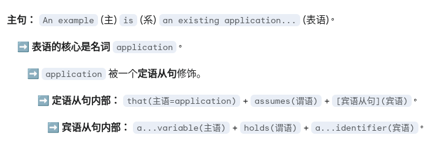

### 1.
React Router embraces this convention with APIs for creating nested layouts coupled to URL segments and data.

> 句子的语法结构：
> 
> 1. 主语：React Router
> 2. 谓语动词：embraces (拥抱，采用)
> 3. 宾语：this convention (这个惯例)
> 4. 介词短语（作为方式补语）：with APIs
> 5. APIs的修饰语：
>    - for creating nested layouts
>    - coupled to URL segments and data
> 
> 进一步分解：
> 
> - "creating nested layouts" 是现在分词短语，作为APIs的目的说明
> - "coupled to URL segments and data" 是过去分词短语，作为layouts的状态描述
> - "URL segments and data" 是并列结构，通过 "and" 连接
> 
> 如果用树状结构表示，这个句子可以这样分解：
> 
> ```
> CopyReact Router embraces this convention
>                 └── with APIs
>                     ├── for creating nested layouts
>                     └── coupled to
>                         ├── URL segments
>                         └── data
> ```

### 2.
Most web apps have persistent navigation sections at the top of the UI, the sidebar, and often multiple levels.

> 句子的语法结构：
> 
> 1. 主语：Most web apps (大多数网络应用)
> 2. 谓语动词：have (拥有)
> 3. 宾语：persistent navigation sections (持久的导航部分)，后面有三个位置介词短语修饰：
>    - at the top of the UI
>    - [at] the sidebar
>    - [and] often [at] multiple levels
> 
> 这里使用了并列结构和省略：
> 
> - "at" 在 "the sidebar" 前被省略
> - "at" 在 "multiple levels" 前也被省略
> - 使用 "and" 连接最后一个元素
> 
> 如果用树状结构表示：
> 
> ```
> CopyMost web apps have persistent navigation sections
>                 └── at the top of the UI
>                 └── [at] the sidebar
>                 └── and often [at] multiple levels
> ```

### 3.
It gives you the UX capabilities of client rendered apps with the simplicity of the "old school" web model.

> 句子的语法结构：
> 
> 1. 主语：It (它)
> 2. 谓语动词：gives (给予)
> 3. 宾语：you the UX capabilities of client rendered apps (你获得客户端渲染应用的UX能力)
> 4. 介词短语（作为方式补语）：with the simplicity of the "old school" web model (使用"旧式"网络模型的简单性)

### 4.
Site replication configures multiple independent MinIO deployments as a cluster of replicas called peer sites.

> 句子的语法结构：
> 
> 1. 主语：Site replication (站点复制)
> 2. 谓语动词：configures (配置)
> 3. 宾语：multiple independent MinIO deployments (多个独立的MinIO部署)
> 4. 介词短语（作为方式补语）：as a cluster of replicas (作为一组副本的集群)
> 5. 名词短语（作为宾语补语）：called peer sites (称为对等站点)

### 5.
This allows a site that is healing or lagging behind other peers to still return an object persisted to other sites.

> 句子的语法结构：
> 
> 1. 主语：This (这)
> 2. 谓语动词：allows (允许)
> 3. 宾语：a site that is healing or lagging behind other peers (一个正在恢复或落后于其他对等站点的站点)
> 4. 介词短语（作为方式补语）：to still return an object persisted to other sites (仍然返回持久化到其他站点的对象)
> > persisted to other sites  是过去分词短语，修饰 "object"，表示该对象已经持久化到其他站点。

### 6.
While each pool is an independent set of servers with distinct erasure sets for availability, the complete loss of one pool results in MinIO stopping I/O for all pools in the deployment.

> 句子的语法结构：
> 这是一个复合句，由从句（While引导的让步状语从句）和主句组成。
> 
> 让步状语从句部分：
> 1. 从句连接词：While (虽然)
> 2. 从句主语：each pool (每个池)
> 3. 从句谓语动词：is (是)
> 4. 从句表语：an independent set of servers (一组独立的服务器)
> 5. 从句修饰语：with distinct erasure sets for availability
>    - with引导的介词短语，表示伴随状态
>    - distinct erasure sets 是介词宾语
>    - for availability 是目的状语
> 
> 主句部分：
> 1. 主句主语：the complete loss of one pool (一个池的完全损失)
> 2. 主句谓语动词：results in (导致)
> 3. 主句宾语：MinIO stopping I/O (MinIO停止I/O)
> 4. 主句修饰语：for all pools in the deployment
>    - for all pools 表示影响范围
>    - in the deployment 表示位置
> 
> 如果用树状结构表示：
> ```
>  While each pool is an independent set of servers
>  └── with distinct erasure sets
>  └── for availability
>  ,
>  the complete loss of one pool results in MinIO stopping I/O
>  └── for all pools
>  └── in the deployment
> ```

### 7.
Bit rot corruption is not prompted by any activity from a user, nor does the system’s operating system alone have awareness of the corruption to notify a user or administrator about a change to the data.

> 整个句子的语法结构是一个**并列复合句**，由两部分通过 **nor** 连接，分别强调：
> - 位腐败并不是由用户活动引起的。any activity from a user
> - 操作系统也没有意识到腐败并且没有相应的通知机制。
> - **nor**：这是一个并列连词，连接两个否定的句子部分。它的作用是表示“也不”，在此处表示“操作系统也没有意识到这种腐败”。
> - **does... have awareness**：这是反转语序，通常句子的正常顺序是“the operating system alone has awareness”，但是在这个并列句中，为了保持语气的对称和强调，使用了倒装结构“does have”。
> - notify...about... 表示通知...关于...
> - change to the data 表示数据的变化
> 
> 这个句子采用了倒装语序（"nor does"）和一些强调成分（"alone"）来突出重点，结构上比较正式。

### 8.
Storage controllers should present XFS-formatted drives in “Just a Bunch of Drives” (JBOD) configurations with no RAID, pooling, or other hardware/software resiliency layers. MinIO recommends against caching, either at the drive or the controller layer. Either type of caching can cause I/O spikes as the cache fills and clears, resulting in unpredictable performance.

> 保持JBOD配置，没有RAID、池化或其他硬件/软件弹性层。
> 
> MinIO建议不进行缓存，无论是驱动器层还是控制器层。
> 
> 任何类型的缓存都可能导致I/O峰值，因为缓存填充和清除【在缓存填充与清除时】，导致性能不可预测。

### 9.
'So, I made the playlist for people like me, and it worked wonders.' 修正为 'So, I made the playlist for people like me, and it worked wonders.'

> * 两个完全独立的句子，用and连接，在and前面用逗号。
> 
> * 其中like是介词，'像我这样的人'。如果要把like当作喜欢意思 ，那就是...for people who like me....

### 10.
Companies subject to control from authoritarian regions like China face legal requirements that can compel them to share data, cooperate with intelligence services, or take other actions that create national security risks.

> * 后置定语 (Post-positive Attribute): subject to control from authoritarian regions like China
> * 它相当于一个省略了关系代词和be动词的定语从句：Companies (which are) subject to control... 这里的subject是形容词，意思是“受...支配的，受...管制的”。在英语中，当定语从句的关系代词作主语，且谓语包含 be 动词时，我们常常可以把关系代词和 be 动词一起省略掉，从而让句子更简洁、更书面化。
> * 完整版: I'm looking for the boy who is responsible for the project.
>   省略版: I'm looking for the boy responsible for the project.
> * be subject to sth.: 隶属于...，受...管制

### 11.
This list is limited to services within the same namespace as the new Container's Pod and Kubernetes control plane services.

> the same ... as ...

### 12.
because , as, since

| Conjunction | Emphasis                                             | Formality      | Best Position                              | Example                                                |
| ----------- | ---------------------------------------------------- | -------------- | ------------------------------------------ | ------------------------------------------------------ |
| **because** | **Strong** focus on the reason.                      | Neutral        | Middle or beginning                        | I read the book **because** it was interesting.        |
| **as**      | **Weak** focus on the reason (it's background info). | **Formal**     | **Beginning** of the sentence is clearest. | **As** it was a holiday, the shops were closed.        |
| **since**   | Weak focus on the reason (it's accepted/known).      | Neutral/Formal | **Beginning** of the sentence.             | **Since** we're here, we might as well see the museum. |

### 13.
This page describes how kubelet managed Containers can use the Container lifecycle hook framework to run code triggered by events during their management lifecycle.

> 其中的managed是过去分词做定语，修饰Containers

### 14.
For example, once a pod is running in your cluster then a critical fault on the node where that pod is running means that all the pods on that node fail.

> * a critical fault on the node, 其中on the node 是介词短语作后置定语修饰fault.
> 
> * **(定语从句 - 完整版):** "a critical fault **that happened** on the node".
> * **经济原则 (Principle of Economy):** 如果一个介词短语能清晰地表达“地点”、“时间”、“归属”等修饰关系，那么通常就会省略掉像 `that is`, `that happened`, `which is located` 这样的冗余部分。动词 `happened` 在这个语境下是**不言而喻**的，故障自然是“发生”的，所以没有必要明确写出来。我们说 "the book **on the table**" (桌上的书)，而不是 "the book **that is lying** on the table" (那本正躺在桌上的书)。

### 15.

Every time you add a node to your cluster that matches the specification in a DaemonSet, the control plane schedules a Pod for that DaemonSet onto the new node. 

> * 其中` a node to your cluster that ` 中的that 从句是修饰a node. 
> * 从句“就近原则”是我们的第一反应，但：
>   1. **逻辑优先 (Logic First):** 句子的逻辑含义是判断修饰关系的最重要依据。
>   2. **结构灵活性 (Structural Flexibility):** 英语语法允许定语从句“跳过”一个介词短语，去修饰它前面的核心名词。
> * **Example 1:** `I saw a man in the car who was waving at me.`
> * **Example 2:** `The gift from my friend that I received yesterday was beautiful.`

### 16.

Make sure not to confuse *Status*, a kubectl display field for user intuition, with the pod's `phase`.

> * `, a kubectl display field for user intuition, ` 同位语，它就像一个括号里的注释，跟在某个名词后面，用来对这个名词进行补充、解释或定义。它和它解释的那个名词，指的是同一个东西。
> * **`not to confuse X with Y`**: 意思是 “不要把 X 和 Y 搞混”。这是一个固定的搭配，`confuse A with B` 就是 “把 A 和 B 混淆” 的意思。

### 17.

With that forceful shutdown tracking in place, the kubelet attempts graceful shutdown.

> with .... in place , 随着什么的就位

### 18.

Many container runtimes respect the STOPSIGNAL value defined in the container image and, if different, send the container image configured STOPSIGNAL instead of TERM. 

> respect 是遵守，遵循的意思
>
> container image configured STOPSIGNAL 这里的`container image configured ` 修饰STOPSIGNAL

### 19.

 If the kubelet or the container runtime's management service is restarted while waiting for processes to terminate, the cluster retries from the start including the full original grace period.

> including 并不是修饰start的定语，而昌retries的伴随状语

### 20.

The Pod in the API server is updated with the time beyond which the Pod is considered "dead" along with the grace period.

> 可以把这个结构看作：is updated with ( A along with B )
>
> beyond which 是修饰 the time ,  可以理解为the Pod is considered "dead"  beyond that time.

### 21.

Some applications need to go beyond finishing open connections .

> beyond是介词短语做go的状语

### 22.

When a force deletion is performed, the API server does not wait for confirmation from the kubelet that the Pod has been terminated on the node it was running on. 

>  与第15个句子类似. that ... 是同位语从句，用来修饰confirmation

### 23. 

In general, if you have used preStop hooks to control the termination order without sidecar containers, you can now remove them and allow the kubelet to manage sidecar termination automatically.

> * 通常来说，如果你（在过去 Kubernetes 还没有原生 Sidecar 功能的版本中）曾经使用 `preStop` **钩子**来控制容器的终止顺序，那么现在你可以移除**它们（指那些钩子）**了，让 Kubelet 自动为你管理 Sidecar 的终止过程。
> * them 是指preStop hooks

### 24.

You can see how Kubernetes varies the rate at which disruptions can happen.

> at which 为rate 的定语从名，表示什么样的速率
>
> vary.... 使改变

### 25.

Some behavior is independent of QoS class.

> be independent of ....  不受...影响
>
> be + adj + of :  be aware of  ; be afraid of ; capable of; proud of ; full of 

### 25.

An example is an existing application that assumes a particular well-known environment variable holds a unique identifier.

> 
>
> assumes + 宾语从名，that被省略
>
> 总结一下：
>
> - `application` 的动词是 `assumes`。
> - `environment variable` 的动词是 `holds`。