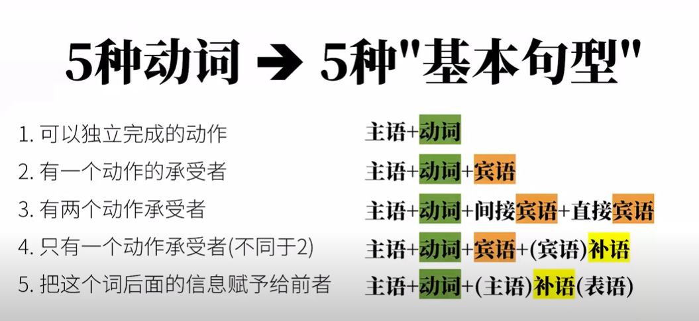
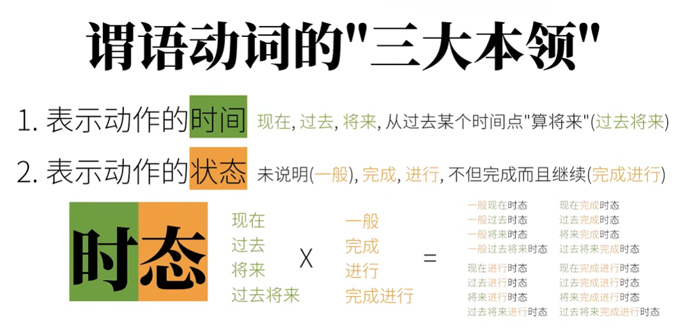
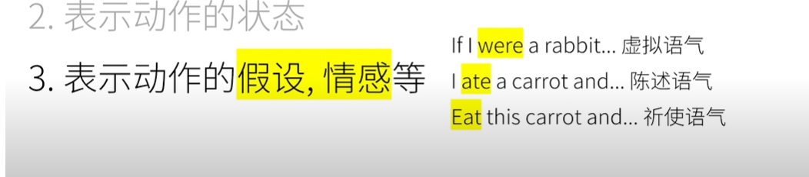
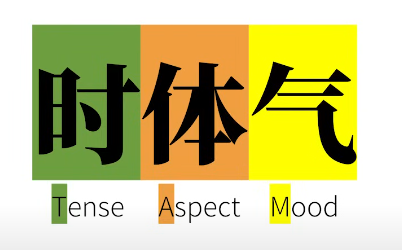
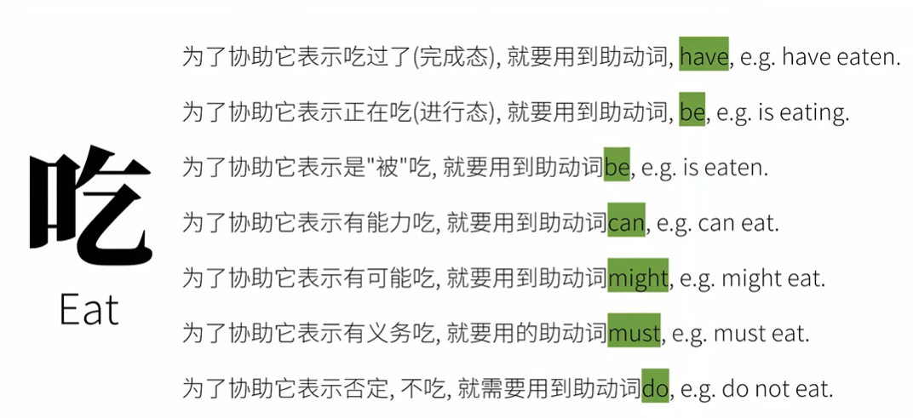
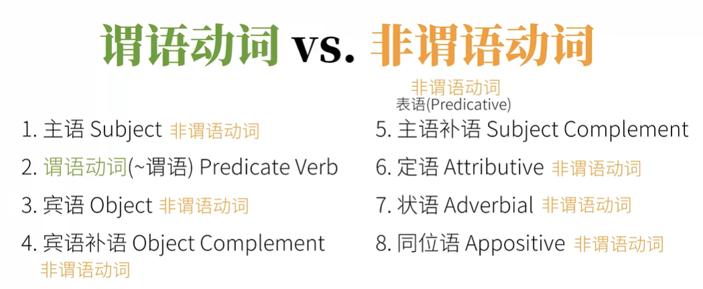
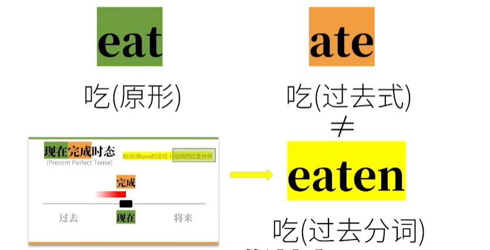
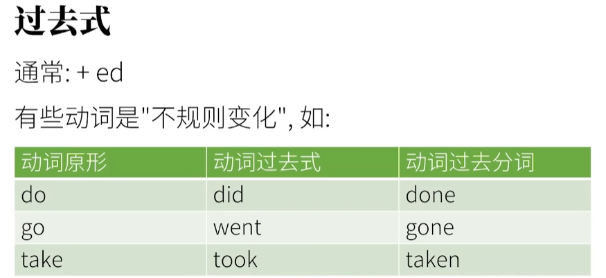

### 句子分析

句子：什么 + 怎么样  ----  `主 + 谓语`。句子中除了了`主语`外，余下来的部分就叫`谓语`。平常说的`谓语`一般是指`谓语动词`

1. 可以独立完成的动作：**不及物动词**。 没有承受者。句子结构： 主语 + 不及物动词

2. 有一个动作的承受者：**单及物动词**。 句子结构：主 + 单及物动词 + 宾

3. 有两个动作的承受者：**双及物动词**。主 + 双及物动词 + 间接宾语 + 直接宾语 

   He teaches you English.

4. 只有一个动作承受者（不同于2）：**复杂及物动词**。主+复杂及物动词+宾语+宾语补足语（补语）

   He considers you smart.

5. （不是个"动作"）的词，把这个词后面的信息赋予给前者:  **(连)系动词** 。主 + 系动词 + （主语）补语【表语】

### 句子成分

#### 简单句

句子成分(Parts Of Speech)

1. 主语Subject
2. 谓语动词(~谓语) Predicate Verb
3. 宾语Object
4. 宾语补语Object Complement
5. 主语补语Subject Complement -- 表语(Predicative)
6. 定语Attributive 主要用来修饰主语或宾语   a **large** ...
7. 状语Adverbial 主要用来修饰谓语动词  He eat **quickly**.
8. 同位语Appositive 主要用来再把主语或宾语说一遍

#### 复合句Compound Sentence :

简单句的叠加，并列句。

#### 复杂句Complex Sentence

把一个句子套在另外一个句子里，可以多层嵌套。在英语语法上称为主句（main clause）和从句(subordinate clause)

* 名词性从句
  1. 主语从句
  2. 宾语从句
  3. 表语从句
  4. 同位语从句

* 定语从句
* 状语从句

#### 谓语动词

充当谓语的动词

`谓语动词` 要联合 `助动词` 来完成 `时体气`

#### 非谓语动词

不充当谓语的动词

非谓语动词几乎可以替换所有的从句，从而简化句子，这样用的话，这些动词失去了时态、语气、语态的本领。

非谓语动词

动词不定式 ,e.g.to eat
现在分词 ,e.g.eating
动名词, e.g. eating
过去分词, e.g.eaten

### 词类

1.名词 Nouns
2.冠词 Articles
3.代词 Pronouns
4.形容词 Adjectives
5.数词 Numerals
6.副词 Adverbs
7.介词 Prepositions
8.叹词 Interjections
9.连词 Conjunctions
10.动词 Verbs

句子成分与词类是完全不同的概念。句子成分中的谓语动词是动词，其它的句子成分都有可能包含其它的词类

### 过去式 VS 过去分词

