# Project Structure
## Folder and file conversions

### Top-level folders

|                                                              |                                    |
| ------------------------------------------------------------ | ---------------------------------- |
| [`app`](https://nextjs.org/docs/app)                         | App Router                         |
| [`pages`](https://nextjs.org/docs/pages/building-your-application/routing) | Pages Router                       |
| [`public`](https://nextjs.org/docs/app/api-reference/file-conventions/public-folder) | Static assets to be served         |
| [`src`](https://nextjs.org/docs/app/api-reference/file-conventions/src-folder) | Optional application source folder |

### Top-level files

|                                                              |                                         |
| ------------------------------------------------------------ | --------------------------------------- |
| **Next.js**                                                  |                                         |
| [`next.config.js`](https://nextjs.org/docs/app/api-reference/config/next-config-js) | Configuration file for Next.js          |
| [`package.json`](https://nextjs.org/docs/app/getting-started/installation#manual-installation) | Project dependencies and scripts        |
| [`instrumentation.ts`](https://nextjs.org/docs/app/guides/instrumentation) | OpenTelemetry and Instrumentation file  |
| [`middleware.ts`](https://nextjs.org/docs/app/api-reference/file-conventions/middleware) | Next.js request middleware              |
| [`.env`](https://nextjs.org/docs/app/guides/environment-variables) | Environment variables                   |
| [`.env.local`](https://nextjs.org/docs/app/guides/environment-variables) | Local environment variables             |
| [`.env.production`](https://nextjs.org/docs/app/guides/environment-variables) | Production environment variables        |
| [`.env.development`](https://nextjs.org/docs/app/guides/environment-variables) | Development environment variables       |
| [`.eslintrc.json`](https://nextjs.org/docs/app/api-reference/config/eslint) | Configuration file for ESLint           |
| `.gitignore`                                                 | Git files and folders to ignore         |
| `next-env.d.ts`                                              | TypeScript declaration file for Next.js |
| `tsconfig.json`                                              | Configuration file for TypeScript       |
| `jsconfig.json`                                              | Configuration file for JavaScript       |

### Routing Files

|                                                              |                     |                              |
| ------------------------------------------------------------ | ------------------- | ---------------------------- |
| [`layout`](https://nextjs.org/docs/app/api-reference/file-conventions/layout) | `.js` `.jsx` `.tsx` | Layout                       |
| [`page`](https://nextjs.org/docs/app/api-reference/file-conventions/page) | `.js` `.jsx` `.tsx` | Page                         |
| [`loading`](https://nextjs.org/docs/app/api-reference/file-conventions/loading) | `.js` `.jsx` `.tsx` | Loading UI                   |
| [`not-found`](https://nextjs.org/docs/app/api-reference/file-conventions/not-found) | `.js` `.jsx` `.tsx` | Not found UI                 |
| [`error`](https://nextjs.org/docs/app/api-reference/file-conventions/error) | `.js` `.jsx` `.tsx` | Error UI                     |
| [`global-error`](https://nextjs.org/docs/app/api-reference/file-conventions/error#global-error) | `.js` `.jsx` `.tsx` | Global error UI              |
| [`route`](https://nextjs.org/docs/app/api-reference/file-conventions/route) | `.js` `.ts`         | API endpoint                 |
| [`template`](https://nextjs.org/docs/app/api-reference/file-conventions/template) | `.js` `.jsx` `.tsx` | Re-rendered layout           |
| [`default`](https://nextjs.org/docs/app/api-reference/file-conventions/default) | `.js` `.jsx` `.tsx` | Parallel route fallback page |

### Nested routes

|                 |                      |
| --------------- | -------------------- |
| `folder`        | Route segment        |
| `folder/folder` | Nested route segment |

### Dynamic routes

|                                                              |                                  |
| ------------------------------------------------------------ | -------------------------------- |
| [`[folder]`](https://nextjs.org/docs/app/api-reference/file-conventions/dynamic-routes#convention) | Dynamic route segment            |
| [`[...folder]`](https://nextjs.org/docs/app/api-reference/file-conventions/dynamic-routes#catch-all-segments) | Catch-all route segment          |
| [`[[...folder]]`](https://nextjs.org/docs/app/api-reference/file-conventions/dynamic-routes#optional-catch-all-segments) | Optional catch-all route segment |

### Route Groups and private folders

|                                                              |                                                  |
| ------------------------------------------------------------ | ------------------------------------------------ |
| [`(folder)`](https://nextjs.org/docs/app/api-reference/file-conventions/route-groups#convention) | Group routes without affecting routing           |
| [`_folder`](https://nextjs.org/docs/app/getting-started/project-structure#private-folders) | Opt folder and all child segments out of routing |

Route Groups can be nested.

#### Example

* **Organize routes without affecting the URL path**

  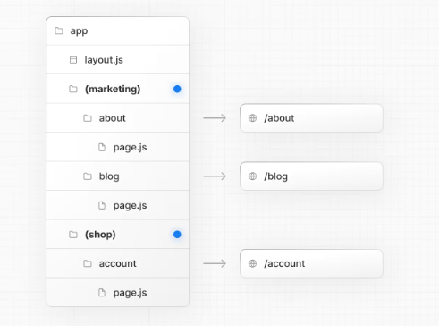

  Even though routes inside `(marketing)` and `(shop)` share the same URL hierarchy, you can create a different layout for each group by adding a `layout.js` file inside their folders.

  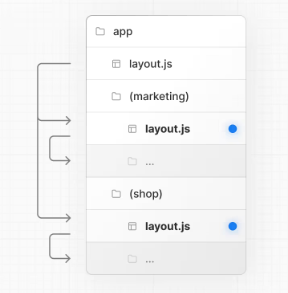

### Parallel and Intercepted Routes

|                                                              |                            |
| ------------------------------------------------------------ | -------------------------- |
| [`@folder`](https://nextjs.org/docs/app/api-reference/file-conventions/parallel-routes#slots) | Named slot                 |
| [`(.)folder`](https://nextjs.org/docs/app/api-reference/file-conventions/intercepting-routes#convention) | Intercept same level       |
| [`(..)folder`](https://nextjs.org/docs/app/api-reference/file-conventions/intercepting-routes#convention) | Intercept one level above  |
| [`(..)(..)folder`](https://nextjs.org/docs/app/api-reference/file-conventions/intercepting-routes#convention) | Intercept two levels above |
| [`(...)folder`](https://nextjs.org/docs/app/api-reference/file-conventions/intercepting-routes#convention) | Intercept from root        |

### Metadata file conventions

#### App icons

|                                                              |                                     |                          |
| ------------------------------------------------------------ | ----------------------------------- | ------------------------ |
| [`favicon`](https://nextjs.org/docs/app/api-reference/file-conventions/metadata/app-icons#favicon) | `.ico`                              | Favicon file             |
| [`icon`](https://nextjs.org/docs/app/api-reference/file-conventions/metadata/app-icons#icon) | `.ico` `.jpg` `.jpeg` `.png` `.svg` | App Icon file            |
| [`icon`](https://nextjs.org/docs/app/api-reference/file-conventions/metadata/app-icons#generate-icons-using-code-js-ts-tsx) | `.js` `.ts` `.tsx`                  | Generated App Icon       |
| [`apple-icon`](https://nextjs.org/docs/app/api-reference/file-conventions/metadata/app-icons#apple-icon) | `.jpg` `.jpeg`, `.png`              | Apple App Icon file      |
| [`apple-icon`](https://nextjs.org/docs/app/api-reference/file-conventions/metadata/app-icons#generate-icons-using-code-js-ts-tsx) | `.js` `.ts` `.tsx`                  | Generated Apple App Icon |

#### SEO

|                                                              |             |                       |
| ------------------------------------------------------------ | ----------- | --------------------- |
| [`sitemap`](https://nextjs.org/docs/app/api-reference/file-conventions/metadata/sitemap#sitemap-files-xml) | `.xml`      | Sitemap file          |
| [`sitemap`](https://nextjs.org/docs/app/api-reference/file-conventions/metadata/sitemap#generating-a-sitemap-using-code-js-ts) | `.js` `.ts` | Generated Sitemap     |
| [`robots`](https://nextjs.org/docs/app/api-reference/file-conventions/metadata/robots#static-robotstxt) | `.txt`      | Robots file           |
| [`robots`](https://nextjs.org/docs/app/api-reference/file-conventions/metadata/robots#generate-a-robots-file) | `.js` `.ts` | Generated Robots file |

### Organizing your project

#### Component hierarchy

The components defined in special files are rendered in a specific hierarchy:

- `layout.js`
- `template.js`
- `error.js` (React error boundary)
- `loading.js` (React suspense boundary)
- `not-found.js` (React error boundary)
- `page.js` or nested `layout.js`

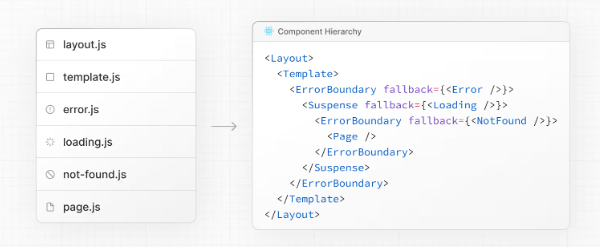

 The components of a route segment will be nested **inside** the components of its parent segment.

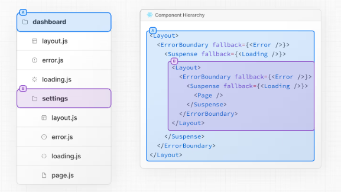

#### Colocation

A route is **not publicly accessible** until a `page.js` or `route.js` file is added to a route segment.

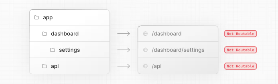

And, even when a route is made publicly accessible, only the **content returned** by `page.js` or `route.js` is sent to the client.

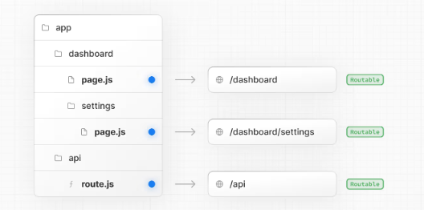

#### Private folders

Private folders can be created by prefixing a folder with an underscore: `_folderName`

his indicates the folder is a private implementation detail and should not be considered by the routing system, thereby **opting the folder and all its subfolders** out of routing.

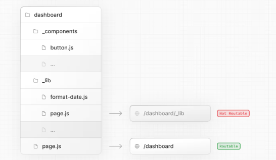

#### Route groups

Route groups can be created by wrapping a folder in parenthesis: `(folderName)`

This indicates the folder is for organizational purposes and should **not be included** in the route's URL path.

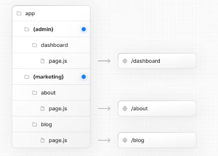

##### Examples

* **Creating multiple root layouts**

  To create multiple [root layouts](https://nextjs.org/docs/app/api-reference/file-conventions/layout#root-layout), remove the top-level `layout.js` file, and add a `layout.js` file inside each route group. This is useful for partitioning an application into sections that have a completely different UI or experience. The `<html>` and `<body>` tags need to be added to each root layout.

  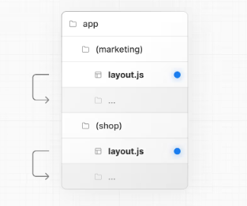

  In the example above, both `(marketing)` and `(shop)` have their own root layout.

# Layouts and Pages

## Creating a page

A **page** is UI that is rendered on a specific route.

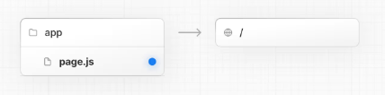

## Creating a layout

A layout is UI that is **shared** between multiple pages. 

```tsx
// app/layout.tsx
export default function DashboardLayout({
  children,
}: {
  children: React.ReactNode
}) {
  return (
    <html lang="en">
      <body>
        {/* Layout UI */}
        {/* Place children where you want to render a page or nested layout */}
        <main>{children}</main>
      </body>
    </html>
  )
}
```

The layout above is called a [root layout](https://nextjs.org/docs/app/api-reference/file-conventions/layout#root-layout) because it's defined at the root of the `app` directory. The root layout is **required** and must contain `html` and `body` tags.

## Creating a nested route

A nested route is a route composed of multiple URL segments. For example, the `/blog/[slug]` route is composed of three segments:

- `/` (Root Segment)
- `blog` (Segment)
- `[slug]` (Leaf Segment)

In Next.js:

- **Folders** are used to define the route segments that map to URL segments.
- **Files** (like `page` and `layout`) are used to create UI that is shown for a segment.

## Nesting layouts

For example, to create a layout for the `/blog` route, add a new `layout` file inside the `blog` folder.

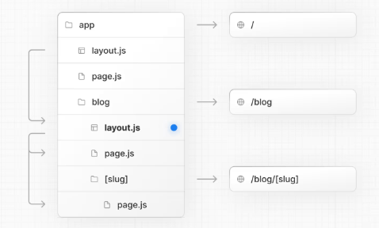

## Creating a dynamic segment

To create a dynamic segment, wrap the segment (folder) name in square brackets: `[segmentName]`. For example, in the `app/blog/[slug]/page.tsx` route, the `[slug]` is the dynamic segment.

```tsx
export default async function BlogPostPage({
  params,
}: {
  params: Promise<{ slug: string }>
}) {
  const { slug } = await params
  const post = await getPost(slug)
 
  return (
    <div>
      <h1>{post.title}</h1>
      <p>{post.content}</p>
    </div>
  )
}
```

Dynamic Segments are passed as the `params` prop to [`layout`](https://nextjs.org/docs/app/api-reference/file-conventions/layout), [`page`](https://nextjs.org/docs/app/api-reference/file-conventions/page), [`route`](https://nextjs.org/docs/app/api-reference/file-conventions/route), and [`generateMetadata`](https://nextjs.org/docs/app/api-reference/functions/generate-metadata#generatemetadata-function) functions.

>  the `params` prop is a promise.  In version 14 and earlier, `params` was a synchronous prop.

# Linking and Navigating

## Server Rendering

There are two types of server rendering, based on *when* it happens:

- **Static Rendering (or Prerendering)** happens at build time or during [revalidation](https://nextjs.org/docs/app/getting-started/caching-and-revalidating) and the result is cached.
- **Dynamic Rendering** happens at request time in response to a client request.

## Prefetching

Prefetching is the process of loading a route in the background before the user navigates to it. This makes navigation between routes in your application feel instant, because by the time a user clicks on a link, the data to render the next route is already available client side.

Next.js automatically prefetches routes linked with the [<Link>](https://nextjs.org/docs/app/api-reference/components/link) when they enter the user's viewport.

## Streaming

To use streaming, create a `loading.tsx` in your route folder:

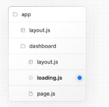


## What can make transitions slow?

### Slow networks

To improve perceived performance, you can use the [`useLinkStatus` hook](https://nextjs.org/docs/app/api-reference/functions/use-link-status) to show inline visual feedback to the user (like spinners or text glimmers on the link) while a transition is in progress.

```tsx
'use client'
 
import { useLinkStatus } from 'next/link'
 
export default function LoadingIndicator() {
  const { pending } = useLinkStatus()
  return pending ? (
    <div role="status" aria-label="Loading" className="spinner" />
  ) : null
}
```

> `useLinkStatus` must be used within a descendant component of a `Link` component

# Server and Client Components

By default, layouts and pages are [Server Components](https://react.dev/reference/rsc/server-components), which lets you fetch data and render parts of your UI on the server, optionally cache the result, and stream it to the client. When you need interactivity or browser APIs, you can use [Client Components](https://react.dev/reference/rsc/use-client) to layer in functionality.

## When to use Server and Client Components

Use **Client Components** when you need:

- [State](https://react.dev/learn/managing-state) and [event handlers](https://react.dev/learn/responding-to-events). E.g. `onClick`, `onChange`.
- [Lifecycle logic](https://react.dev/learn/lifecycle-of-reactive-effects). E.g. `useEffect`.
- Browser-only APIs. E.g. `localStorage`, `window`, `Navigator.geolocation`, etc.
- [Custom hooks](https://react.dev/learn/reusing-logic-with-custom-hooks).

Use **Server Components** when you need:

- Fetch data from databases or APIs close to the source.
- Use API keys, tokens, and other secrets without exposing them to the client.
- Reduce the amount of JavaScript sent to the browser.
- Improve the [First Contentful Paint (FCP)](https://web.dev/fcp/), and stream content progressively to the client.

## Examples

### Using Client Components

You can create a Client Component by adding the [`"use client"`](https://react.dev/reference/react/use-client) directive at the top of the file, above your imports.

Once a file is marked with `"use client"`, **all its imports and child components are considered part of the client bundle**. This means you don't need to add the directive to every component that is intended for the client.

**Client components cannot be async functions.**

### Passing data from Server to Client Components

You can pass data from Server Components to Client Components using props.

### Interleaving Server and Client Components

You can pass Server Components as a prop to a Client Component. This allows you to visually nest server-rendered UI within Client components.

### Context providers

[React context](https://react.dev/learn/passing-data-deeply-with-context) is commonly used to share global state like the current theme. However, React context is not supported in Server Components.

To use context, create a Client Component that accepts `children`:

### Third-party components

When using a third-party component that relies on client-only features, you can wrap it in a Client Component to ensure it works as expected.

 If you try to use `<Carousel />` directly within a Server Component, you'll see an error. This is because Next.js doesn't know `<Carousel />` is using client-only features.

To fix this, you can wrap third-party components that rely on client-only features in your own Client Components:

```tsx
'use client'
 
import { Carousel } from 'acme-carousel'
 
export default Carousel
```

Now, you can use `<Carousel />` directly within a Server Component

### Preventing environment poisoning

JavaScript modules can be shared between both Server and Client Components modules. This means it's possible to accidentally import server-only code into the client. For example, consider the following function:

```ts
export async function getData() {
  const res = await fetch('https://external-service.com/data', {
    headers: {
      authorization: process.env.API_KEY,
    },
  })
 
  return res.json()
}
```

This function contains an `API_KEY` that should never be exposed to the client.

In Next.js, only environment variables prefixed with `NEXT_PUBLIC_` are included in the client bundle. If variables are not prefixed, Next.js replaces them with an empty string.

As a result, even though `getData()` can be imported and executed on the client, it won't work as expected.

To prevent accidental usage in Client Components, you can use the [`server-only` package](https://www.npmjs.com/package/server-only).

```ts
import 'server-only'
 
export async function getData() {
  const res = await fetch('https://external-service.com/data', {
    headers: {
      authorization: process.env.API_KEY,
    },
  })
 
  return res.json()
}
```

Now, if you try to import the module into a Client Component, there will be a build-time error.

### Build Server Components

When running` npm run build `in Next.js, it attempts to pre-render pages. At this time, the local server is not actually running, so fetching from http://localhost:3000 will fail.  There are two solutions:

1.  Set the page to dynamic rendering, preventing pre-rendering at build time
2. Set no-cache parameters when fetching: like [`await fetch(${baseUrl}/api/users, { cache: "no-store" });`]

# Fetching data

## Server Components

You can fetch data in Server Components using:

1. The [`fetch` API](https://nextjs.org/docs/app/getting-started/fetching-data#with-the-fetch-api)
2. An [ORM or database](https://nextjs.org/docs/app/getting-started/fetching-data#with-an-orm-or-database)

## Client Components

There are two ways to fetch data in Client Components, using:

1. React's [`use` hook](https://react.dev/reference/react/use)
2. A community library like [SWR](https://swr.vercel.app/) or [React Query](https://tanstack.com/query/latest)

## Examples

### Sequential data fetching

```tsx
export default async function Page({ params }) {
  // These requests will be sequential
  const { username } = await params
  const artist = await getArtist(username)
  const albums = await getAlbums(username)
  return <div>{artist.name}</div>
}
```

### Parallel data fetching

```tsx
export default async function Page({
  params,
}: {
  params: Promise<{ username: string }>
}) {
  const { username } = await params
  const artistData = getArtist(username)
  const albumsData = getAlbums(username)
 
  // Initiate both requests in parallel
  const [artist, albums] = await Promise.all([artistData, albumsData])
 
  return (
    <>
      <h1>{artist.name}</h1>
      <Albums list={albums} />
    </>
  )
}
```

> **Good to know:** If one request fails when using `Promise.all`, the entire operation will fail. To handle this, you can use the [`Promise.allSettled`](https://developer.mozilla.org/en-US/docs/Web/JavaScript/Reference/Global_Objects/Promise/allSettled) method instead.

# Updating data

You can update data in Next.js using React's [Server Functions](https://react.dev/reference/rsc/server-functions). 

## What are Server Functions?

A **Server Function** is an asynchronous function that runs on the server. They can be called from client through a network request, which is why they must be asynchronous.

By convention, a Server Action is an async function used with [`startTransition`](https://react.dev/reference/react/startTransition). This happens automatically when the function is:

- Passed to a `<form>` using the `action` prop.
- Passed to a `<button>` using the `formAction` prop.

## Creating Server Functions

A Server Function can be defined by using the [`use server`](https://react.dev/reference/rsc/use-server) directive. You can place the directive at the top of an **asynchronous** function to mark the function as a Server Function, or at the top of a separate file to mark all exports of that file.

```ts
export async function createPost(formData: FormData) {
  'use server'
  const title = formData.get('title')
  const content = formData.get('content')
 
  // Update data
  // Revalidate cache
}
 
export async function deletePost(formData: FormData) {
  'use server'
  const id = formData.get('id')
 
  // Update data
  // Revalidate cache
}
```

### Server Components

Server Functions can be inlined in Server Components by adding the `"use server"` directive to the top of the function body:

```tsx
export default function Page() {
  // Server Action
  async function createPost(formData: FormData) {
    'use server'
    // ...
  }
 
  return <></>
}
```

### Client Components

It's not possible to define Server Functions in Client Components. However, you can invoke them in Client Components by importing them from a file that has the `"use server"` directive at the top of it:

```ts
'use server'
 
export async function createPost() {}
```

### Passing actions as props

```tsx
'use client'
 
export default function ClientComponent({
  updateItemAction,
}: {
  updateItemAction: (formData: FormData) => void
}) {
  return <form action={updateItemAction}>{/* ... */}</form>
}
```

## Invoking Server Functions

There are two main ways you can invoke a Server Function:

1. [Forms](https://nextjs.org/docs/app/getting-started/updating-data#forms) in Server and Client Components
2. [Event Handlers](https://nextjs.org/docs/app/getting-started/updating-data#event-handlers) and [useEffect](https://nextjs.org/docs/app/getting-started/updating-data#useeffect) in Client Components

### Forms

React extends the HTML `<form>` element to allow Server Function to be invoked with the HTML `action` prop.

When invoked in a form, the function automatically receives the [`FormData`](https://developer.mozilla.org/docs/Web/API/FormData/FormData) object. You can extract the data using the native [`FormData` methods](https://developer.mozilla.org/en-US/docs/Web/API/FormData#instance_methods):

```tsx
// app/ui/form.tsx
import { createPost } from '@/app/actions'
 
export function Form() {
  return (
    <form action={createPost}>
      <input type="text" name="title" />
      <input type="text" name="content" />
      <button type="submit">Create</button>
    </form>
  )
}
```

```ts
// app/actions.ts
'use server'
 
export async function createPost(formData: FormData) {
  const title = formData.get('title')
  const content = formData.get('content')
 
  // Update data
  // Revalidate cache
}
```

### Event Handlers

You can invoke a Server Function in a Client Component by using event handlers such as `onClick`.

# Caching and Revalidating

Caching is a technique for storing the result of data fetching and other computations so that future requests for the same data can be served faster, without doing the work again. While revalidation allows you to update cache entries without having to rebuild your entire application.

Next.js provides a few APIs to handle caching and revalidation. This guide will walk you through when and how to use them.

- [`fetch`](https://nextjs.org/docs/app/getting-started/caching-and-revalidating#fetch)
- [`unstable_cache`](https://nextjs.org/docs/app/getting-started/caching-and-revalidating#unstable_cache)
- [`revalidatePath`](https://nextjs.org/docs/app/getting-started/caching-and-revalidating#revalidatepath)
- [`revalidateTag`](https://nextjs.org/docs/app/getting-started/caching-and-revalidating#revalidatetag)

## fetch

```ts
export default async function Page() {
  const data = await fetch('https://...', { cache: 'force-cache' })
}
```

> **Good to know**: Although `fetch` requests are not cached by default, Next.js will [prerender](https://nextjs.org/docs/app/getting-started/partial-prerendering#static-rendering) routes that have `fetch` requests and cache the HTML. If you want to guarantee a route is [dynamic](https://nextjs.org/docs/app/getting-started/partial-prerendering#dynamic-rendering), use the [`connection` API](https://nextjs.org/docs/app/api-reference/functions/connection).

To revalidate the data returned by a `fetch` request, you can use the `next.revalidate` option.

```ts
export default async function Page() {
  const data = await fetch('https://...', { next: { revalidate: 3600 } })
}
```

> This will revalidate the data after a specified amount of seconds.  
>
> Next.js extends the [Web `fetch()` API](https://developer.mozilla.org/docs/Web/API/Fetch_API) to allow each request on the server to set its own persistent caching and revalidation semantics.

## unstable_cache

```ts
const getCachedUser = unstable_cache(
  async () => {
    return getUserById(userId)
  },
  [userId], // add the user ID to the cache key
  {
    tags: ['user'],
    revalidate: 3600,
  }
)
```

The function accepts a third optional object to define how the cache should be revalidated. It accepts:

- `tags`: an array of tags used by Next.js to revalidate the cache.
- `revalidate`: the number of seconds after cache should be revalidated.

## revalidateTag

```ts
import { revalidateTag } from 'next/cache'
 
export async function updateUser(id: string) {
  // Mutate data
  revalidateTag('user')
}
```

You can reuse the same tag in multiple functions to revalidate them all at once. **In other words,** you can revalidate tags **used in the options of the `fetch` and `unstable_cache` methods.**

## revalidatePath

`revalidatePath` is used to revalidate a route and following an event. To use it, call it in a [Route Handler](https://nextjs.org/docs/app/api-reference/file-conventions/route) or Server Action:

```ts
// app/lib/actions.ts
import { revalidatePath } from 'next/cache'
 
export async function updateUser(id: string) {
  // Mutate data
  revalidatePath('/profile')
}
```

# Error Handling

## Handling expected errors

Expected errors are those that can occur during the normal operation of the application, such as those from [server-side form validation](https://nextjs.org/docs/app/guides/forms) or failed requests. These errors should be handled explicitly and returned to the client.

## Handling uncaught exceptions

Uncaught exceptions are unexpected errors that indicate bugs or issues that should not occur during the normal flow of your application. These should be handled by throwing errors, which will then be caught by error boundaries.

### Global errors

While less common, you can handle errors in the root layout using the [`global-error.js`](https://nextjs.org/docs/app/api-reference/file-conventions/error#global-error) file, located in the root app directory, even when leveraging [internationalization](https://nextjs.org/docs/app/guides/internationalization). Global error UI must define its own `<html>` and `<body>` tags, since it is replacing the root layout or template when active.

# CSS

## CSS Modules

CSS Modules locally scope CSS by generating unique class names. This allows you to use the same class in different files without worrying about naming collisions.

To start using CSS Modules, create a new file with the extension `.module.css` and import it into any component inside the `app` directory（it's not necessary）.

## Global CSS

You can use global CSS to apply styles across your application.

Create a `app/global.css` file and import it in the root layout to apply the styles to **every route** in your application

# Image Optimization

The Next.js [`Image`](https://nextjs.org/docs/app/api-reference/components/image) component extends the HTML `` element to provide:

## Local images

You can store static files, like images and fonts, under a folder called [`public`](https://nextjs.org/docs/app/api-reference/file-conventions/public-folder) in the root directory. Files inside `public` can then be referenced by your code starting from the base URL (`/`).

```tsx
import Image from 'next/image'
 
export default function Page() {
  return (
    <Image
      src="/profile.png"
      alt="Picture of the author"
      width={500}
      height={500}
    />
  )
}
```

If the image is statically imported, Next.js will automatically determine the intrinsic [`width`](https://nextjs.org/docs/app/api-reference/components/image#width-and-height) and [`height`](https://nextjs.org/docs/app/api-reference/components/image#width-and-height).

```tsx
import Image from 'next/image'
import ProfileImage from './profile.png'
 
export default function Page() {
  return (
    <Image
      src={ProfileImage}
      alt="Picture of the author"
      // width={500} automatically provided
      // height={500} automatically provided
      // blurDataURL="data:..." automatically provided
      // placeholder="blur" // Optional blur-up while loading
    />
  )
}
```

## Remote images

To use a remote image, you can provide a URL string for the `src` property.

Since Next.js does not have access to remote files during the build process, you'll need to provide the [`width`](https://nextjs.org/docs/app/api-reference/components/image#width-and-height), [`height`](https://nextjs.org/docs/app/api-reference/components/image#width-and-height) and optional [`blurDataURL`](https://nextjs.org/docs/app/api-reference/components/image#blurdataurl) props manually. Alternatively, you can use the [`fill` property](https://nextjs.org/docs/app/api-reference/components/image#fill) to make the image fill the size of the parent element.

```tsx
import Image from 'next/image'
 
export default function Page() {
  return (
    <Image
      src="https://s3.amazonaws.com/my-bucket/profile.png"
      alt="Picture of the author"
      width={500}
      height={500}
    />
  )
}
```

To safely allow images from remote servers, you need to define a list of supported URL patterns in [`next.config.js`](https://nextjs.org/docs/app/api-reference/config/next-config-js). 

```tsx
import type { NextConfig } from 'next'
 
const config: NextConfig = {
  images: {
    remotePatterns: [
      {
        protocol: 'https',
        hostname: 's3.amazonaws.com',
        port: '',
        pathname: '/my-bucket/**',
        search: '',
      },
    ],
  },
}
 
export default config
```

> When **using** a remote image with the `Image` component by setting the image URL in the `src` property, the user's browser **doesn't** send a request directly to the URL, but **instead sends it** to the Next.js project server

# Font Optimization

The [`next/font`](https://nextjs.org/docs/app/api-reference/components/font) module automatically optimizes your fonts and removes external network requests for improved privacy and performance.

## Google fonts

You can automatically self-host any Google Font. Fonts are included stored as static assets and served from the same domain as your deployment, meaning no requests are sent to Google by the browser when the user visits your site.

```tsx
import { Geist } from 'next/font/google'
 
const geist = Geist({
  subsets: ['latin'],
})
 
export default function RootLayout({
  children,
}: {
  children: React.ReactNode
}) {
  return (
    <html lang="en" className={geist.className}>
      <body>{children}</body>
    </html>
  )
}
```

## Local fonts

To use a local font, import your font from `next/font/local` and specify the [`src`](https://nextjs.org/docs/app/api-reference/components/font#src) of your local font file. Fonts can be stored in the [`public`](https://nextjs.org/docs/app/api-reference/file-conventions/public-folder) folder or co-located inside the `app` folder. For example:

```tsx
import localFont from 'next/font/local'
 
const myFont = localFont({
  src: './my-font.woff2',
})
 
export default function RootLayout({
  children,
}: {
  children: React.ReactNode
}) {
  return (
    <html lang="en" className={myFont.className}>
      <body>{children}</body>
    </html>
  )
}
```

> The `localFont` function must be declared at the top of the module (in other words, at the top of the file), and its `src` value **cannot be** a path alias (e.g., `@/fonts/my-font.woff2`).
