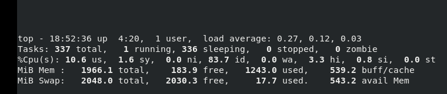

## 常用的系统工作命令+快捷键

使用man，--help方式查询命令的帮助文档

`ctrl + u` ：在命令行中快速删除光标前的内容

`ctrl + k` : 在命令行中快速删除光标后的内容

`ctrl + l` : 清屏

`ctrl + w` : 删除光标左侧的一个单词

`ctrl + y` : 粘贴之前用`ctrl + u `、`ctrl + k`、`ctrl + w` 删除的内容

`ctrl + r` : 搜索历史命令

### 1. echo命令

echo命令用于在终端设备上输出字符串或变量提取后的值，语法格式为“echo [字符串] [$变量]”r。

`-e` 参数使字符串中的转义字符生效

`echo -e 'first line \n second line'`

###  date

date命令用于显示或设置系统的时间与日期，语法格式为“date [+指定的格式]”。

如：

```shell
date "+%F %T"
### +之后，-之前； 后面可以继续对时间进行格式化
date -d "-1 day" "+%F %T"
```

**date命令中的参数及其作用**

| 参数 | 作用                             |
| ---- | :------------------------------- |
| %F   | 相当于"%Y-%m-%d"                 |
| %S   | 秒（00～59）                     |
| %M   | 分钟（00～59）                   |
| %H   | 小时（00～23）                   |
| %I   | 小时（00～12）                   |
| %m   | 月份（1~12）                     |
| %p   | 显示出AM或PM                     |
| %a   | 缩写的工作日名称（例如：Sun）    |
| %A   | 完整的工作日名称（例如：Sunday） |
| %b   | 缩写的月份名称（例如：Jan）      |
| %B   | 完整的月份名称（例如：January）  |
| %q   | 季度（1~4）                      |
| %y   | 简写年份（例如：20）             |
| %Y   | 完整年份（例如：2020）           |
| %d   | 本月中的第几天                   |
| %j   | 今年中的第几天                   |
| %n   | 换行符（相当于按下回车键）       |
| %t   | 跳格（相当于按下Tab键）          |
| %T   | 时间，相当于"+%H-%M-%S"          |

### 3. timedatectl命令

timedatectl命令用于设置系统的时间，英文全称为“time date control”，语法格式为“timedatectl [参数] {command}”。

### 4. reboot命令

reboot命令用于重启系统，输入该命令后按回车键执行即可。

### 5. poweroff

poweroff命令用于关闭系统，输入该命令后按回车键执行即可。

### shutdown

关机 

`shutdown -h +10`

```shell
## 取消
shudown -c
```


### 6. wget命令

wget命令用于在终端命令行中下载网络文件，英文全称为“web get”，语法格式为“wget [参数] 网址”。

```shell
## 下载到目标文件
wget -O [targetFile] [url]
## 根据url强制生成文件夹 
wget -x [url]
```

`-c` ：继续下载文件

###  ps

`ps` 命令用于查看系统中当前的进程状态，英文全称为“Process Status”，是静态的【快照】，不会随时间的变化而变化。

`ps` 不带参数，只显示当行用户在当前终端下运行的进程

```shell
ps -ef
## 以乔木状显示
ps -efH 
### 由某个用户启动的进程
ps -u
## 看进程资源使用情况  注意与ps aux的区别，标准应该是用aux
ps -aux 
## 排序
ps -aux --sort -pcpu 
## 控制输出的列
ps -i uid,cmd
```

> 打印结果的意思：
>
> 在Linux中，`ps -ef`命令用于列出当前系统上运行的所有进程的信息。`ps -ef`的输出包含多列，每一列代表不同的进程信息，以下是各列的含义：
>
> 1. `UID`：用户ID，表示运行进程的用户的标识符。
> 2. `PID`：进程ID，是一个唯一的数字标识符，用于区分每个进程。
> 3. `PPID`：父进程ID，表示启动当前进程的父进程的ID。
> 4. `C`：CPU使用百分比。这一列可能显示进程的CPU使用情况。
> 5. `STIME`：进程的启动时间，即进程开始运行的时间。
> 6. `TTY`：终端类型，显示与进程相关的终端。
> 7. `TIME`：进程已运行的累计CPU时间。
> 8. `CMD`：进程的命令行，显示启动此进程的命令和参数。如果有相同的值，说明一个命令产生了不同的进程
>
> 这些列提供了关于系统中运行的进程的重要信息，包括它们的所有者、ID、资源使用情况、启动时间和命令行参数等。这些信息对于系统管理和故障排除非常有用。

可以结合 `less` 命令来进行更好的控制、搜索、查看等

### 8. pstree 命令

pstree命令用于以树状图的形式展示进程之间的关系，英文全称为“process tree”

###  top

top命令用于**动态**地监视进程活动及系统负载等信息，输入该命令后按回车键执行即可。

top命令执行结果的前5行为系统整体的统计信息



> 第1行：系统时间、运行时间、登录终端数、系统负载（3个数值分别为1分钟、5分钟、15分钟内的平均值，数值越小意味着负载越低）。
>
> 第2行：进程总数、运行中的进程数、睡眠中的进程数、停止的进程数、僵死的进程数。
>
> 第3行：用户占用资源百分比、系统内核占用资源百分比、改变过优先级的进程资源百分比、空闲的资源百分比等。其中数据均为CPU数据并以百分比格式显示，例如“99.9 id”意味着有99.9%的CPU处理器资源处于空闲。
>
> 第4行：物理内存总量、内存空闲量、内存使用量、作为内核缓存的内存量。
>
> 第5行：虚拟内存总量、虚拟内存空闲量、虚拟内存使用量、已被提前加载的内存量。

当在top命令里时，可以使用快捷键进行交互

* h: 帮助文档
* M：按内存排序
* P: 按cpu排序
* 1: cpu
* f/F: 进程列表中添加删除某些列，操作排序等
* u: 按照用户来过滤显示
* k: 结束某个进程号
* s: 设置刷新时间

### 10. nice命令

nice命令用于调整进程的优先级，语法格式为“nice优先级数字 服务名称”。

```shell
[root@linuxprobe ~]# nice -n -20 bash
```

### 11. pidof命令

pidof命令用于查询某个指定服务进程的PID号码值，语法格式为“pidof [参数] 服务名称”。

### kill

kill命令用于终止某个指定PID值的服务进程，语法格式为“kill [参数] 进程的PID”。

但有时系统会提示进程无法被终止，此时可以加参数-9，表示最高级别地强制杀死进程：

```shell
[root@linuxprobe ~]# kill -9 2156
```

###　killall

killall命令用于终止某个指定名称的服务所对应的全部进程，语法格式为“killall [参数] 服务名称”。

通常来讲，复杂软件的服务程序会有多个进程协同为用户提供服务，如果用kill命令逐个去结束这些进程会比较麻烦，此时可以使用killall命令来批量结束某个服务程序带有的全部进程。

### 14. env

查看系统的所有环境变量

### 15. hostname

查看主机名

### whoami


### 16. systemctl命令

 管理系统服务

**语法格式**：systemctl [参数] [服务]

**常用参数：**

| -start                      | 启动服务               |
| --------------------------- | ---------------------- |
| -stop                       | 停止服务               |
| -restart                    | 重启服务               |
| -enable                     | 使某服务开机自启       |
| -disable                    | 关闭某服务开机自启     |
| -status                     | 查看服务状态           |
| -list -units --type=service | 列举所有已启动服务     |
| list-unit-files             | 查出所有已安装的服务   |
| is-active                   | 查询某个服务是否active |

**参考实例**

启动httpd服务：

```
[root@linuxcool ~]# systemctl start httpd.service 
```

停止httpd服务：

```
[root@linuxcool ~]# systemctl stop httpd.service 
```

重启httpd服务：

```
[root@linuxcool ~]# systemctl restart httpd.service 
```

查看httpd服务状态：

```
[root@linuxcool ~]# systemctl status httpd.service  
```

使httpd开机自启：

```
[root@linuxcool ~]# systemctl enable httpd.service  
```

取消httpd开机自启：

```
[root@linuxcool ~]# systemctl disable httpd.service   
```

列举所有已启动服务(unit单元) ：

```shell
[root@linuxcool ~]# systemctl list-units --type=service
```

### 17. rpm

rpm不会下载相应的依赖

安装

```shell
rpm -i *.rpm
```

查询安装了的openjdk

```shell
rpm -qa | grep openjdk -i 
```
删除软件
```shell
rpm -e --nodeps 需要删除的软件
```

查询某个命令来自哪个软件

```shell
which ss
# /usr/sbin/ss
rpm -qf /usr/sbin/ss
# iproute-4.11.0-30.el7.x86_64
yum info iproute
```

查询某个包包含哪些文件

```shell
rpm -ql [option]
```


### 18. yum

yum安装软件会自动下载需要的依赖

安装某个软件且自动同意

```shell
yum install -y packagename
```

更新某个软件

```shell
yum update packagename
```

更新除了某些软件的所有软件

```shell
yum --exclude update packagename1,packagename2	 
```

清除没有安装完的软件

```shell
yum clean packages
```

检查安装了哪些软件

```shell
yum list installed | grep ....
```

删除软件
```shell
yum remove package
```
> `yum autoremove`命令会扫描系统，并删除这些不再需要的软件包，以释放磁盘空间并保持系统的干净整洁。

安装本地包

```shell
yum localintall *.rpm
```

```shell
yum info [package]
```

```shell
## 查询哪一个包提供了semanage
yum provides semanage
```

```shell
yum search java | grep openjdk
```


### 19. alias

查看命令别名
To make an alias permanent, you can add it to a shell configuration file such as `~/.bashrc` or `~/.bash_aliases`. These files are executed every time you start a new shell session, so any alias commands defined in these files will be available in all future shell sessions.

### 20. netstat  【网络统计】

查找某个正在使用的端口

```shell
### 查看tcp进程
netstat -nplta
netstat -tnlp | grep :8888
```

### 查看某个PID的具体内容

要查看特定PID（进程标识符）为13069的进程的具体内容，你可以使用不同的方法，具体取决于你想查看的信息和进程的类型。以下是一些常见的方法：

1. **查看进程的命令行参数和环境变量**：你可以使用以下命令来查看进程的命令行参数和环境变量：

   ```
   cat /proc/13069/cmdline   # 查看命令行参数
   cat /proc/13069/environ   # 查看环境变量
   ```

   这将显示进程的命令行参数和环境变量的内容。

2. **查看进程的文件描述符**：你可以使用以下命令来查看进程的文件描述符，这将列出进程当前打开的文件和网络套接字：

   ```
   ls -l /proc/13069/fd
   ```

   这将列出进程打开的文件和套接字的符号链接。

3. **查看进程的输出**：如果进程有标准输出和标准错误输出，你可以将它们重定向到文件并查看输出内容。例如：

   ```
   cat /proc/13069/fd/1   # 查看标准输出
   cat /proc/13069/fd/2   # 查看标准错误输出
   ```

   这将显示进程的标准输出和标准错误输出内容。

4. **使用工具查看进程详细信息**：你还可以使用工具如 `top`、`htop`、`ps` 等来查看进程的详细信息。例如：

   ```
   top -p 13069   # 使用 top 查看进程的详细信息
   ```

   这将显示进程的 CPU、内存等使用情况以及进程的详细信息。

请根据你需要查看的具体信息选择合适的方法。注意，有些信息可能需要特定的权限才能查看。

```shell
### 查询网络接口的数据统计
netstat -i
```


### `;` `&&` `||`分隔命令

多个命令之间可以用这几个符号分隔

`;`不管前面的命令运行的结果都会继续执行后面的命令 【指命令之间没有关联关系】

```shell
touch file1.txt; sleep 10; rm -f file1.txt;
```

`&&` 逻辑与，要前面的正确执行才会执行后面的命令。

`||` 要前面的命令执行出错了才会执行后面的命令

### ss

与 `netstat` 相似。但是更新更全面

```shell
LISTEN 0   4096            0.0.0.0:3306    0.0.0.0:*  users:(("docker-proxy",pid=21804,fd=4))
```

- `State`：`LISTEN`，表示该套接字正在监听连接请求。
- `Ref-Cnt`：`0`，表示没有应用程序或内核模块正在使用该套接字。
- `Mem-Snd`：`0`，表示该套接字尚未发送任何数据。
- `Mem-Rcv`：`0`，表示该套接字尚未接收任何数据。
- `Local Address`：`0.0.0.0:3306`，表示该套接字位于本地机器的 `0.0.0.0` 接口上，端口号为 `3306`。
- `0.0.0.0:*` 表示哪些端口可以连3306
- `Pid/Program`：程序进程id

查看某个进程开启了哪些端口

```shell
lsof -i -P -n | grep <service_name>
###　可用于查询现在占用8086端口的进程
lsof -i :8086
```


### at

安装

```shell
yum install -y at
```

```shell
## 指定日期与时间
at 22:00 [月/日/年]
## 指定间隔时间
at now +10 [minutes|hours|days|weeks|months|years]
```

输入`ctrl + d` 结束输入

`atq`: 查询在排队执行的命令

`atrm`: 删除

### sleep命令

```shell
##  默认秒s
sleep 10
# 10分
sleep 10m
# 10小时
sleep 10h
```

### crontab命令

SYNOPSIS
       crontab [-u user] file
       crontab [-u user] [-l | -r | -e] [-i] [-s]
       crontab -n [ hostname ]
       crontab -c

crontab 用于编辑crontab 文件，cron 用于执行


### apropose

查找相关的命令

### seq

输出1-10

```shell
seq 1 10
```


## 系统状态检测命令

### 1. ifconfig命令

是一个比较旧的命令

当ifconfig不可用时，先安装

```bash
yum install net-tools
```

ifconfig命令用于获取网卡配置与网络状态等信息，英文全称为“interface config”，语法格式为“ifconfig [参数] [网络设备]”。

### ip addr


### 2. uname命令

uname命令用于查看系统内核版本与系统架构等信息，英文全称为“unix name”，语法格式为“uname [-a]”。

如果要查看当前系统版本的详细信息，则需要查看redhat-release文件，其命令以及相应的结果如下：

```shell
[root@linuxprobe ~]# cat /etc/redhat-release
Red Hat Enterprise Linux release 8.0 (Ootpa)
```

查看是哪个发行版

```shell
cat /etc/os-release
```


### 3. uptime命令

uptime命令用于查看系统的负载信息，输入该命令后按回车键执行即可。

它可以显示当前系统时间、系统已运行时间、启用终端数量以及平均负载值等信息。平均负载值指的是系统在最近1分钟、5分钟、15分钟内的压力情况（下面加粗的信息部分），负载值越低越好：

```shell
[root@linuxprobe ~]# uptime
22:49:55 up 10 min, 1 users, load average: 0.01, 0.19, 0.18
```

### 4. free命令

free命令用于显示当前系统中内存的使用量信息，语法格式为“free [-h]”。

如果不使用-h（易读模式）查看内存使用量情况，则默认以KB为单位。这样一来，服务器如果有几百GB的内存，则换算下来就会是一大长串的数字，真不利于阅读。

```shell
free -hm
```


### 5. who命令

who命令用于查看当前登入主机的用户终端信息，输入该命令后按回车键执行即可。

可以快速显示出所有正在登录本机的用户名称以及他们正在开启的终端信息；如果有远程用户，还会显示出来访者的IP地址。表2-10所示为执行who命令后的结果。

### w

Show who is logged on and what they are doing

```shell
[root@ruancong130 ~]# w
 11:51:17 up  6:13,  1 user,  load average: 0.00, 0.01, 0.05
USER     TTY      FROM             LOGIN@   IDLE   JCPU   PCPU WHAT
root     pts/0    192.168.154.1    08:56    5.00s  0.08s  0.00s w
```

the system load averages for the past 1, 5, and 15 minutes 。单核处理器服务器如果超1就是表示超载了，同理双核就是超过2。

* TTY：终端名称(teletypewriter). pts为伪终端从属(pseudo terminal slave)

### 6. last 命令

last命令用于调取主机的被访记录，输入该命令后按回车键执行即可。

### 7. ping命令

ping命令用于测试主机之间的网络连通性，语法格式为“ping [参数] 主机地址”。

### ８. tracepath命令

tracepath命令用于显示数据包到达目的主机时途中经过的所有路由信息，语法格式为“tracepath [参数] 域名”。

### 9. netstat命令

netstat命令用于显示如网络连接、路由表、接口状态等的网络相关信息，英文全称为“network status”，语法格式为“netstat [参数]”。

查询某个正在运行的端口

```shell
netstat -tnlp | grep :8888
```


### 10. history命令

history命令用于显示执行过的命令历史，语法格式为“history [-c]”。

-c 清除history。执行history命令能显示出当前用户在本地计算机中执行过的最近1000条命令记录。如果觉得1000不够用，可以自定义**/etc/profile**文件中的`HISTSIZE`变量值。

历史命令会被保存到用户家目录中的.bash_history文件中。Linux系统中以点（.）开头的文件均代表隐藏文件，这些文件大多数为系统服务文件，可以用cat命令查看其文件内容：

还可以使用**!编码数字**的方式来重复执行某一次的命令

```shell
[root@linuxprobe ~]# cat ~/.bash_history
```

###　11. sosreport命令

sosreport命令用于收集系统配置及架构信息并输出诊断文档，输入该命令后按回车键执行即可。

当Linux系统出现故障需要联系技术支持人员时，大多数时候都要先使用这个命令来简单收集系统的运行状态和服务配置信息，以便让技术支持人员能够远程解决一些小问题，抑或让他们能提前了解某些复杂问题。在下面的输出信息中，加粗的部分是收集好的资料压缩文件以及校验码，将其发送给技术支持人员即可

### hostnamectl

查看主机信息，系统信息

##  查找定位文件命令

### 1. pwd命令

pwd命令用于显示用户当前所处的工作目录，英文全称为“print working directory”，输入该命令后按回车键执行即可。

### 2. cd命令
cd命令用于切换当前的工作路径，英文全称为“change directory”，语法格式为“cd [参数] [目录]”。
```shell
# 表示回到刚刚的那个目录
cd -
# 回到家目录
cd ~
## 回到家目录[不加任何参数]
cd
```


### ls

ls命令用于显示目录中的文件信息，英文全称为“list”，语法格式为“ls [参数] [文件名称]”。

所处的工作目录不同，当前工作目录下能看到的文件肯定也不同。使用ls命令的-a参数可以看到全部文件（包括隐藏文件），使用-l参数可以查看文件的属性、大小等详细信息。将这两个参数整合之后，再执行ls命令即可查看当前目录中的所有文件并输出这些文件的属性信息 

`--full-time` 完整时间

>-r  ：将排序结果反向输出，例如：原本文件名由小到大，反向则为由大到小；
 -R  ：连同子目录内容一起列出来，等于该目录下的所有文件都会显示出来；
 -S  ：以文件大小大小排序，而不是用文件名排序；
 -t  ：依时间排序，而不是用文件名。

> 如果显示了颜色，绿色表示拥有所有权限的文件

### tree

tree命令用于以树状图的形式列出目录内容及结构，输入该命令后按回车键执行即可。

安装：
```shell
yum install tree
```

### find
find命令用于按照指定条件来查找文件所对应的位置，语法格式为“find [查找范围] 寻找条件”。
find命令中的参数以及作用

| 参数              | 作用                                                         |
| ----------------- | ------------------------------------------------------------ |
| -name             | 匹配名称                                                     |
| -perm             | 匹配权限（mode为完全匹配，-mode为包含即可）                  |
| -user             | 匹配所有者                                                   |
| -group            | 匹配所有组                                                   |
| -mtime -n +n      | 匹配修改内容的时间（-n指n天以内，+n指n天以前）               |
| -atime -n +n      | 匹配访问文件的时间（-n指n天以内，+n指n天以前）               |
| -ctime -n +n      | 匹配修改文件权限的时间（-n指n天以内，+n指n天以前）           |
| -nouser           | 匹配无所有者的文件 【可能创建文件的账号已经被删除】          |
| -nogroup          | 匹配无所有组的文件                                           |
| -newer f1 !f2     | 匹配比文件f1新但比f2旧的文件                                 |
| -type b/d/c/p/l/f | 匹配文件类型（后面的字幕字母依次表示块设备、目录、字符设备、管道、链接文件、文本文件） |
| -size             | 匹配文件的大小（+50KB为查找超过50KB的文件，而-50KB为查找小于50KB的文件） |
| -prune            | 忽略某个目录                                                 |
| -exec …… {}\;     | 后面可跟用于进一步处理搜索结果的命令（下文会有演示）         |
| -ok               | 每个文件确认一次再执行命令                                   |
| -delete           | 删除【没有确认】                                             |


```shell
# 4天前的那一天
find /var -mtime 4
# 4天内被更动过的文件文件名
find /var -mtime -4
# 4天以外
find /var -mtime +4
```
时间天数的理解:

* +4代表大于等于5天前的文件名：ex> find /var -mtime +4
* -4代表小于等于4天内的文件文件名：ex> find /var -mtime -4
* 4则是代表4-5那一天的文件文件名：ex> find /var -mtime 4

统计搜索文件个数

```shell
find / -name *.conf | wc -l
```

### locate
locate命令用于按照名称快速搜索文件所对应的位置，语法格式为“locate文件名称”。

使用find命令进行全盘搜索虽然更准确，但是效率有点低。如果仅仅是想找一些常见的且又知道大概名称的文件，不如试试locate命令。在使用locate命令时，先使用`updatedb`命令生成一个索引库文件，这个库文件的名字是`/var/lib/mlocate/mlocate.db`，后续在使用locate命令搜索文件时就是在该库中进行查找操作，速度会快很多。

第一次使用locate命令之前，记得先执行updatedb命令来生成索引数据库，然后再进行查找：

```shell
[root@linuxprobe ~]# updatedb 
[root@linuxprobe ~]# ls -l /var/lib/mlocate/mlocate.db
-rw-r-----. 1 root slocate 2945917 Sep 13 17:54 /var/lib/mlocate/mlocate.db
```

安装：
```shell
yum install mlocate
```

### whereis

whereis命令用于按照名称快速搜索二进制程序（命令）、源代码以及帮助文件所对应的位置，语法格式为“whereis命令名称”。

whereis命令也是基于updatedb命令所生成的索引库文件进行搜索，它与locate命令的区别是不关心那些相同名称的文件，仅仅是快速找到对应的命令文件及其帮助文件所在的位置。

-a 将所有由 PATH 目录中可以找到的指令均列出，而不止第一个被找到的指令名称
-l 可以显示whereis搜索了哪些目录

### 8. which

which命令用于按照指定名称快速搜索二进制程序（命令）所对应的位置，语法格式为“which命令名称”。

### type

用于查询一个命令是否是一个内置命令，它是用于查询命令使用，并不是用于查询文件，与which相似


### 9. whatis


##  文本文件编辑命令

###  cat
cat命令用于查看纯文本文件（内容较少的），英文全称为“concatenate”，语法格式为“cat [参数] 文件名称”。
如果在查看文本内容时还想顺便显示行号的话，不妨在cat命令后面追加一个-n参数：

还可以进行文件合并

```shell
## 合并a b c到dd
cat a b c > dd
```

### tac
从最后一行开始显示，可以看出 tac 是 cat 的倒着写！

### more
more命令用于查看纯文本文件（内容较多的），语法格式为“more [参数] 文件名称”。
可以使用`空格键`或`回车`键向下翻页
>空白键 （space）：代表向下翻一页；
>Enter ：代表向下翻“一行”；
>:f ：立刻显示出文件名以及目前显示的行数；
>q ：代表立刻离开 more ，不再显示该文件内容。
>b 或 [ctrl]-b ：代表往回翻页，不过这动作只对文件有用，对管线无用

### less
* 空白键 ：向下翻动一页；

* pagedown：向下翻动一页；

* pageup：向上翻动一页；

* /字串 ：向下搜寻“字串”的功能；

* ?字串 ：向上搜寻“字串”的功能；

* n ：重复前一个搜寻 （与 / 或 ? 有关！）

* N ：反向的重复前一个搜寻 （与 / 或 ? 有关！）

* g ：前进到这个数据的第一行去；

* G ：前进到这个数据的最后一行去 （注意大小写）；

* q ：离开 less 这个程序；
  less -i file时在搜索时忽略大小写

* =: 显示在文档的哪个位置

* h: 打开帮助文档

  ```shell
  ## 显示行数
  less -N a.txt
  ```

  

### head
head命令用于查看纯文本文件的前*N*行，语法格式为“head [参数] 文件名称”。
```shell
# 打印文件的前100行  不加的-n的话，默认显示前十行
head -n 100
# -n后面可以接负数   打印文件的后100行之前的
head -n -100
```

### tail
tail命令用于查看纯文本文件的后*N*行或持续刷新文件的最新内容，语法格式为`tail [参数]` 文件名称。
tail命令的操作方法与head命令非常相似，只需要执行`tail -n 20 文件名称`命令就可以达到这样的效果。
tail命令最强悍的功能是能够持续刷新一个文件的内容，当想要实时查看最新的日志文件时，这特别有用，此时的命令格式为`tail -f 文件名称`
```shell
# 显示第10行到20行的数据，并且显示行号
cat -n man_db.conf | head -n 20 | tail -n 11
```

```shell
### 每隔4s刷新一次文件
tail -f -s 4 a.txt
```


### tr

tr命令用于替换文本内容中的字符，英文全称为“transform”，语法格式为“tr [原始字符] [目标字符]”。

可以先使用cat命令读取待处理的文本，然后通过管道符（详见第3章）把这些文本内容传递给tr命令进行替换操作即可。例如，把某个文本内容中的英文全部替换为大写：

```shell
[root@linuxprobe ~]# cat anaconda-ks.cfg | tr [a-z] [A-Z]
```

### wc
wc命令用于统计指定文本文件的行数、字数或字节数，英文全称为“word counts”，语法格式为“wc [参数] 文件名称”。

wc命令中的参数以及作用

| 参数 | 作用         |
| ---- | ------------ |
| -l   | 只显示行数   |
| -w   | 只显示单词数 |
| -c   | 只显示字节数 |
| -m   | 字符数       |

### stat
stat命令用于查看文件的具体存储细节和时间等信息，英文全称为“status”，语法格式为“stat文件名称”。

### grep

 

grep命令用于按行提取文本内容，语法格式为“grep [参数] 文件名称”。

grep命令两个最常用的参数：

> -n参数用来显示搜索到的信息的行号；
>
> -v参数用于反选信息（即没有包含关键词的所有信息行）。
>
> -i 忽略大小写
>
> -I 排除二进制文件
>
> -o 只打印匹配的部分,且一行一个

搜索关键词可用正则表达式, 复杂正则时可用-E进行包裹

```shell
grep -E '^[^#]|^#{2,}'
```

```shell
## 显示查找到的内容的前后20行内容
grep -A 20 -B 20 ... 
```


用例：

> --递归查找目录下含有该字符串的所有文件
>
> ```shell
> grep -rn "data_chushou_pay_info"  /home/hadoop/nisj/automationDemand/
> ```
>
> --查找当前目录下后缀名过滤的文件
>
> ```shell
> grep -Rn "data_chushou_pay_info" *.py
> ```
>
> --当前目录及设定子目录下的符合条件的文件
>
> ```shell
> grep -Rn "data_chushou_pay_info" /home/hadoop/nisj/automationDemand/ *.py
> ```
>


```shell
firewall-cmd --help | grep -- --*port
```

> 使用了双减号（`--`）来确保`grep`不会将`--*port`解释为`grep`选项，而是将其作为正则表达式的一部分进行匹配。 默认情况下grep 后面的单引号''里面的内容是不会被解析和转义的，直传给grep 命令。但是当内容中有-n这种时，grep 会认为-n是grep的选项，因此需要`--`来告诉grep 命令部分内容已经结束了。后面的字符是你需要匹配的内容。


###  cut命令

cut命令用于按“列”提取文本内容，语法格式为`cut [参数] 文件名称`。

如果按“列”搜索，不仅要使用-f参数设置需要查看的列数，还需要使用-d参数来设置间隔符号。

使用下述命令尝试提取出passwd文件中的用户名信息，即提取以冒号（：）为间隔符号的第一列内容：

```shell
[root@linuxprobe ~]# cut -d : -f 1 /etc/passwd
## -f 1,3 第一、三列
## -f 2- 第二列以后的所有列

```

### diff命令

用于比较多个文件之间内容的差异，英文全称为“different”，语法格式为“diff [参数] 文件名称A 文件名称B”。

在使用diff命令时，不仅可以使用`--brief`参数来确认两个文件是否相同，还可以使用`-c`参数来详细比较出多个文件的差异之处。这绝对是判断文件是否被篡改的有力神器。

### uniq

uniq命令用于去除文本中连续的重复行，英文全称为“unique”，语法格式为“uniq [参数] 文件名称”。中间不能夹杂其他文本行（非相邻的默认不会去重）

### sort

sort命令用于对文本内容进行再排序，语法格式为“sort [参数] 文件名称”。

 sort命令中的参数及其作用

| 参数 | 作用                                    |
| ---- | --------------------------------------- |
| -f   | 忽略大小写                              |
| -b   | 忽略缩进与空格                          |
| -n   | 以数值型排序 【默认以字符串形式排序的】 |
| -r   | 反向排序                                |
| -u   | 去除重复行                              |
| -t   | 指定间隔符                              |
| -k   | 设置字段范围                            |

那么可以用-t参数指定间隔符，用-k参数指定第几列，用-n参数进行数字排序来搞定：

```
[root@linuxprobe ~]# sort -t : -k 3 -n user.txt 
```

### lsof

列出打开的文件。

```shell
###　可用于查询现在占用8086端口的进程
lsof -i :8086
```

```shell
### 输出
COMMAND   PID  USER   FD   TYPE DEVICE SIZE/OFF NODE NAME
java    13069  user   X    TCP6       0      0 :::8086                :::* LISTEN
```

> ## 查看某个进程的的具体内容
>
> 要查看特定PID（进程标识符）为13069的进程的具体内容，你可以使用不同的方法，具体取决于你想查看的信息和进程的类型。以下是一些常见的方法：
>
> 1. **查看进程的命令行参数和环境变量**：你可以使用以下命令来查看进程的命令行参数和环境变量：
>
>    ```
>    cat /proc/13069/cmdline   # 查看命令行参数
>    cat /proc/13069/environ   # 查看环境变量
>    ```
>
>    这将显示进程的命令行参数和环境变量的内容。
>
> 2. **查看进程的文件描述符**：你可以使用以下命令来查看进程的文件描述符，这将列出进程当前打开的文件和网络套接字：
>
>    ```
>    ls -l /proc/13069/fd
>    ```
>
>    这将列出进程打开的文件和套接字的符号链接。
>
> 3. **查看进程的输出**：如果进程有标准输出和标准错误输出，你可以将它们重定向到文件并查看输出内容。例如：
>
>    ```
>    cat /proc/13069/fd/1   # 查看标准输出
>    cat /proc/13069/fd/2   # 查看标准错误输出
>    ```
>
>    这将显示进程的标准输出和标准错误输出内容。
>
> 4. **使用工具查看进程详细信息**：你还可以使用工具如 `top`、`htop`、`ps` 等来查看进程的详细信息。例如：
>
>    ```
>    top -p 13069   # 使用 top 查看进程的详细信息
>    ```
>
>    这将显示进程的 CPU、内存等使用情况以及进程的详细信息。
>
> 请根据你需要查看的具体信息选择合适的方法。注意，有些信息可能需要特定的权限才能查看。

##  文件目录管理命令

### touch
touch命令用于创建空白文件或设置文件的时间，语法格式为“touch [参数] 文件名称”。该文件的三个时间 （atime/ctime/mtime） 都会更新为目前的时间

文件的几个关键时间属性
-   **modification time （mtime）**： 当该文件的“内容数据”变更时，就会更新这个时间！内容数据指的是文件的内容，而不是文件的属性或权限喔！
-   **status time （ctime）**： 当该文件的“状态 （status）”改变时，就会更新这个时间，举例来说，像是权限与属性被更改了，都会更新这个时间啊。
-   **access time （atime）**： 当“该文件的内容被取用”时，就会更新这个读取时间 （access）。举例来说，我们使用 cat 去读取 /etc/man_db.conf ， 就会更新该文件的 atime 了
ls 显示出来的是该文件的 mtime

### mkdir
mkdir命令用于创建空白的目录，英文全称为“make directory”，语法格式为“mkdir [参数] 目录名称”。
可以结合-p参数来递归创建出具有嵌套层叠关系的文件目录
-m 来强制设置属性，系统会使用默认属性。

```shell
## 同时创建多个目录
mkdir a b c
```

### rmdir
删除空目录

### cp

cp命令用于复制文件或目录，英文全称为“copy”，语法格式为“cp [参数] 源文件名称 目标文件名称”。

需要记住的就是在复制目录时要加上-r参数

 cp命令中的参数及其作用

| 参数 | 作用                                         |
| ---- | -------------------------------------------- |
| -p   | 保留原始文件的属性                           |
| -d   | 若对象为“链接文件”，则保留该“链接文件”的属性 |
| -r   | 递归持续复制（用于目录）                     |
| -i   | 若目标文件存在则询问是否覆盖                 |
| -a   | 相当于-pdr（p、d、r为上述参数）              |

### scp

secure copy  网间传输, 基于`ssh`  

`scp [file2] [file2]`

两个文件都可以用`user@ip:fileName` 来表示，本机的文件可以省略`user@ip:`

`-r` 复制文件夹

### mv

mv命令用于剪切或重命名文件，英文全称为“move”，语法格式为“mv [参数] 源文件名称 目标文件名称”。

剪切操作不同于复制操作，因为它默认会把源文件删除，只保留剪切后的文件。如果在同一个目录中将某个文件剪切后还粘贴到当前目录下，其实也就是对该文件进行了重命名操作.

### rm

rm命令用于删除文件或目录，英文全称为“remove”，语法格式为“rm [参数] 文件  名称”。

想删除一个目录，需要在rm命令后面加一个-r参数才可以.

rm命令中的参数及其作用

| 参数 | 作用       |
| ---- | ---------- |
| -f   | 强制执行   |
| -i   | 删除前询问 |
| -r   | 删除目录   |
| -v   | 显示过程   |

### dd

dd命令用于按照指定大小和个数的数据块来复制文件或转换文件，语法格式为“dd if=参数值of=参数值count=参数值bs=参数值”。

​    dd命令中的参数及其作用

| 参数  | 作用                 |
| ----- | -------------------- |
| if    | 输入的文件名称       |
| of    | 输出的文件名称       |
| bs    | 设置每个“块”的大小   |
| count | 设置要复制“块”的个数 |

例如，用dd命令从/dev/zero设备文件中取出一个大小为560MB的数据块，然后保存成名为560_file的文件。在理解了这个命令后，以后就能随意创建任意大小的文件了： 

```
[root@linuxprobe ~]# dd if=/dev/zero of=560_file count=1 bs=560M
```

> Linux系统中有一个名为/dev/zero的设备文件，每次在课堂上解释它时都充满哲学理论的色彩。因为这个文件不会占用系统存储空间，但却可以提供无穷无尽的数据，因此常常使用它作为dd命令的输入文件，来生成一个指定大小的文件。

### file

file命令用于查看文件的类型，语法格式为“file文件名称”。

### tar

打包压缩: 其实是两个步骤，一个是用tar进行打包，一个是gzip或bzip2进行压缩。可以用tar一步实现打包压缩。

生成的文件名一般是*.tar.gz 或 *.tar.bz2.

tar命令用于对文件进行打包压缩或解压，语法格式为“tar参数 文件名称”。

​      tar命令中的参数及其作用

| 参数 | 作用                   |
| ---- | ---------------------- |
| -c   | 创建压缩文件           |
| -x   | 解开压缩文件           |
| -t   | 查看压缩包内有哪些文件 |
| -z   | 用Gzip压缩或解压       |
| -j   | 用bzip2压缩或解压      |
| -v   | 显示压缩或解压的过程   |
| -f   | 目标文件名             |
| -p   | 保留原始的权限与属性   |
| -P   | 使用绝对路径来压缩     |
| -C   | 指定解压到的目录       |
| -r   | 追加文件               |

-f参数特别重要，它必须放到参数的最后一位，代表要压缩或解压的软件包名称

```shell
# 打包
tar -cvf abc.tar abc/
## 查看归档文件里面的内容，不解压
tar -tvf abc.tar
## 解包
tar -xvf abc.tar
## 打包压缩
tar -zcvf abc.tar.gz abc/
## 解压缩包
tar -zxvf abc.tar.gz 

```

`zcat / bzcat` ,` zmore / bzmore` , `zless / bzless`显示用` gzip / bzip2` 压缩的文件的内容

### zip/unzip

### rar/unrar

https://www.rarlab.com/rar/rarlinux-x64-5.5.0.tar.gz

解压之后，运行make .

### umask

在没有umask的作用下，创建“文件”的默认权限为：666，`-rw-rw-rw-`;  创建“文件夹”的默认权限为777，`drwxrwxrwx`

```shell
# 以数字的形式显示出来
umask 
## 0022  第一个数是特殊权限用的 【4 为 SUID 、2 为 SGID 、1 为 SBIT】
# 以符号的形式显示出来 Symbolic
umask -S
#  修改umask的值
umask 002
```
umask 的分数指的是“该默认值需要减掉的权限！”因为 r、w、x 分别是 4、2、1 分。
umask 为 022时 ，user 并没有被拿掉任何权限，不过 group 与 others 的权限被拿掉了 2 （也就是 w 这个权限）

在umask的作用下，创建文件变成权限644，文件夹变成755。

### chattr
设置文件的隐藏权限
`chattr [+-=][ASacdistu] 文件或目录名称`
属性设置常见的是 a 与 i 的设置值，而且很多设置值必须要身为 root 才能设置。
xfs 文件系统仅支持 AadiS 而已。

### ln
`ln [-sf] 来源文件 目标文件`
创建文件链接
默认是`实体链接`，加`-s` 是创建`符号链接`

> ## 文件硬链接、软链接
>
> ### 硬链接
>
> 使链接的两个文件共享同样文件内容，就是同样的inode 
>
> > ```shell
> > ##来查看inode信息
> > ls -i file
> > ```
> >
> > 
>
> 硬链接缺陷:只能创建指向文件的硬链接，不能创建指向目录的硬链接 【一般情况下】
>
> 创建硬链接
>
> ```shell
> ln file1 file2
> ```
>
> 要删除file1和file2他们共同的文件内容才会消失
>
> ### 软链接
>
> 软链接才真正像我们在 Windows下的快捷方式，原理很相似
> 创建硬链接时In 不带任何参数，创建软链接需要加上-s参数
> s是symbolic(（符号的）的缩写
>
> ```shell
> ## 创建file1的软链接
> ln -s file1 file2
> ```
>
> ls -i 命令显示出来的两个文件的inode信息不一样, 数量为1，而硬链接是大于1。当删除file1文件时，file2就成了`死链接`了，没有目标文件了。


## 用户相关

在Linux系统中，UID就像我们的身份证号码一样具有唯一性，因此可通过用户的UID值来判断用户身份。在RHEL 8系统中，用户身份有下面这些。

> **管理员UID为0**：系统的管理员用户。
>
> **系统用户UID为1～999**：Linux系统为了避免因某个服务程序出现漏洞而被黑客提权至整台服务器，默认服务程序会由独立的系统用户负责运行，进而有效控制被破坏范围。
>
> **普通用户UID从1000开始**：是由管理员创建的用于日常工作的用户。

需要注意的是，UID是不能冲突的，而且管理员创建的普通用户的UID默认是从1000开始的（即使前面有闲置的号码）。

在Linux系统中创建每个用户时，将自动创建一个与其同名的基本用户组，而且这个基本用户组只有该用户一个人。如果该用户以后被归纳到其他用户组，则这个其他用户组称之为扩展用户组。一个用户只有一个基本用户组，但是可以有多个扩展用户组，从而满足日常的工作需要。

### 1. id命令

id命令用于显示用户的详细信息，语法格式为“id用户名”。

### 2. useradd命令

useradd命令用于创建新的用户账户，语法格式为“useradd [参数] 用户名”。

useradd命令创建用户账户。使用该命令创建用户账户时，默认的用户家目录会被存放在/home目录中，默认的[Shell](https://www.linuxcool.com/)解释器为/bin/bash，而且默认会创建一个与该用户同名的基本用户组。这些默认设置可以根据表5-1中的useradd命令参数自行修改。

表5-1                    useradd命令中的参数以及作用

| 参数 | 作用                                     |
| ---- | ---------------------------------------- |
| -d   | 指定用户的家目录（默认为/home/username） |
| -e   | 账户的到期时间，格式为YYYY-MM-DD.        |
| -u   | 指定该用户的默认UID                      |
| -g   | 指定一个初始的用户基本组（必须已存在）   |
| -G   | 指定一个或多个扩展用户组                 |
| -N   | 不创建与用户同名的基本用户组             |
| -s   | 指定该用户的默认Shell解释器              |

### 3. groupadd命令

groupadd命令用于创建新的用户组，语法格式为“groupadd [参数] 群组名”。

为了能够更加高效地指派系统中各个用户的权限，在工作中常常会把几个用户加入到同一个组里面，这样便可以针对一类用户统一安排权限。例如在工作中成立一个部门组，当有新的同事加入时就把他的账号添加到这个部门组中，这样新同事的权限就自动跟其他同事一模一样了，从而省去了一系列烦琐的操作。

### groupdel


### 4.  usermod命令

usermod命令用于修改用户的属性，英文全称为“user modify”，语法格式为“usermod [参数] 用户名”。

 用户的信息保存在/etc/passwd文件中，可以直接用文本编辑器来修改其中的用户参数项目，也可以用usermod命令修改已经创建的用户信息，比如用户的UID、基本/扩展用户组、默认终端等。usermod命令的参数以及作用如表5-2所示。

表5-2                      usermod命令中的参数以及作用

| 参数  | 作用                                                         |
| ----- | ------------------------------------------------------------ |
| -c    | 填写用户账户的备注信息                                       |
| -d -m | 参数-m与参数-d连用，可重新指定用户的家目录并自动把旧的数据转移过去 |
| -e    | 账户的到期时间，格式为YYYY-MM-DD                             |
| -g    | 变更所属用户组 【修改到一个新的组】                          |
| -G    | 变更扩展用户组 【变到多个组】                                |
| -L    | 锁定用户禁止其登录系统                                       |
| -U    | 解锁用户，允许其登录系统                                     |
| -s    | 变更默认终端                                                 |
| -u    | 修改用户的UID                                                |

> ```shell
> ## 加到一个新的组
> usermod -g group1 user1
> ## 加到多个组
> usermod -G group1,group2,group3 user1
> ```
>
> **-g与-G会把用户从原来的组删除，再加入新的组。如果不想离开原来的组，而加入新的组可以配合-a与-G使用**


如果把用户的解释器终端由默认的/bin/bash修改为/sbin/nologin后会有什么样的效果呢？我们来试试吧：

```
[root@linuxprobe ~]# usermod -s /sbin/nologin linuxprobe
[root@linuxprobe ~]# su - linuxprobe
This account is currently not available.
```

效果很直观！将用户的终端设置成/sbin/nologin后用户马上就不能登录了（切换身份也不行），但这个用户依然可以被某个服务所调用，管理某个具体的服务。这样的好处是当黑客通过这个服务入侵成功后，破坏的范围也仅仅局限于这个特定的服务，而不能使用这个用户身份登录到整台服务器上，从而尽可能地把损失降至最小化。

### groups

查询用户属于哪些用户组

```shell
groups root
```


### 5. passwd命令

passwd命令用于修改用户的密码、过期时间等信息，英文全称为“password”，语法格式为“passwd [参数] 用户名”。

 passwd命令中的参数以及作用

| 参数    | 作用                                                         |
| ------- | ------------------------------------------------------------ |
| -l      | 锁定用户，禁止其登录                                         |
| -u      | 解除锁定，允许用户登录                                       |
| --stdin | 允许通过标准输入修改用户密码，如echo "NewPassWord" \| passwd --stdin Username |
| -d      | 使该用户可用空密码登录系统                                   |
| -e      | 强制用户在下次登录时修改密码                                 |
| -S      | 显示用户的密码是否被锁定，以及密码所采用的加密算法名称       |

### userdel

userdel命令用于删除已有的用户账户，英文全称为“user delete”，语法格式为“userdel [参数] 用户名”。

在执行删除操作时，该用户的家目录默认会保留下来，此时可以使用-r参数将其删除。userdel命令的参数以及作用如表5-4所示。

表5-4                       userdel命令中的参数以及作用

| 参数 | 作用                                |
| ---- | ----------------------------------- |
| -f   | 强制删除用户                        |
| -r   | 同时删除用户及用户家目录 【remove】 |

### gpasswd
增加一个已经存在的用户到一个已经存在的用户组里面

## 系统挂载、磁盘分区

### lsblk

列出本系统下的所有磁盘与磁盘内的分区信息


### blkid

blkid命令来查询设备UUID

### 2. fdisk

fdisk命令用于新建、修改及删除磁盘的分区表信息，英文全称为“format disk”，语法格式为“fdisk磁盘名称”

### 3. mkfs

格式化操作的命令是mkfs `make filesystem, mkfs`

Linux系统中用于格式化操作的命令是mkfs。这条命令很有意思，因为在Shell终端中输入mkfs名后再敲击两下用于补齐命令的Tab键，会有如下所示的效果：

```shell
[root@linuxprobe ~]# mkfs
mkfs         mkfs.ext2    mkfs.ext4    mkfs.minix   mkfs.vfat    
mkfs.cramfs  mkfs.ext3    mkfs.fat     mkfs.msdos   mkfs.xfs     
```

### 4. mount

-a参数 它会在执行后自动检查/etc/fstab文件中有无被疏漏挂载的设备文件，如果有，则进行自动挂载操作。

### 5. 挂载信息配置

挂载信息按照指定的填写格式“设备文件 挂载目录 格式类型 权限选项 是否备份 是否自检” 写入到/etc/fstab文件中。这个文件中包含着挂载所需的诸多信息项目，一旦配置好之后就能一劳永逸了。

  用于挂载信息的指定填写格式中，各字段所表示的意义

| 字段     | 意义                                                         |
| -------- | ------------------------------------------------------------ |
| 设备文件 | 一般为设备的路径+设备名称，也可以写唯一识别码（UUID，Universally Unique Identifier） |
| 挂载目录 | 指定要挂载到的目录，需在挂载前创建好                         |
| 格式类型 | 指定文件系统的格式，比如Ext3、Ext4、XFS、SWAP、iso9660（此为光盘设备）等 |
| 权限选项 | 若设置为defaults，则默认权限为：rw, suid, dev, exec, auto, nouser, async |
| 是否备份 | 若为1则开机后使用dump进行磁盘备份，为0则不备份               |
| 是否自检 | 若为1则开机后自动进行磁盘自检，为0则不自检                   |

### 6. df
命令用于查看已挂载的磁盘空间使用情况 .  由于 df 主要读取的数据几乎都是针对一整个文件系统，因此读取的范围主要是在 Superblock 内的信息， 所以这个指令显示结果的速度非常的快速！
-h .
-s 文件夹总使用情况
-T 可以查看文件系统类型，如`xfs`、`ext4`

### 7. umount 
卸载设备

### 8. du
du命令用查看分区或目录所占用的磁盘容量大小，英文全称为“disk usage”，语法格式为“du -sh 目录名称”。

### date
查看当前日期

### locale
查看当前系统的语言信息

### cal
查看日历

```shell
cal -1
cal -3
cal -y
```

### bc
简单计算器。输入`quit`退出，要想得到小数结果，需要设置保留的小数位，如`scale=3`

