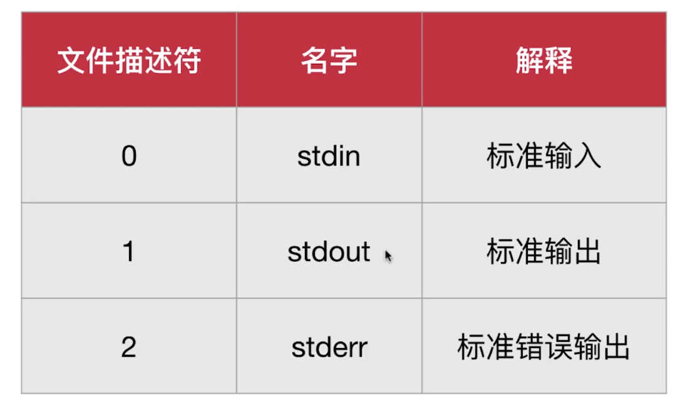
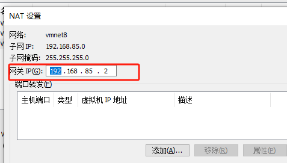

## 服务器类型

塔式服务器、机式服务器、刀片服务器、柜式服务器。


## GNU与Linux的关系

GNU（GNU's Not Unix）和Linux是两个开源计算机操作系统的关键组成部分。它们之间的关系可以追溯到20世纪80年代末和90年代初，当时GNU项目和Linux内核项目相互结合，创造了一个完整的自由开源操作系统，通常称为GNU/Linux或简称Linux。

1. GNU项目：GNU项目是由理查德·斯托曼（Richard Stallman）于1983年发起的，旨在开发一个自由开源的Unix类操作系统。GNU项目开发了许多操作系统组件，如编译器（GCC）、文本编辑器（Emacs）、图形库（GTK+）、C库（GNU C库，glibc）等，这些组件是构建完整操作系统所必需的。GNU项目的目标是创建一个完整的自由软件操作系统。

2. Linux内核：Linus Torvalds于1991年发起了Linux内核项目，这是操作系统的核心部分，它负责管理计算机的硬件资源和提供系统调度等功能。Linux内核是在GNU项目的帮助下与GNU的用户空间工具结合在一起的，从而创建了一个完整的操作系统。

3. GNU/Linux：当Linux内核与GNU项目的工具集和库相结合时，形成了一个完整的自由开源操作系统。通常称之为GNU/Linux，强调了GNU项目对操作系统的重要贡献。这个操作系统在90年代后期和21世纪初期迅速扩展，成为服务器、桌面和嵌入式系统等各种领域的首选操作系统。

尽管GNU项目和Linux内核是两个不同的项目，但它们协同工作，为用户提供了一个功能强大且自由的操作系统。因此，GNU/Linux操作系统的发展史是GNU项目和Linux内核的合作史。虽然在日常对话中通常简称为Linux，但更准确地称之为GNU/Linux，以表彰GNU项目对这个操作系统的重要贡献。

## 不同的 Linux 发行版

* Red Hat:性能稳定，老牌的Linux发行版。收费的是 RHEL
* Fedora: Red Hat 的社区免费后继版
* Centos:算是 RHEL 的克隆版，免费
* Deepin:中国发行。对优秀的开源产品进行集成和配置，开发软件
* Debian:算是迄今为止，最遵循 GNU 规范的 Linux 系统
* Ubuntu:Debian 的后继或一个分支

每一个发行版本都有两种运行模式，一种是命令行模式，一种是桌面模式【通过桌面管理器，如：GNOME】

## 镜像网站

阿里云：https://developer.aliyun.com/mirror/

163：https://mirrors.163.com/

## 查看linux版本

查看是哪个发行版

```shell
cat /etc/os-release
```

```shell
cat /etc/redhat-release
```

`hostnamectl`也可以查看系统信息。

## 修改主机名

`vi /etc/hostname`

## 系统基本配置

网络配置的命令：

`ifconfig`  : 是旧版的命令，在 `net-tools` （已停止维护）软件包中，新版系统中不一定有安装

`ip addr` :  新版命令，在 `iproute2` 中。逐渐替换 `ifconfig`

## 配置网卡信息

当 `ifconfig` 不可用时，先安装

```bash
yum install net-tools
```

**第1步**：首先切换到/etc/sysconfig/network-scripts目录中（存放着网卡的配置文件）。

**第2步**：使用Vim编辑器修改网卡文件ifcfg-ens160，逐项写入下面的配置参数并保存退出。由于每台设备的硬件及架构是不一样的，因此请读者使用ifconfig命令自行确认各自网卡的默认名称。

> **设备类型**：TYPE=Ethernet
>
> **地址分配模式**：BOOTPROTO=static
>
> **网卡名称**：NAME=ens160
>
> **是否启动**：ONBOOT=yes
>
> **IP地址**：IPADDR=192.168.10.10
>
> **子网掩码**：NETMASK=255.255.255.0
>
> **网关地址**：GATEWAY=192.168.10.1
>
> **DNS地址**：DNS1=192.168.10.1

```shell
TYPE="Ethernet"
BOOTPROTO="static"
NAME="ens33"
DEVICE="ens33"
ONBOOT="yes"
IPADDR=192.168.85.130
NETMASK=255.255.255.0
GATEWAY=192.168.85.2
DNS1=8.8.8.8
DNS2=8.8.4.4
```

**第3步**：重启网络服务并测试网络是否连通。

nmcli connection reload ens160   或者重启网络服务 `systemctl restart network`

### nmtui

Text User Interface for controlling NetworkManager.


## 配置软件仓库

**第1步**：进入/etc/yum.repos.d/目录中（因为该目录存放着软件仓库的配置文件）。

**第2步**：使用Vim编辑器创建一个名为rhel8.repo的新配置文件（文件名称可随意，但后缀必须为.repo），逐项写入下面的配置参数并保存退出。

> **仓库名称**：具有唯一性的标识名称，不应与其他软件仓库发生冲突。
>
> **描述信息（name）**：可以是一些介绍性的词，易于识别软件仓库的用处。
>
> **仓库位置（baseurl）**：软件包的获取方式，可以使用FTP或HTTP下载，也可以是本地的文件（需要在后面添加file参数）。
>
> **是否启用（enabled）**：设置此源是否可用；1为可用，0为禁用。
>
> **是否校验（gpgcheck）**：设置此源是否校验文件；1为校验，0为不校验。
>
> **公钥位置（gpgkey）**：若上面的参数开启了校验功能，则此处为公钥文件位置。若没有开启，则省略不写。

**第3步**：按配置参数中所填写的仓库位置挂载光盘，并把光盘挂载信息写入/etc/fstab文件中。

**第4步**：使用“dnf install httpd -y”命令检查软件仓库是否已经可用。

##  安装软件的方法

### RPM

在RPM（红帽软件包管理器）公布之前，要想在Linux系统中安装软件，只能采取编译源码包的方式。RPM有点像Windows系统中的控制面板，会建立统一的数据库，详细记录软件信息并能够自动分析依赖关系。

### Yum软件仓库

Yum软件仓库便是为了进一步降低软件安装难度和复杂度而设计的技术。Yum软件仓库可以根据用户的要求分析出所需软件包及其相关的依赖关系，然后自动从服务器下载软件包并安装到系统

### DNF

DNF实际上就是解决了上述问题的Yum软件仓库的提升版，行业内称之为Yum v4版本。RHEL 8系统也照顾到了老用户的习惯问题，同时兼容并保留了yum和dnf两个命令，大家在实际操作中随意选择就好。甚至这两个命令的提示信息都基本一样，感知不到什么区别

### 简述RPM与软件仓库的作用。

RPM是通过将`源代码`与`安装规则`打包在一起，降低了单个软件的安装难度。而Yum与DNF软件仓库则是将大量常用的`RPM软件`包打包到一起，解决了软件包之间的依赖关系，这进一步降低了软件的整体安装难度。

## yum默认源

yum默认源地址：`/etc/yum.repos.d/CentOS-Base.repo`

镜像地址：[地址](https://www.centos.org/download/mirrors/)

修改默认源为阿里云的源

下载相应的配置文件替换`/etc/yum.repos.d/CentOS-Base.repo`，

如centos 7

```shell
wget -O /etc/yum.repos.d/CentOS-Base.repo https://mirrors.aliyun.com/repo/Centos-7.repo

```

再运行`yum makecache `

## 安装man手册

如果系统是最小化安装的，可能就没有安装帮助手册。可以进行安装

```shell
yum install -y man-pages
```

更新手册内容

```shell
mandb
```

man的替代方案，可以使用命令+ -h或--help，通常--help比man更加精简

```shell
## 简单查看某个命令的使用方法
命令 --usage
```

## man手册阅读

man手册中的 synopsis 语法总结

* 粗体: 原封不动地输入
* 下划线的部分: 用实际的内容替换
* [-hvc] : -h、-v和-c选项都是可选的，非强制性的
* a | b: 你可以输入a或者b选项，但是不能够同时输入a和b
* option...: 省略号表示前面的内容可以输入任意多个

系统中可能含有相同的命令/函数的帮助文件，如`rand` , 可以使用下面的方式查看不同部分的文档

`man 数字 命令` 其中的`数字`是命令的哪部分，

 ## apropos

查找相关的命令，如： 

```shell
apropos sound
```

 就列出了所有使用手册中有sound这个关键字的命令

## ssh 相关

### ssh 服务端

ssh的服务端配置文件位置：`/etc/ssh/sshd_config` ; 

配置文件配置帮助手册: `man sshd_config`

修改完配置后，需要重启`sshd` 服务使配置生效

 sshd服务配置文件中包含的参数以及作用

| 参数                              | 作用                                |
| --------------------------------- | ----------------------------------- |
| Port 22                           | 默认的sshd服务端口                  |
| ListenAddress 0.0.0.0             | 设定sshd服务器监听的IP地址          |
| Protocol 2                        | SSH协议的版本号                     |
| HostKey /tc/ssh/ssh_host_key      | SSH协议版本为1时，DES私钥存放的位置 |
| HostKey /etc/ssh/ssh_host_rsa_key | SSH协议版本为2时，RSA私钥存放的位置 |
| HostKey /etc/ssh/ssh_host_dsa_key | SSH协议版本为2时，DSA私钥存放的位置 |
| PermitRootLogin yes               | 设定是否允许root管理员直接登录      |
| StrictModes yes                   | 当远程用户的私钥改变时直接拒绝连接  |
| MaxAuthTries 6                    | 最大密码尝试次数                    |
| MaxSessions 10                    | 最大终端数                          |
| PasswordAuthentication yes        | 是否允许密码验证                    |
| PermitEmptyPasswords no           | 是否允许空密码登录（很不安全）      |

### ssh的客户端

ssh的客户端配置文件位置：`/etc/ssh/ssh_config` ;  `~/.ssh/config`

查看客户端帮助手册: `man ssh_config`

客户端配置例子：

```shell
Host local-131
HostName 192.168.85.131
Port 22
User root
```

### ssh 免密登陆

```
* 客户端生成密钥对: 使用`ssh-keygen` 命令生成，【默认使用RSA非对称加密算法】 
```

 * 将公钥拷贝到服务器内。可以使用 `ssh-copy-id root@192.168.85.131`； 也可以手动通过其它方式，公钥存储位置在主配置文件里这个条目： `AuthorizedKeysFile      .ssh/authorized_keys`；`authorized_keys`是文件，不是文件夹
 * 在客户端运行 `ssh -T server_ip` 测试ssh是否已通

> .ssh文件在所要登陆的用户的主目录文件下。如root用户位置为 /root/.ssh

> `~/.ssh/known_hosts` 文件是 SSH 客户端用于存储已知主机的公钥的地方。当你首次连接到一个 SSH 服务器时，客户端会询问是否接受服务器的公钥，并将其存储在 `known_hosts` 文件中。下次连接到同一台服务器时，客户端会检查 `known_hosts` 文件，以确保服务器的公钥与之前存储的一致。如果不一致，客户端可能会发出警告，以防止潜在的安全问题。
>
> 这个文件对于安全至关重要，因为它可以帮助客户端检测到中间人攻击（Man-in-the-Middle Attack）或其他与服务器身份验证相关的问题。如果服务器的公钥发生了变化，可能表示存在安全风险，因此客户端会发出警告或阻止连接。
>
> `known_hosts` 文件中的条目通常以主机名或 IP 地址开头，然后是服务器的公钥。每个条目都有一个或多个密钥算法和相应的公钥数据。这样，客户端可以验证连接时所使用的服务器是否与先前连接的服务器相同。

## 系统初始化进程

RHEL 7/8系统替换掉了熟悉的初始化进程服务System V init，正式采用全新的systemd初始化进程服务

## Linux命令的格式

**命令名称   [命令参数]   [命令对象]**

> 命令参数 与 命令对象都是可选的。它们的个数可以是单个或者多个

**命令名称**：就是语法中的“动词”，表达的是想要做的事情，例如创建用户、查看文件、重启系统等操作。

**命令参数**：用于对命令进行调整，让“修改”过的命令能更好地贴合工作需求，达到事半功倍的效果。参数可以用长格式（完整的选项名称），也可以用短格式（单个字母的缩写），两者分别用`--`与`-`作为前缀，例如`man --help`，`man -h`

**命令对象**：一般指要处理的文件、目录、用户等资源名称，也就是命令执行后的`承受方`。例如创建一位叫小明的用户、查看一个叫工资表的文件、重启一个IP为192.168.10.10的系统等。

<span style="color:red">**要注意Linux系统中的命令、参数、对象都是严格区分大小写的**</span>

**输入命令前就已经存在的　[root@linuxprobe～]#**

当前登录用户名为`root`，简要的主机名是`linuxprobe`，所在目录是`～`，`～`表示当前用户的家目录。 `#`表示管理员身份（如果是`$`则表示普通用户，相应的权限也会小一些）

## 额外的4个快捷键/组合键小技巧

* **Tab键**： 想不起命令的完整拼写；例如：`re<Tab键><Tab键>` 按两次tab键
* **Ctrl+c组合键**：当同时按下键盘上的Ctrl和字母c的时候，意味着终止当前进程的运行。

* **Ctrl+d组合键**：当同时按下键盘上的Ctrl和字母d的时候，表示键盘输入结束。

* **Ctrl+l组合键**：当同时按下键盘上行的Ctrl和字母l的时候，会清空当前终端中已有的内容（相当于清屏操作）。

## Shell 与 Bash

Shell就是终端程序的统称，它充当了人与内核（硬件）之间的翻译官。红帽系统在内的许多主流Linux系统默认使用的终端是Bash（Bourne-Again SHell）解释器。

它俩的关系是：Bash是Shell的一个实现

###　查看系统内所有shell

查看`/etc/shells` 文件内的内容

### 查看系统使用的shell

```shell
# 查看当前对话使用的shell 【并不是100%精确】
echo $0
# 或者
ps -p $$
```

### 查看系统默认的shell

```shell
echo $SHELL
```

### 使用新的shell

```shell
# 直接输入shell的名字就可以
new_shell
```

> 输入`exit`退出

### 修改默认的shell

```shell
chsh -s /usr/bin/fish
```

## login shell

`login shell`是当用户登录系统时启动的shell实例。通常，它会读取并执行特定的初始化脚本，为用户设置环境和其他任务。

读取并执行`/etc/profile`（对于所有用户）和`~/.bash_profile`, `~/.bash_login`或`~/.profile`（对于特定用户）。

通常用于设置环境变量，如`PATH`，和其他会话初始化任务。

- 非login shell不会读取上述的初始化脚本，但可能会读取其它如`~/.bashrc`的脚本。

  > rc 是run commnds的缩写, 取自runcom

- 非login shell通常是在登录后在图形界面中打开终端窗口时启动的。

### 如何确定是否为login shell

- 查看`$0`变量的值。如果它以'-'开头，那么它是一个login shell。
- 使用`shopt -q login_shell`命令。返回true则为login shell。

## 命令将进入后台来执行

如果有些命令在执行时不断地在屏幕上输出信息，影响到后续命令的输入，则可以在执行命令时在末尾添加一个&符号，这样命令将进入系统后台来执行。

## 查询环境变量

我们可以使用env命令来查看Linux系统中所有的环境变量，而刘遄老师为您精挑细选出了最重要的10个环境变量

​                                  Linux系统中最重要的10个环境变量

| 变量名称     | 作用                             |
| ------------ | -------------------------------- |
| HOME         | 用户的主目录（即家目录）         |
| SHELL        | 用户在使用的Shell解释器名称      |
| HISTSIZE     | 输出的历史命令记录条数           |
| HISTFILESIZE | 保存的历史命令记录条数           |
| MAIL         | 邮件保存路径                     |
| LANG         | 系统语言、语系名称               |
| RANDOM       | 生成一个随机数字                 |
| PS1          | Bash解释器的提示符               |
| PATH         | 定义解释器搜索用户执行命令的路径 |
| EDITOR       | 用户默认的文本编辑器             |

## 输出重定向

输出重定向中用到的符号及其作用

| 符号                               | 作用                                                 |
| ---------------------------------- | ---------------------------------------------------- |
| 命令 > 文件                        | 将标准输出重定向到一个文件中（清空原有文件的数据）   |
| 命令 2> 文件                       | 将错误输出重定向到一个文件中（清空原有文件的数据）   |
| 命令 >> 文件                       | 将标准输出重定向到一个文件中（追加到原有内容的后面） |
| 命令 2>> 文件                      | 将错误输出重定向到一个文件中（追加到原有内容的后面） |
| 命令 >> 文件 2>&1 或 命令 &>> 文件 | 将标准输出与错误输出共同写入到文件                   |

一种常见情况，就是我们想不区分标准输出和错误输出，只要命令有输出信息则全部追加写入到文件中。这就要用到&>>操作符了：

```shell
ls -l linuxprobe &>> readme.txt
ls -l xxxxxx &>> readme.txt
# -rw-r--r--. 1 root root 0 Mar  1 13:30 linuxprobe
## 标准输出和错误输出都写入result.log文件
cat not_exist_file.csv > result.log 2>&1
cat not_exist_file.csv >> result.log 2>&1
```

文件描述符



## 输入重定向

用`<`与`<<`

`<`从文件输入

```shell
cat < abc.txt
```

`<<` 从键盘输入

```shell
## 读取从键盘输入，当遇到END时，输入结束
sort -n << END
### 输入输出重定向综合使用
sort -n << END >> sort_result.log 2>&1
```


## 管道命令符

管道命令符的作用也可以用一句话概括为“**把前一个命令原本要输出到屏幕的信息当作后一个命令的标准输入**”

## 运行后台进程与前台进程

使用`&` 使进程在后台运行：

```shell
find / -name '*log' > find_result.txt 2>&1 &
```

`&`符号虽然使进程到了后台运行，但是进程仍与终端关联在一起了，终端结束后，进程也就结束了。

这是可以使用`nohup` 做到真正的后台运行，使运行的进程不受hangups 信号的影响。

```shell
nohup find / -name '*log' > find_result.txt 2>&1 &
```

前后台进程转化


`jobs`命令可以查看当前后台运行的进程 

`bg + 1,2`(进程标号)使停止的后台进程恢复在后台运行。

`fg`也一样

## 进程运行状态

* R : runnable
* S : sleeping
* D : uninterruptible sleep 不可中断
* Z : zombie 僵死
* T : traced or stopped 停止 

## 设置自定义环境变量

变量是由固定的变量名与用户或系统设置的变量值两部分组成的，我们完全可以自行创建变量来满足工作需求。例如，设置一个名称为WORKDIR的变量，方便用户更轻松地进入一个层次较深的目录：

```shell
[root@linuxprobe ~]# mkdir /home/workdir
[root@linuxprobe ~]# WORKDIR=/home/workdir
[root@linuxprobe ~]# cd $WORKDIR 
[root@linuxprobe workdir]# pwd
/home/workdir
```

但是，这样的变量不具有全局性，作用范围也有限，默认情况下不能被其他用户使用：

可以使用export命令将其提升为全局变量，这样其他用户也就可以使用它了：

```shell
[root@linuxprobe ~]# export WORKDIR
[root@linuxprobe ~]# su linuxprobe
[linuxprobe@linuxprobe ~]$ cd $WORKDIR
[linuxprobe@linuxprobe workdir]$ pwd
/home/workdir
```

后续要是不使用这个变量了，则可执行unset命令把它取消掉：

```shell
[root@linuxprobe ~]# unset WORKDIR
[root@linuxprobe ~]#
```

## nano编辑器

###　安装nano

```shell
yum install -y nano
```

### nano配置文件

在个人家目录下可以有针对用户的配置文件`.nanorc`文件，还有一个全局的配置文件`/etc/nanorc`，一个有`.`一个没有。

配置文件每一行一句配置语句，配置语句是以 set 或unset 开头

```shell
set mounse
set autoindent
set smarthome
### 具体的配置项可以参考/etc/nanorc配置文件里的内容
```

### 常用参数

-m: 激活鼠标

-i: 激活自动缩进

-A: 激活智能Home键 

### 快捷键

alt + _: 撤回

## Vim编辑器

内置了一个教程程序 `vimtutor`

### 打开文件

`vim +数字 文件路径`: 打开文件的某一行

`vim +/关键词 文件路径`: 打开文件并高亮关键词


### 3种模式切换

先搞清这3种模式的操作区别以及模式之间的切换方法。

> **命令模式**【Normal mode】：控制光标移动，可对文本进行复制、粘贴、删除和查找等工作。
>
> **输入模式**：正常的文本录入。
>
> **末行模式**：保存或退出文档，以及设置编辑环境。


在每次运行Vim编辑器时，默认进入命令模式，此时需要先切换到输入模式后再进行文档编写工作。而每次在编写完文档后需要先返回命令模式，然后再进入末行模式，执行文档的保存或退出操作。

可以分别使用a、i、o三个键从命令模式切换到输入模式。其中，a键与i键分别是在光标后面一位和光标当前位置切换到输入模式，而o键则是在光标的下面再创建一个空行

 

### 常用的命令

命令模式中最常用的一些命令

| 命令                                                         | 作用                                                         |
| ------------------------------------------------------------ | ------------------------------------------------------------ |
| dd                                                           | 删除（剪切）光标所在整行 【删除之后下一行会上移】            |
| 5dd                                                          | 删除（剪切）从光标处开始的5行                                |
| D                                                            | 删除之后下一行不会上移                                       |
| yy                                                           | 复制光标所在整行                                             |
| 5yy                                                          | 复制从光标处开始的5行                                        |
| n                                                            | 显示搜索命令`/`定位到的下一个字符串                          |
| N                                                            | 显示搜索命令定位到的上一个字符串                             |
| u                                                            | 撤销上一步的操作                                             |
| Ctrl-r                                                       | 用于重做（redo）已经被撤销的操作。 与u 的作用相反            |
| p                                                            | 将之前（dd）、（dw）等删除或复制（yy）过的数据粘贴到光标的后面，如果是一行的话就是粘贴到下一行。 |
| ctrl + G                                                     | show your location in the file and the file status           |
| G                                                            | 转到最后一行。`数字+G` 跳转到指定的行                        |
| gg                                                           | 转到首行                                                     |
| ctrl + O                                                     | To go back to where you came from press                      |
| ctrl + I                                                     | go forward                                                   |
| v                                                            | 进入可视化模式，用上下左右控制选区。y 复制，p粘贴            |
| x                                                            | 删除光标下面的字符                                           |
| a\|i\|o\|A\|O                                                | 在光标后开始插入\|在光标前开始插入\|在光标的下一行开始\|在光标所在行的最末处插入文本\|在光标的上一行开始 |
| de、dw、d$、d3e<br/>d为operator<br/>`e、w、$`为motion<br/>d0 删除到行首 | 删除内容<br/>w - until the start of the next word, EXCLUDING its first character.<br/>e - to the end of the current word, INCLUDING the last character. <br/>$ - to the end of the line, INCLUDING the last character.<br/>3e - 删除三个单词 |
| 0、$                                                         | 光标分别移到行首和行末                                       |
| r+字符 \| R                                                  | 替换某个字符 \| 替换多个字符                                 |
| ce 【`c`与`d`一样有相同的motions】                           | 更改某个单词，再按`ESC`退出                                  |
| %                                                            | Type  %  to find a matching ),], or } .                      |

 Many commands that change text are made from an operator and a motion.格式为：`operator+motion` , 如：`de、dw、d$`, 

还可以在有些`motion`前面加数字表示操作的数量，

如`3e`：光标移动3个单词；`d3e`: 删除三个单词


末行模式主要用于保存或退出文件，以及设置Vim编辑器的工作环境，还可以让用户执行外部的Linux命令或跳转到所编写文档的特定行数。要想切换到末行模式，在命令模式中输入一个冒号就可以了。末行模式中常用的命令如表4-2所示。

表4-2                          末行模式中最常用的一些命令

| 命令          | 作用                                                         |
| ------------- | ------------------------------------------------------------ |
| :w            | 保存 可以用`:w FILENAME` 保存到新的文件                      |
| :q            | 退出                                                         |
| :q!           | 强制退出（放弃对文档的修改内容）                             |
| :wq!          | 强制保存退出                                                 |
| :set nu       | 显示行号                                                     |
| :set nonu     | 不显示行号                                                   |
| :set hls      | 高亮搜索结果  【取消高亮nohlsearch】                         |
| :命令         | 执行该命令                                                   |
| :整数         | 跳转到该行                                                   |
| :s/one/two    | 将当前光标所在行的第一个one替换成two                         |
| :s/one/two/g  | 将当前光标所在行的所有one替换成two                           |
| :%s/one/two/g | 将全文中的所有one替换成two。还可以用/gc，来进行选择是否替换  |
| ?字符串       | 在文本中从下至上搜索该字符串                                 |
| /字符串       | 在文本中从上至下搜索该字符串。默认是区分大小写的，在最前面加入`\c` 将不区分大小写。如：`/\chello` |
| :u            | 撤销上一步操作                                               |
| :set ic       | ignorecase  忽略大小写                                       |
| :set noic     | 不忽略大小写                                                 |
| :!            | 执行外部命令                                                 |


保存到新的文件，`:w FILENAME` 

选中文件中的部分内容到新的文件： 

* 按`v` 进入可视化模式
* 移动光标以选中文本
* 按`:w FILENAM` . 如果文件已经存在，需要覆盖的话，用`w!`

复制选中的文本

* `v`
* 移动光标以选中文本
* `y`
* `p`

追加其它文件内容的到光标下一行

`r: FILENAME`

分屏打开其它文件

`:sp`: 水平分屏

`:vsp`: 垂直分屏

在不同的屏幕之前跳转按两次`ctrl + w`。或者`ctrl + w + 方向键`。`ctrl + w + [加号|减号|等号|r|o]`

`ctrl + v` 块级可视化模式: `r` 批量替换，`I` 批量插入

### vim配置文件

持久化设置vim的一些设置。默认的配置文件位置：`/etc/vim/vimrc`

> 有些发行版，可能是另外配置文件 `vimrc.local`

新建一个配置文件：`~/.vimrc`

常用的配置项

```shell
set number
set showcmd
set ignorecase
set mouse=a
```


## shell 脚本

（#!）用来告诉系统使用哪种Shell解释器来执行该脚本； 

（#）是对脚本功能和某些命令的介绍信息，使得自己或他人在日后看到这个脚本内容时，可以快速知道该脚本的作用或一些警告信息；

## shell 学习书

http://billie66.github.io/TLCL/book/

## 接受用户输入参数

`$0`对应的是当前Shell脚本程序的名称，`$#`对应的是总共有几个参数，`$*`对应的是所有位置的参数值，$?对应的是显示上一次命令的执行返回值，而$1、$2、$3……则分别对应着第*N*个位置的参数值

按照测试对象来划分，条件测试语句可以分为4种：

> 文件测试语句；
>
> 逻辑测试语句；
>
> 整数值比较语句；
>
> 字符串比较语句。

Shell脚本中的条件测试语法可以判断表达式是否成立，若条件成立则返回数字0，否则便返回非零值。条件测试语法的执行格式如图所示。切记，条件表达式<span style="color:red">两边均应有一个空格。</span>


&&: 它表示当前面的命令执行成功后才会执行它后面的命令

||：表示当前面的命令执行失败后才会执行它后面的命令

!：表示当前面的命令执行失败后才会执行它后面的命令

```shell
[ ! $USER = root ] 
```

## 文件测试所用的参数

| 操作符 | 作用                       |
| ------ | -------------------------- |
| -d     | 测试文件是否为目录类型     |
| -e     | 测试文件是否存在           |
| -f     | 判断是否为一般文件         |
| -r     | 测试当前用户是否有权限读取 |
| -w     | 测试当前用户是否有权限写入 |
| -x     | 测试当前用户是否有权限执行 |

## 可用的整数比较运算符

| 操作符 | 作用           |
| ------ | -------------- |
| -eq    | 是否等于       |
| -ne    | 是否不等于     |
| -gt    | 是否大于       |
| -lt    | 是否小于       |
| -le    | 是否等于或小于 |
| -ge    | 是否大于或等于 |

## 常见的字符串比较运算符

| 操作符 | 作用                   |
| ------ | ---------------------- |
| =      | 比较字符串内容是否相同 |
| !=     | 比较字符串内容是否不同 |
| -z     | 判断字符串内容是否为空 |

## 文件权限与归属

文件来说，权限比较容易理解：“可读”表示能够读取文件的实际内容；“可写”表示能够编辑、新增、修改、删除文件的实际内容；“可执行”则表示能够运行一个脚本程序。但是，对于目录文件来说，“可读”表示能够读取目录内的文件列表；“可写”表示能够在目录内新增、删除、重命名文件；而“可执行”则表示能够进入该目录。

读写执行权限对于文件与目录可执行命令的区别


文件权限的字符与数字表示


通过ls命令查看到的文件属性信息


包含了文件的类型、访问权限、所有者（属主）、所属组（属组）、占用的磁盘大小、最后修改时间和文件名称等信息

排在权限前面的减号（-）是文件类型（减号表示普通文件）

>常见的文件类型包括普通文件（-）、目录文件（d）、链接文件（l）、管道文件（p）、块设备文件（b）以及字符设备文件（c）。

### 文件的特殊权限

**SUID**

SUID是一种对二进制程序进行设置的特殊权限，能够让二进制程序的执行者临时拥有所有者的权限（仅对拥有执行权限的二进制程序有效）。例如，所有用户都可以执行passwd命令来修改自己的用户密码，而用户密码保存在/etc/shadow文件中。仔细查看这个文件就会发现它的默认权限是000，也就是说除了root管理员以外，所有用户都没有查看或编辑该文件的权限。

-   SUID 权限仅对二进制程序（binary program）有效 【仅可用在binary program 上， 不能够用在 shell script 上面】；
-   执行者对于该程序需要具有 x 的可执行权限；
-   本权限仅在执行该程序的过程中有效 （run-time）；
-   执行者将具有该程序拥有者 （owner） 的权限。

 **SGID**

SGID特殊权限有两种应用场景：当对二进制程序进行设置时，能够让执行者临时获取文件所属组的权限；当对目录进行设置时，则是让目录内新创建的文件自动继承该目录原有用户组的名称。

-   SGID 对二进制程序有用；
-   程序执行者对于该程序来说，需具备 x 的权限；
-   执行者在执行的过程中将会获得该程序群组的支持！


**SBIT**

SBIT特殊权限位可确保用户只能删除自己的文件，而不能删除其他用户的文件。换句话说，当对某个目录设置了SBIT粘滞位权限后，那么该目录中的文件就只能被其所有者执行删除操作了。

前面所讲的SUID和SGID权限显示方法不同，当目录被设置SBIT特殊权限位后，文件的其他用户权限部分的x执行权限就会被替换成t或者T—原本有x执行权限则会写成t，原本没有x执行权限则会被写成T。

其实，SUID、SGID与SBIT也有对应的数字表示法，分别为4、2、1。也就是说777还不是最大权限，最大权限应该是7777，其中第1个数字代表的是特殊权限位。

 SUID、SGID、SBIT特殊权限的设置参数

| 参数 | 作用         |
| ---- | ------------ |
| u+s  | 设置SUID权限 |
| u-s  | 取消SUID权限 |
| g+s  | 设置SGID权限 |
| g-s  | 取消SGID权限 |
| o+t  | 设置SBIT权限 |
| o-t  | 取消SBIT权限 |


### chmod和chown、chgrp。

chmod命令用于设置文件的一般权限及特殊权限，英文全称为“change mode”，语法格式为“chmod [参数] 文件名”。

chown命令用于设置文件的所有者和所有组，英文全称为change own，语法格式为“chown 所有者:所有组 文件名”。

chmod和chown命令是用于修改文件属性和权限的最常用命令，它们还有一个特别的共性，就是针对目录进行操作时需要加上 大写 参数`-R`来表示递归操作，即对目录内所有的文件进行整体操作。

修改文件权限

```shell
[root@linuxprobe tmp]# chmod -R 777 testdir
```

<span style="color:red">其实，文件能否被删除并不取决于自身的权限，而是看其所在目录是否有写入权限</span>

chgrp: 改变文件所属群组

## 文件的隐藏属性

Linux系统中的文件除了具备一般权限和特殊权限之外，还有一种隐藏权限，即被隐藏起来的权限，默认情况下不能直接被用户发觉

### chattr命令

chattr命令用于设置文件的隐藏权限，英文全称为change attributes，语法格式为“chattr [参数] 文件名称”。

想要把某个隐藏功能添加到文件上，则需要在命令后面追加“+参数”，如果想要把某个隐藏功能移出文件，则需要追加“-参数”

 chattr命令中的参数及其作用

| 参数 | 作用                                                         |
| ---- | ------------------------------------------------------------ |
| i    | 无法对文件进行修改；若对目录设置了该参数，则仅能修改其中的子文件内容而不能新建或删除文件 |
| a    | 仅允许补充（追加）内容，无法覆盖/删除内容（Append Only）     |
| S    | 文件内容在变更后立即同步到硬盘（sync）                       |
| s    | 彻底从硬盘中删除，不可恢复（用0填充原文件所在硬盘区域）      |
| A    | 不再修改这个文件或目录的最后访问时间（atime）                |
| b    | 不再修改文件或目录的存取时间                                 |
| D    | 检查压缩文件中的错误                                         |
| d    | 使用dump命令备份时忽略本文件/目录                            |
| c    | 默认将文件或目录进行压缩                                     |
| u    | 当删除该文件后依然保留其在硬盘中的数据，方便日后恢复         |
| t    | 让文件系统支持尾部合并（tail-merging）                       |
| x    | 可以直接访问压缩文件中的内容                                 |

### lsattr命令

lsattr命令用于查看文件的隐藏权限，英文全称为“list attributes”，语法格式为“lsattr [参数] 文件名称”。

## 文件访问控制列表

基于普通文件或目录设置ACL其实就是针对指定的用户或用户组设置文件或目录的操作权限，更加精准地派发权限。另外，如果针对某个目录设置了ACL，则目录中的文件会继承其ACL权限；若针对文件设置了ACL，则文件不再继承其所在目录的ACL权限。

###  setfacl命令

setfacl命令用于管理文件的ACL权限规则，英文全称为“set files ACL”，语法格式为“setfacl [参数] 文件名称”。

例如，我们原本是无法进入/root目录中的，现在为普通用户单独设置一下权限：

```shell
[root@linuxprobe ~]# setfacl -Rm u:linuxprobe:rwx /root
```

ACL权限提供的是在所有者、所属组、其他人的读/写/执行权限之外的特殊权限控制。使用setfacl命令可以针对单一用户或用户组、单一文件或目录来进行读/写/执行权限的控制。其中，针对目录文件需要使用-R递归参数；针对普通文件则使用-m参数；如果想要删除某个文件的ACL，则可以使用-b参数。setfacl命令的常用参数如表所示。

  setfacl命令中的参数以及作用

| 参数 | 作用             |
| ---- | ---------------- |
| -m   | 修改权限         |
| -M   | 从文件中读取权限 |
| -x   | 删除某个权限     |
| -b   | 删除全部权限     |
| -R   | 递归子目录       |

常用的ls命令是看不到ACL信息的，但是却可以看到文件权限的最后一个点（**.**）变成了加号（**+**），这就意味着该文件已经设置了ACL。 

###  getfacl命令

getfacl命令用于查看文件的ACL权限规则，英文全称为“get files ACL”，语法格式为“getfacl [参数] 文件名称”。

### 备份/恢复acl

备份：

```shell
[root@linuxprobe /]# getfacl -R home > backup.acl
```

恢复：

```shell
[root@linuxprobe /]# setfacl --restore backup.acl
```

## su命令与sudo服务

> sudo是英文substitute user do

su命令可以解决切换用户身份的需求，使得当前用户在不退出登录的情况下，顺畅地切换到其他用户，比如从root管理员切换至普通用户：

```shell
[root@linuxprobe ~]# su - linuxprobe
```

上面的su命令与用户名之间有一个减号（-），这意味着完全切换到新的用户，即把环境变量信息也变更为新用户的相应信息，而不是保留原始的信息。强烈建议在切换用户身份时添加这个减号（-）。
> sudo -i 和 sudo su - 的功能是等价的，都提供一个完整的 root 登录环境

sudo命令用于给普通用户提供额外的权限，语法格式为“sudo [参数] 用户名”。

使用sudo命令可以给普通用户提供额外的权限来完成原本只有root管理员才能完成的任务，可以限制用户执行指定的命令，记录用户执行过的每一条命令，集中管理用户与权限（/etc/sudoers）

使用sudo命令可以给普通用户提供额外的权限来完成原本只有root管理员才能完成的任务，可以限制用户执行指定的命令，记录用户执行过的每一条命令，集中管理用户与权限（/etc/sudoers），以及可以在验证密码后的一段时间无须让用户再次验证密码。常见的sudo命令的可用参数如表5-10所示。

表5-10                     sudo命令中的可用参数以及作用

| 参数             | 作用                                                   |
| ---------------- | ------------------------------------------------------ |
| -h               | 列出帮助信息                                           |
| -l               | 列出当前用户可执行的命令                               |
| -u 用户名或UID值 | 以指定的用户身份执行命令                               |
| -k               | 清空密码的有效时间，下次执行sudo时需要再次进行密码验证 |
| -b               | 在后台执行指定的命令                                   |
| -p               | 更改询问密码的提示语                                   |

visudo命令用于编辑、配置用户sudo的权限文件，语法格式为“visudo [参数]”。

使用visudo命令配置权限文件时，其操作方法与Vim编辑器中用到的方法完全一致，因此在编写完成后记得在末行模式下保存并退出。在配置权限文件时，按照下面的格式在第101行（大约）填写上指定的信息。

> **谁可以使用：**稍后要为哪位用户进行命令授权。
>
> **允许使用的主机：**可以填写ALL表示不限制来源的主机，亦可填写如192.168.10.0/24这样的网段限制来源地址，使得只有从允许网段登录时才能使用sudo命令。
>
> **以谁的身份：**可以填写ALL表示系统最高权限，也可以是另外一位用户的名字。
>
> **可执行命令的列表：**可以填写ALL表示不限制命令，亦可填写如/usr/bin/cat这样的文件名称来限制命令列表，多个命令文件之间用逗号（,）间隔。

```shell
[root@linuxprobe ~]# visudo
 99 ## Allow root to run any commands anywhere
100 root ALL=(ALL) ALL
101 linuxprobe ALL=(ALL) ALL
```

然后使用visudo命令继续编辑权限文件，将原先第101行所新增的参数作如下修改，且多个命令之间用逗号（,）间隔：

```shell
[root@linuxprobe ~]# visudo
 99 ## Allow root to run any commands anywhere
100 root ALL=(ALL) ALL
101 linuxprobe ALL=(ALL) /usr/bin/cat,/usr/sbin/reboot
```

每次执行sudo命令都要输入一次密码其实也挺麻烦的，这时可以添加NOPASSWD参数，使得用户下次再执行sudo命令时就不用密码验证：

```shell
[root@linuxprobe ~]# visudo
 99 ## Allow root to run any commands anywhere
100 root ALL=(ALL) ALL
101 linuxprobe ALL=(ALL) NOPASSWD:/usr/bin/cat,/usr/sbin/reboot
```

##  Linux系统中常见的目录名称

   Linux系统中常见的目录名称以及相应内容

| 目录名称    | 应放置文件的内容                                             |
| ----------- | ------------------------------------------------------------ |
| /boot       | 开机所需文件—内核、开机菜单以及所需配置文件等                |
| /dev        | 以文件形式存放任何设备与接口                                 |
| /etc        | 配置文件  【法语相关，翻译成and so on....等等。放一些零零碎碎的东西，就遗留下来的】 |
| /home       | 用户主目录 【除了root用户以外的用户，root用户单独在/root文件夹】 |
| /bin        | 存放单用户模式下还可以操作的[命令](https://www.linuxcool.com/) |
| /lib        | 开机时用到的函数库，以及/bin与/sbin下面的命令要调用的函数    |
| /sbin       | 开机过程中需要的命令 【system binary】,有super 权限的用户才能执行的命令 |
| /media      | 用于挂载设备文件的目录                                       |
| /opt        | 放置第三方的软件 【optional application software package】   |
| /root       | 系统管理员的家目录                                           |
| /srv        | 一些网络服务的数据文件目录                                   |
| /tmp        | 任何人均可使用的“共享”临时目录                               |
| /proc       | 虚拟文件系统，例如系统内核、进程、外部设备及网络状态等       |
| /usr/local  | 用户自行安装的软件 【usr:是英语 Unix Software Resource 的缩写】 |
| /usr/sbin   | Linux系统开机时不会使用到的软件/命令/[脚本](https://www.linuxcool.com/) |
| /usr/share  | 帮助与说明文件，也可放置共享文件                             |
| /var        | 主要存放经常变化的文件，如日志                               |
| /lost+found | 当文件系统发生错误时，将一些丢失的文件片段存放在这里         |

### 物理设备的命名规则

在Linux系统中一切都是文件，硬件设备也不例外。既然是文件，就必须有文件名称。系统内核中的udev设备管理器会自动把硬件名称规范起来，目的是让用户通过设备文件的名字可以猜出设备大致的属性以及分区信息等；这对于陌生的设备来说特别方便。另外，udev设备管理器的服务会一直以守护进程的形式运行并侦听内核发出的信号来管理/dev目录下的设备文件。Linux系统中常见的硬件设备及其文件名称如表6-2所示。

表6-2                       常见的硬件设备及其文件名称

| 硬件设备      | 文件名称           |
| ------------- | ------------------ |
| IDE设备       | /dev/hd[a-d]       |
| SCSI/SATA/U盘 | /dev/sd[a-z]       |
| virtio设备    | /dev/vd[a-z]       |
| 软驱          | /dev/fd[0-1]       |
| 打印机        | /dev/lp[0-15]      |
| 光驱          | /dev/cdrom         |
| 鼠标          | /dev/mouse         |
| 磁带机        | /dev/st0或/dev/ht0 |


由于现在的IDE设备已经很少见了，所以一般的硬盘设备都是以“/dev/sd”开头。而一台主机上可以有多块硬盘，因此系统采用a～z来代表26块不同的硬盘（默认从a开始分配），而且硬盘的分区编号也很有讲究：

> 主分区或扩展分区的编号从1开始，到4结束；
>
> 逻辑分区从编号5开始。

### 文件系统与数据资料
**Ext4**：Ext3的改进版本，作为RHEL 6系统中默认的文件管理系统，它支持的存储容量高达1EB（1EB=1,073,741,824GB），且能够有无限多的子目录。另外，Ext4文件系统能够批量分配block（块），从而极大地提高了读写效率。现在很多主流服务器也会使用Ext4文件系统。

**XFS**：是一种高性能的日志文件系统，而且是RHEL 7/8中默认的文件管理系统。它的优势在发生意外宕机后尤其明显，即可以快速地恢复可能被破坏的文件，而且强大的日志功能只需花费极低的计算和存储性能。它支持的最大存储容量为18EB【18EB等于18,874,368TB。假设每块硬盘的容量是100TB，那么大概需要19万块硬盘才能把18EB的数据都装下】，这几乎满足了所有需求。

RHEL 7/8系统中一个比较大的变化就是使用了XFS作为文件系统，这不同于RHEL 6使用的Ext4。

在拿到一块新的硬盘存储设备后，先需要分区，然后再格式化文件系统，最后才能挂载并正常使用。

## 文件硬链接、软链接

### 硬链接

使链接的两个文件共享同样文件内容，就是同样的inode 

> ```shell
> 
> ##来查看inode信息
> ls -i file
> ```
>
> 

硬链接缺陷:只能创建指向文件的硬链接，不能创建指向目录的硬链接 【一般情况下】

创建硬链接

```shell
ln file1 file2
```

要删除file1和file2他们共同的文件内容才会消失

### 软链接

软链接才真正像我们在 Windows下的快捷方式，原理很相似
创建硬链接时In 不带任何参数，创建软链接需要加上-s参数
s是symbolic(（符号的）的缩写

```shell
## 创建file1的软链接
ln -s file1 file2
```

ls -i 命令显示出来的两个文件的inode信息不一样, 数量为1，而硬链接是大于1。当删除file1文件时，file2就成了`死链接`了，没有目标文件了。

## 添加交换分区

交换（SWAP）分区是一种通过在硬盘中预先划分一定的空间，然后把内存中暂时不常用的数据临时存放到硬盘中，以便腾出物理内存空间让更活跃的程序服务来使用的技术，其设计目的是为了解决真实物理内存不足的问题。

在生产环境中，交换分区的大小一般为真实物理内存的1.5～2倍。

* 用fdisk 创建分区
* 修改分区的标识码为82
* 用mkswap对交换分区进行格式化
* 用swapon激活新的交换分区

## 磁盘容量配额

可以使用quota技术进行磁盘容量配额管理，从而限制用户的硬盘可用容量或所能创建的最大文件个数。quota技术还有软限制和硬限制的功能。

> **软限制**：当达到软限制时会提示用户，但仍允许用户在限定的额度内继续使用。
>
> **硬限制**：当达到硬限制时会提示用户，且强制终止用户的操作。

RHEL 8系统中已经安装了quota磁盘容量配额服务程序包，但存储设备却默认没有开启对quota技术的支持，此时需要手动编辑配置文件并重启一次系统，让系统中的启动目录（/boot）能够支持quota磁盘配额技术。

xfs_quota命令用于管理设备的磁盘容量配额，语法格式为“xfs_quota [参数] 配额 文件系统”。

```shell
[root@linuxprobe ~]# xfs_quota -x -c 'limit bsoft=3m bhard=6m isoft=3 ihard=6 tom' /boot
```

## 使用RAID与LVM磁盘阵列技术


## 防火墙管理工具[firewall]

RHEL 7系统开始，firewalld防火墙正式取代了iptables防火墙。其实，iptables与firewalld都不是真正的防火墙，它们都只是用来定义防火墙策略的防火墙管理工具而已

* 防火墙策略规则的设置有两种：“通”（即放行[ACCEPT]）和“堵”（即阻止[DROP]）

* 多条规则可以组成一个规则链，而规则链则依据数据包处理位置的不同进行分类，具体如下：

  > 在进行路由选择前处理数据包（PREROUTING）；
  >
  > 处理流入的数据包（INPUT）；
  >
  > 处理流出的数据包（OUTPUT）；
  >
  > 处理转发的数据包（FORWARD）；
  >
  > 在进行路由选择后处理数据包（POSTROUTING）。

  firewall-cmd命令中使用的参数以及作用

| 参数                          | 作用                                                 |
| ----------------------------- | ---------------------------------------------------- |
| --get-default-zone            | 查询默认的区域名称                                   |
| --set-default-zone=<区域名称> | 设置默认的区域，使其永久生效                         |
| --get-zones                   | 显示可用的区域                                       |
| --get-services                | 显示预先定义的服务                                   |
| --get-active-zones            | 显示当前正在使用的区域与网卡名称                     |
| --add-source=                 | 将源自此IP或子网的流量导向指定的区域                 |
| --remove-source=              | 不再将源自此IP或子网的流量导向某个指定区域           |
| --add-interface=<网卡名称>    | 将源自该网卡的所有流量都导向某个指定区域             |
| --change-interface=<网卡名称> | 将某个网卡与区域进行关联                             |
| --list-all                    | 显示当前区域的网卡配置参数、资源、端口以及服务等信息 |
| --list-all-zones              | 显示所有区域的网卡配置参数、资源、端口以及服务等信息 |
| --list-ports                  | 查看已经开放的端口                                   |
|  --list-service | 列出服务
| --remove-service= |删除服务|
| --add-service=<服务名>        | 设置默认区域允许该服务的流量                         |
| --add-port=<端口号/协议>      | 设置默认区域允许该端口的流量                         |
| --remove-service=<服务名>     | 设置默认区域不再允许该服务的流量                     |
| --remove-port=<端口号/协议>   | 设置默认区域不再允许该端口的流量                     |
| --reload                      | 让“永久生效”的配置规则立即生效，并覆盖当前的配置规则 |
| --panic-on                    | 开启应急状况模式                                     |
| --panic-off                   | 关闭应急状况模式                                     |

> `firewall-cmd --permanent --zone=public --add-port=3306/tcp`
> `firewall-cmd --reload `

firewalld配置的防火墙策略默认为运行时（Runtime）模式，会随着系统的重启而失效。用firewall-cmd命令正常设置防火墙策略时添加--permanent参数，这样配置的防火墙策略就可以永久生效了。但是，只有在系统重启之后才能自动生效。如果想让配置的策略立即生效，需要手动执行firewall-cmd --reload命令。

## Centos 7 firewall 命令：

* 查看已经开放的端口：
  firewall-cmd --list-ports

* 开启端口
  firewall-cmd --zone=public --add-port=80/tcp --permanent

  命令含义：

  –zone #作用域

  –add-port=80/tcp #添加端口，格式为：端口/通讯协议

  –permanent #永久生效，没有此参数重启后失效

* 重启防火墙

  firewall-cmd --reload #重启firewall

  systemctl stop firewalld.service #停止firewall

  systemctl disable firewalld.service #禁止firewall开机启动

  firewall-cmd --state #查看默认防火墙状态（关闭后显示notrunning，开启后显示running）

## iptables 基本的命令参数 

  iptables中常用的参数以及作用

| 参数        | 作用                                         |
| ----------- | -------------------------------------------- |
| -P          | 设置默认策略                                 |
| -F          | 清空规则链                                   |
| -L          | 查看规则链                                   |
| -A          | 在规则链的末尾加入新规则                     |
| -I num      | 在规则链的头部加入新规则                     |
| -D num      | 删除某一条规则                               |
| -s          | 匹配来源地址IP/MASK，加叹号“!”表示除这个IP外 |
| -d          | 匹配目标地址                                 |
| -i 网卡名称 | 匹配从这块网卡流入的数据                     |
| -o 网卡名称 | 匹配从这块网卡流出的数据                     |
| -p          | 匹配协议，如TCP、UDP、ICMP                   |
| --dport num | 匹配目标端口号                               |
| --sport num | 匹配来源端口号                               |

例子

* 把INPUT规则链的默认策略设置为拒绝。

  ```shell
iptables -P INPUT DROP
  ```

* 向INPUT链中添加允许ICMP流量进入的策略规则

  ```shell
iptables -I INPUT -p icmp -j ACCEPT
  ```

* 删除INPUT规则链中刚刚加入的那条策略（允许ICMP流量），并把默认策略设置为允许

  使用-F参数会清空已有的所有防火墙策略；使用-D参数可以删除某一条指定的策略，因此更加安全和准确。

  ```shell
  iptables -D INPUT 1
  iptables -P INPUT ACCEPT
  ```

<span style="color:red">**请特别注意**</span>，使用iptables命令配置的防火墙规则默认会在系统下一次重启时失效，如果想让配置的防火墙策略永久生效，还要执行保存命令：

```shell
iptables-save 
```

服务器是5/6/7版本的话，对应的保存命令应该是：

```shell
service iptables save
```

## 远程传输命令

scp

  scp命令中可用的参数及作用

| 参数 | 作用                     |
| ---- | ------------------------ |
| -v   | 显示详细的连接进度       |
| -P   | 指定远程主机的sshd端口号 |
| -r   | 用于传送文件夹           |
| -6   | 使用IPv6协议             |

上传：

```shell
[root@Client ~]# scp /root/readme.txt 192.168.10.10:/home
```

下载：

```shell
[root@Client ~]# scp 192.168.10.10:/etc/redhat-release /root
```

## 不间断会话服务

Terminal Multiplexer（终端复用器，简称为Tmux）是一款能够实现多窗口远程控制的开源服务程序。

* 安装Tmux

    ```
     yum install tmux
    ```
    
* 输入tmux就可进入会话窗口
	
	> 会话窗口的底部出现了一个绿色的状态栏，里面分别显示的是会话编号、名称、主机名及系统时间。
	
* 新建一个指定名称的会话
    ```
    tmux new -s backup
    ```
    
* 输入exit就可以退出当前会话

* 将会话隐藏到后台
    ```
    tmux detach
    ```

* 查看会话列表
    ```
    tmux ls
    ```

* 恢复会话

	直接在tmux命令后面加attach和会话编号或会话名称就可以
    ```
    tmux attach -t backup
    ```

* 管理多窗格

先进入一个tmux会话，再使用“tmux split-window”命令可以创建上下切割的多窗格终端界面。使用“tmux split-window -h”命令可以创建左右切割的多窗格终端界面。可以同时按下“Ctrl + B +方向键”调整窗格的尺寸。

**Tmux不间断会话多窗格切换命令**

| 命令                | 作用             |
| ------------------- | ---------------- |
| tmux select-pane -U | 切换至上方的窗格 |
| tmux select-pane -D | 切换至下方的窗格 |
| tmux select-pane -L | 切换至左方的窗格 |
| tmux select-pane -R | 切换至右方的窗格 |

**Tmux不间断会话多窗格互换命令**

| 命令              | 作用                       |
| ----------------- | -------------------------- |
| tmux swap-pane -U | 将当前窗格与上方的窗格互换 |
| tmux swap-pane -D | 将当前窗格与下方的窗格互换 |
| tmux swap-pane -L | 将当前窗格与左方的窗格互换 |
| tmux swap-pane -R | 将当前窗格与右方的窗格互换 |

**快捷键来执行窗格的切换**

先同时按下Ctrl+B组合键，然后松手后再迅速按下其他后续按键，而不是一起按下。常见快捷键如表

| 快捷键   | 作用                           |
| -------- | ------------------------------ |
| %        | 划分左右两个窗格               |
| "        | 划分上下两个窗格               |
| <方向键> | 切换到上下左右相邻的一个窗格   |
| ;        | 切换至上一个窗格               |
| o        | 切换至下一个窗格               |
| {        | 将当前窗格与上一个窗格位置互换 |
| }        | 将当前窗格与下一个窗格位置互换 |
| x        | 关闭窗格                       |
| !        | 将当前窗格拆分成独立窗口       |
| q        | 显示窗格编号                   |

## hosts 位置

linux hosts配置文件位置  `/etc/hosts`

## Linux 内核参数修改

linux 内核参数配置文件位置 `/etc/sysctl.conf`

> 例如，最常用的配置：
> fs.file-max = 999999  
> net.ipv4.tcp_tw_reuse = 1
> net.ipv4.tcp_keepalive_time = 600
> net.ipv4.tcp_fin_timeout = 30
> net.ipv4.tcp_max_tw_buckets = 5000
> net.ipv4.ip_local_port_range = 1024    61000
> net.ipv4.tcp_rmem = 4096 32768 262142
> net.ipv4.tcp_wmem = 4096 32768 262142
> net.core.netdev_max_backlog = 8096
> net.core.rmem_default = 262144
> net.core.wmem_default = 262144
> net.core.rmem_max = 2097152
> net.core.wmem_max = 2097152
> net.ipv4.tcp_syncookies = 1
> net.ipv4.tcp_max_syn.backlog=1024
>
> file-max：这个参数表示进程（比如一个worker进程）可以同时打开的最大句柄数，这个参数直接限制最大并发连接数，需根据实际情况配置。

## 查看某个进程一具体内容

查看某个端口的进程: `netstat -nlp | grep 8086`

要查看特定PID（进程标识符）为13069的进程的具体内容，你可以使用不同的方法，具体取决于你想查看的信息和进程的类型。以下是一些常见的方法：

1. **查看进程的命令行参数和环境变量**：你可以使用以下命令来查看进程的命令行参数和环境变量：

   ```
   cat /proc/13069/cmdline   # 查看命令行参数
   cat /proc/13069/environ   # 查看环境变量
   ```

   这将显示进程的命令行参数和环境变量的内容。

2. **查看进程的文件描述符**：你可以使用以下命令来查看进程的文件描述符，这将列出进程当前打开的文件和网络套接字：

   ```
   ls -l /proc/13069/fd
   ```

   这将列出进程打开的文件和套接字的符号链接。

3. **查看进程的输出**：如果进程有标准输出和标准错误输出，你可以将它们重定向到文件并查看输出内容。例如：

   ```
   cat /proc/13069/fd/1   # 查看标准输出
   cat /proc/13069/fd/2   # 查看标准错误输出
   ```

   这将显示进程的标准输出和标准错误输出内容。

4. **使用工具查看进程详细信息**：你还可以使用工具如 `top`、`htop`、`ps` 等来查看进程的详细信息。例如：

   ```
   top -p 13069   # 使用 top 查看进程的详细信息
   ```

   这将显示进程的 CPU、内存等使用情况以及进程的详细信息。

请根据你需要查看的具体信息选择合适的方法。注意，有些信息可能需要特定的权限才能查看。

## 全局常用配置文件

家目录下的配置文件的优先级要高于全局的配置文件

* /etc/bashrc

  对应的家目录下有.bashrc

* /etc/nanorc

  对应的家目录有.nanorc

* /etc/profile

  对应的家目录有.profile

* ip地址配置文件

  `/etc/sysconfig/network-scripts `
  
  ```shell
  TYPE="Ethernet"
  PROXY_METHOD="none"
  BROWSER_ONLY="no"
  BOOTPROTO="DHCP"
  DEFROUTE="yes"
  IPV4_FAILURE_FATAL="no"
  IPV6INIT="yes"
  IPV6_AUTOCONF="yes"
  IPV6_DEFROUTE="yes"
  IPV6_FAILURE_FATAL="no"
  IPV6_ADDR_GEN_MODE="stable-privacy"
  NAME="ens33"
  UUID="6de7f4cc-80b8-4d14-a796-29fb97e106d2"
  DEVICE="ens33"
  ONBOOT="yes"
  IPADDR=192.168.85.130
  NETMASK=255.255.255.0
  GATEWAY=192.168.85.2
  DNS1=192.168.85.2
  
  ```
  
  虚拟机内网关地址配置
  
  

对这些配置文件的修改默认是下次启动的时候生效，如果想立即生效可以运行`source 配置文件`

## 通过编译源代码安装程序

* 下载源代码
* 解压
* configure 【有些包已经编译好了】
* make：编译
* sudo make install : 安装。【成功安装完以后，一般会使可执行命令加到usr/local/bin中】

## 系统进程管理

可以使用`ps`, `top` 命令来查询系统进程的情况。

还可以使用如 `glances`、`htop` 软件来查看系统进程

`ctrl + c` 停止终端下在进行的进程。在终端中复制/粘贴是`ctrl + shift + c`/`ctrl + shift +v`

用`kill` `killall`来结束进程

## 关机

halt 、reboot、 shutdown

## 定期、延期任务

`at` 只能让程序执行一次

`sleep` 休息一会

`crontab` 定时任务

## 加密协议

* 对称加密 ：Symmetric-Key Encryption 【对称密钥加密】

* 非对称加密： Asymmetric-Key Encryption 【非对称密钥加密】

  public key 加密， 可以网络上明文传输

   private key 解密， 不可公开，需保管好

  非对称加密算法中，RSA 算法运用广泛

非对称加密太消耗电脑资源了，非对称加密比对称加密要慢大概 100~1000 倍

用 SSH 创建一个安全的通信管道。
SSH 结合使用非对称加密和对称加密两种方法：首先，使用非对称加密，安全地传输对称加密的密钥，之后，就一直使用对称加密的密钥来作为加密和解密的手段。

ssh 连接主机

```shell
ssh root@127.
```

## git

```shell
## 可查看配置帮助文档，配置文件所在位置查看FILES 部分的内容
git config --help
## 
git config --global user.name "leite"
### 替换
git config --global --replace-all user.name "newName"
```

git 配置文件的格式

```gitconfig
 # Core variables
[core]
       ; Don't trust file modes 这是注释
       filemode = false

# Our diff algorithm
[diff]
       external = /usr/local/bin/diff-wrapper
       renames = true

[branch "devel"]
       remote = origin
       merge = refs/heads/devel
# 设置命令别名
[alias]        
       co = checkout
```

## 文件传输

`wget` 、`scp`

`ftp`

```shell
ftp -p [host]
### 公共的ftp服务器的用户名一般是anonymous,密码随便
```

连上ftp服务器后，想要运行本机的命令可以使用`![command]`

`ctrl + d` 退出ftp 服务器。

`sftp` 也是基于ssh的，连接和ssh类似。连接成功以后的操作和tfp一样

`rsync` : 同步备份  【增量备份】

```shell
## 将images/ 下的所有文件备份到backups目录下
# -a 保留文件的所有信息，包括权限，修改日期，等等
rsync -arv images/ backups/
```

默认的，`rsync` 不会同步删除目标目录里的文件。可以加上`--delete`参数进行删除目标目录里的文件

## systemd

```shell
### systemctl 的默认行为是 `systemctl list-units`
systemctl
## 显示service的文件内容
systemctl cat jenkins
### 编辑service文件内容  ## 重载部分设置
systemctl edit jenkins
```

用 `target` 来管理进程组[多个unit构成]。查询target

```shell
systemctl --type=target list-units
```

查询`taget` 的依赖树

```shell
systemctl list-dependencies [targetName]
```

查看某个进程id的状态

```shell
systemctl status [pid]
```

### journalctl

默认地，`journalctl`按时间顺序显示由 `systemd` 管理的所有日志

```shell
# 自系统启动以来的日志
journalctl -b 
## 跳到日志最后一行, 多显示行数
journalctl -ex
```

> `-k` : 内核日志
>
> `-u` : 某个unit的日志

### systemctl-analyze

```shell
## 查询系统启动时间
systemctl-analyze
```

> `blame` : 各个unit的启动时间

## SELinux

`security-enhanced linux` 

`selinux`的双重保险

| 模式 | 含义 |
|---|---|
| 域限制 (Domain Limitation) | 对服务程序的功能进行限制 |
| 安全上下文 (Security Context) | 对文件资源的访问限制 |

`MAC` : mandatory access controller

防火墙 vs SELIinux

> 防火墙就像“防盗门””，用于抵御外部的危险
> SELinux 就像“保险柜'，用于保护内部的资源

查询selinux的状态 : `sestatus`

配置文件地址 : `/etc/selinux/config`, 修改这里面的配置需要重启计算机才生效

查询`enforce`情况 : `getenforce`

不重启生效 : `setenforce 0`

`ls -dZ [dir]`  查看某个目录的安全context

###　semanage

常用参数

| 参数 | 功能 |
| ---- | ---- |
| -l   | 查询 |
| -a   | 添加 |
| -m   | 修改 |
| -d   | 删除 |

```shell

semanage fcontext -a -t [`ls -dZ [dir]查询到的selinux context`] [file]
## 修改完之后
restorecon -rv [firDir]
```

```shell
semanage port -l | grep redis
```


### getsebool

查询se的一个设置： 如 `getsebool -a | grep httpd`

### setsebool

```shellsetsebool
setsebool -P
```


## CA

Certificate Authorities 的缩写:“证书(公证)权威(机构)

CA 用于为客户端确认所连接的网站的服务器提供的证书是否合法

数字证书是经过 CA 认证的公钥，其内容不止包含公钥

apache 安装ssl 模块 【未完成】

### openssl 生成自制证书

【未完成】

* 生成key
* 生成csr
* 生成crt

## Squid 

可用作正向代理服务器
