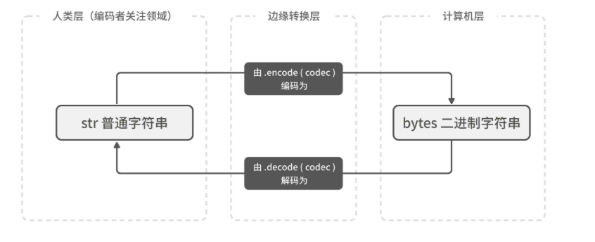

# Python note

## 查看版本

```shell
## 新的 liunx 中默认没有python，需要使用python3
python3 -V

python -V 
## 或者
python --version
```

## 传统的创建虚拟环境的方式

### Create the virtual environment

```shell
python3 -m venv .venv
```

### Activate the environment

```shell
source .venv/bin/activate
```

## 使用uv创建虚拟环境

### 安装uv

```shell
# 官方推荐的安装方式 (Linux/macOS)
curl -LsSf https://astral.sh/uv/install.sh | sh

# 验证安装
uv --version
```

### 安装python

```shell
# 查看有哪些版本
uv python list

# 安装特定版本
uv python install 3.12

```

### 创建虚拟环境

```shell

# 指定项目使用该版本
uv venv --python 3.12
```

## 编写代码的工具

### 交互式环境

输入命令`python`然后回车就可以进入到Python的交互式环境中。

如果希望退出交互式环境，可以在交互式环境中输入`quit()`

### 更好的交互式环境 - IPython

Python的包管理工具`pip`来安装IPython，如下所示。

```shell
pip install ipython
```

> **温馨提示**：在使用上面的命令安装IPython之前，可以先通过`pip config set global.index-url https://pypi.doubanio.com/simple`命令将`pip`的下载源修改为国内的豆瓣网，否则下载安装的过程可能会非常的缓慢。
> 如果想恢复到默认设置，可以`pip config unset global.index-url`, 或者`pip config edit --editor vim`打开配置文件，进行注释

### 集成开发环境 - PyCharm

## 运行程序

```shell
python hello.py
```

## 注释代码

Python中有两种形式的注释：

1. 单行注释：以`#`和空格开头，可以注释掉从`#`开始后面一整行的内容。
2. 多行注释：三个引号开头，三个引号结尾，通常用于添加多行说明性内容。

在一个方法中，第一个非空行的注释会被解释为文档字符串（docstring）。可以用`help()`函数或者`__doc__`属性来查看文档字符串。它的标准格式如下：

```python
def add(a, b):
    """
    这是一个加法函数

    Args:
        a: 第一个加数
        b: 第二个加数

    Returns:
        两个数的和
    """
    return a + b
```

## 基础数据类型

- 整型（`int`）：Python中可以处理任意大小的整数，而且支持二进制（如`0b100`，换算成十进制是4）、八进制（如`0o100`，换算成十进制是64）、十进制（`100`）和十六进制（`0x100`，换算成十进制是256）的表示法。

  > 定义数值字面量时，如果数字特别长，可以通过插入 _ 分隔符来让它变得更易读
  >
  > 以"千"为单位分隔数字
  >
  > i = 1_000_000

- 浮点型（`float`）：浮点数也就是小数，之所以称为浮点数，是因为按照科学记数法表示时，一个浮点数的小数点位置是可变的，浮点数除了数学写法（如`123.456`）之外还支持科学计数法（如`1.23456e2`）。

  > print(0.1 + 0.2) # 会丢失精度
  >
  > 不损失任何精度 有decimal.Decimal
  >
  > ```python
  > # 必须使用字符串来表示数字。如果你提供的是普通浮点数而非字符串，在转换为 Decimal 对象前就会损失精度
  > Decimal('0.1') + Decimal('0.2')
  > ```

- 布尔型（`bool`）：布尔值只有`True`、`False`两种值，要么是`True`，要么是`False`。

> 可以使用`type`函数对变量的类型进行检查

不同类型的变量可以相互转换，这一点可以通过Python的内置函数来实现。

- `int()`：将一个数值或字符串转换成整数，可以指定进制。
- `float()`：将一个字符串转换成浮点数。
- `str()`：将指定的对象转换成字符串形式，可以指定编码。
- `chr()`：将整数转换成该编码对应的字符串（一个字符）。
- `ord()`：将字符串（一个字符）转换成对应的编码（整数）

数字的无穷大

```python

# 无穷大，无穷小 float("inf") 和 float("-inf")。这两个值分别对应数学世界里的正负无穷大。
# 当它们和任意数值做比较时，满足这样的规律：float("-inf") < 任意数值 < float("inf")。
print(float("-inf") < 9 < float("inf"))
 
def sort_users_inf(users):

    def key_func(username):
        age = users[username]
        # 当年龄为空时，返回正无穷大作为 key，因此就会被排到最后
        return age if age is not None else float('inf')

    return sorted(users.keys(), key=key_func)

users = {"tom": 19, "jenny": 13, "jack": None, "andrew": 43}
print(sort_users_inf(users))
 
```


## 变量命名

规则又分为必须遵守的硬性规则和建议遵守的非硬性规则。

- 硬性规则：
  - 规则1：变量名由**字母**、数字和**下划线**构成，**数字不能开头**。需要说明的是，这里说的字母指的是Unicode字符，Unicode称为万国码，囊括了世界上大部分的文字系统，这也就意味着中文、日文、希腊字母等都可以作为变量名中的字符，但是像`!`、`@`、`#`这些特殊字符是不能出现在变量名中的，而且我们强烈建议大家**尽可能使用英文字母**。
  - 规则2：**大小写敏感**，简单的说就是大写的`A`和小写的`a`是两个不同的变量。
  - 规则3：变量名**不要跟Python语言的关键字**（有特殊含义的单词，后面会讲到）和**保留字**（如已有的函数、模块等的名字）**发生重名的冲突**。
- 非硬性规则：
  - 规则1：变量名通常使用小写英文字母，多个单词用下划线进行连接。
  - 规则2：受保护的变量用单个下划线开头。
  - 规则3：私有的变量用两个下划线开头。

规则2和规则3大家暂时不用理解，后面自然会明白的。当然，作为一个专业的程序员，给变量（事实上应该是所有的标识符）命名时做到**见名知意**也非常重要。

## 运算符

| 运算符                                          | 描述                           |
| ----------------------------------------------- | ------------------------------ |
| `[]` `[:]`                                      | 下标，切片                     |
| `**`                                            | 指数                           |
| `~` `+` `-`                                     | 按位取反, 正负号               |
| `*` `/` `%` `//`                                | 乘，除，模，整除               |
| `+` `-`                                         | 加，减                         |
| `>>` `<<`                                       | 右移，左移                     |
| `&`                                             | 按位与                         |
| `^``|`                                          | 按位异或，按位或               |
| `<=` `<` `>` `>=`                               | 小于等于，小于，大于，大于等于 |
| `==` `!=`                                       | 等于，不等于                   |
| `is` `is not`                                   | 身份运算符                     |
| `in` `not in`                                   | 成员运算符                     |
| `not` `or` `and`                                | 逻辑运算符                     |
| `=` `+=` `-=` `*=` `/=` `%=` `//=` `**=` `&=` ` | =` `^=` `>>=` `<<=`            |

## 代码块

不同于C++、Java等编程语言，Python中没有用花括号来构造代码块而是**使用了缩进的方式来表示代码的层次结构**，如果`if`条件成立的情况下需要执行多条语句，只要保持多条语句具有相同的缩进就可以了。换句话说**连续的代码如果又保持了相同的缩进那么它们属于同一个代码块**，相当于是一个执行的整体。**缩进**可以使用任意数量的空格，但**通常使用4个空格**，强烈建议大家**不要使用制表键来缩进代码**，如果你已经习惯了这么做，可以**设置代码编辑工具将1个制表键自动变成4个空格**，很多的代码编辑工具都支持这项功能。

## 分支结构

分支，可以使用`if...elif...else...`结构或者嵌套的`if...else...`结构，下面的代码演示了如何

```python
x = float(input('x = '))
if x > 1:
    y = 3 * x - 5
elif x >= -1:
    y = x + 2
else:
    y = 5 * x + 3
print(f'f({x}) = {y}')
```

> “**Flat is better than nested**”，提倡代码“扁平化”

## 循环结构

> **如果知道循环的次数，我们通常使用**`for`**循环**；如果**循环次数不能确定，可以用**`while`**循环**。在循环中还**可以使用**`break`**来提前结束循环**。

### for-in循环

如果明确的知道循环执行的次数，我们推荐使用`for-in`循环

```python
total = 0
for x in range(2, 101, 2):
    total += x
print(total)
```

> - `range(101)`：可以用来产生0到100范围的整数，需要注意的是取不到101。
> - `range(1, 101)`：可以用来产生1到100范围的整数，相当于前面是闭区间后面是开区间。
> - `range(1, 101, 2)`：可以用来产生1到100的奇数，其中2是步长，即每次递增的值。
> - `range(100, 0, -2)`：可以用来产生100到1的偶数，其中-2是步长，即每次递减的值。

### while循环

如果要构造不知道具体循环次数的循环结构，我们推荐使用`while`循环

```python
import random

targetNumber = random.randint(1, 100)

while True:
    guess = int(input("请输入1-100的数字: "))
    if guess < targetNumber:
        print("小了")
    elif guess > targetNumber:
        print("大了")
    else:
        print("你猜对了")
        break
```

## 容器类型

### 列表

内置的`list`函数【构造器】

```python
my_list = list('hello list')
print(my_list) ## 因为字符串是可迭代的，所以构造了单个字符的list

my_list_num = list(range(10))
print(my_list_num)
```

> 列表是一种**可变数据类型**，也就是说列表可以添加元素、删除元素、更新元素，这一点跟我们上一课讲到的字符串有着鲜明的差别。字符串是一种**不可变数据类型**，也就是说对字符串做拼接、重复、转换大小写、修剪空格等操作的时候会产生新的字符串，原来的字符串并没有发生任何改变。

列表的运算例子:

```python
items1 = [35, 12, 99, 68, 55, 87]
items2 = [45, 8, 29]

# 列表的拼接
items3 = items1 + items2
print(items3)    # [35, 12, 99, 68, 55, 87, 45, 8, 29]

# 列表的重复
items4 = ['hello'] * 3
print(items4)    # ['hello', 'hello', 'hello']

# 列表的成员运算
print(100 in items3)        # False
print('hello' in items4)    # True

# 获取列表的长度(元素个数)
size = len(items3)
print(size)                 # 9

# 列表的索引
print(items3[0], items3[-size])        # 35 35
items3[-1] = 100
print(items3[size - 1], items3[-1])    # 100 100

# 列表的切片
#  origin list : [35, 12, 99, 68, 55, 87,45, 8, 29,100]
print(items3[:5])          # [35, 12, 99, 68, 55]
print(items3[4:])          # [55, 87, 45, 8,29, 100]
print(items3[-5:-7:-1])    # [87, 55]
print(items3[::-2])        # [100, 45, 55, 99, 35]

# 列表的比较运算
items5 = [1, 2, 3, 4]
items6 = list(range(1, 5))
# 两个列表比较相等性比的是对应索引位置上的元素是否相等
print(items5 == items6)    # True
items7 = [3, 2, 1]
# 两个列表比较大小比的是对应索引位置上的元素的大小
print(items5 <= items7)    # True
```

> 对列表做索引操作一样要注意索引越界的问题，对于有`N`个元素的列表，正向索引的范围是`0`到`N-1`，负向索引的范围是`-1`到`-N`，如果超出这个范围，将引发`IndexError`异常，错误信息为：`list index out of range`。

列表的方法:

```python
items = ['Python', 'Java', 'Go', 'Kotlin']

# 使用append方法在列表尾部添加元素
items.append('Swift')
print(items)    # ['Python', 'Java', 'Go', 'Kotlin', 'Swift']
# 使用insert方法在列表指定索引位置插入元素
items.insert(2, 'SQL')
print(items)    # ['Python', 'Java', 'SQL', 'Go', 'Kotlin', 'Swift']

# 删除指定的元素
items.remove('Java')
print(items)    # ['Python', 'SQL', 'Go', 'Kotlin', 'Swift']
# 删除指定索引位置的元素
items.pop(0)
items.pop(len(items) - 1)
print(items)    # ['SQL', 'Go', 'Kotlin']

# 清空列表中的元素
items.clear()
print(items)    # []
```

列表的生成式:

```python
# 创建一个由1到9的数字构成的列表
items1 = [x for x in range(1, 10)]
print(items1)    # [1, 2, 3, 4, 5, 6, 7, 8, 9]

# 创建一个由'hello world'中除空格和元音字母外的字符构成的列表
items2 = [x for x in 'hello world' if x not in ' aeiou']
print(items2)    # ['h', 'l', 'l', 'w', 'r', 'l', 'd']

# 创建一个由个两个字符串中字符的笛卡尔积构成的列表
items3 = [x + y for x in 'ABC' for y in '12']
print(items3)    # ['A1', 'A2', 'B1', 'B2', 'C1', 'C2']
```

嵌套的列表:

例如：我们想保存5个学生3门课程的成绩，可以定义一个保存5个元素的列表保存5个学生的信息，而每个列表元素又是3个元素构成的列表，分别代表3门课程的成绩。

```python
scores = [[0] * 3] * 5
print(scores)    # [[0, 0, 0], [0, 0, 0], [0, 0, 0], [0, 0, 0], [0, 0, 0]]
# 嵌套的列表需要多次索引操作才能获取元素
scores[0][0] = 95
print(scores)
# [[95, 0, 0], [95, 0, 0], [95, 0, 0], [95, 0, 0], [95, 0, 0]]
```

> 看上去我们好像创建了一个`5 * 3`的嵌套列表，但实际上当我们录入`scores[0][0] = 95`，你就会发现问题来了，我们看看下面代码的输出。

这样就没有问题：

```python
scores = [[0] * 3 for _ in range(5)]
scores[0][0] = 95
print(scores)
# [[95, 0, 0], [0, 0, 0], [0, 0, 0], [0, 0, 0], [0, 0, 0]]
```

### 元组

元组和列表的不同之处在于，元组是不可变类型，这就意味着元组类型的变量一旦定义，其中的元素不能再添加或删除，而且元素的值也不能进行修改。一个元组中如果有两个元素，我们就称之为二元组；一个元组中如果五个元素，我们就称之为五元组。需要提醒大家注意的是，`()`表示空元组，但是如果元组中只有一个元素，需要加上一个逗号，否则`()`就不是代表元组的字面量语法，而是改变运算优先级的圆括号，所以`('hello', )`和`(100, )`才是一元组，而`('hello')`和`(100)`只是字符串和整数。

```python
# 空元组
a = ()
print(type(a))    # <class 'tuple'>
# 不是元组
b = ('hello')
print(type(b))    # <class 'str'>
c = (100)
print(type(c))    # <class 'int'>
# 一元组
d = ('hello', )
print(type(d))    # <class 'tuple'>
e = (100, )
print(type(e))    # <class 'tuple'>
# 接收iterable 对象
f = tuple('hello')
print(f)
```

#### 打包和解包

在 Python 的解包（Unpacking）上下文中，“贪婪地”（greedily）表示 **尽可能多地匹配和捕获剩余的元素**。

具体来说，当解释器处理带有星号`*`的解包表达式时，它的工作逻辑是：

1. **先满足确定的**：先给没有星号的变量分配值（以此确定开头和结尾的锚点）。
2. **统吃剩下的**：星号表达式负责把**剩下所有**未被分配的元素全部“吞”进去，打包成一个列表。

当我们把多个用逗号分隔的值赋给一个变量时，多个值会打包成一个元组类型；当我们把一个元组赋值给多个变量时，元组会解包成多个值然后分别赋给对应的变量。 如下面的代码所示。

> 举例说明
> 假设有一个包含 5 个元素的列表：
>
> ```python
> data = [0, 1, 2, 3, 4]
> ```
>
> ```python
> head, *body, tail = data
> ```
>
> 1. head 拿走第 1 个元素 (0)
> 2. tail 拿走最后 1 个元素 (4)
> 3. *body 贪婪地捕获剩下所有中间的元素 ([1, 2, 3])

```python
# 打包
a = 1, 10, 100
print(type(a), a)    # <class 'tuple'> (1, 10, 100)
# 解包
i, j, k = a
print(i, j, k)       # 1 10 100
```

有一种解决变量个数少于元素的个数方法，就是使用星号表达式。用星号表达式修饰的变量会变成一个列表，列表中有0个或多个元素。还有在解包语法中，星号表达式只能出现一次。

```python
a = 1, 10, 100, 1000
i, j, *k = a
print(i, j, k)          # 1 10 [100, 1000]
i, *j, k = a
print(i, j, k)          # 1 [10, 100] 1000
*i, j, k = a
print(i, j, k)          # [1, 10] 100 1000
*i, j = a
print(i, j)             # [1, 10, 100] 1000
i, *j = a
print(i, j)             # 1 [10, 100, 1000]
i, j, k, *l = a
print(i, j, k, l)       # 1 10 100 [1000]
i, j, k, l, *m = a
print(i, j, k, l, m)    # 1 10 100 1000 []
```

> 解包语法对所有的序列都成立，这就意味着对列表以及我们之前讲到的`range`函数返回的范围序列都可以使用解包语法。
>
> **交换变量的值**
>
> ```python
> a, b = b, a
> ```
>
> ```python
> a, b, c = b, c, a
> ```
>
> 需要说明的是，上面并没有用到打包和解包语法，Python的字节码指令中有`ROT_TWO`和`ROT_THREE`这样的指令可以实现这个操作，效率是非常高的。但是如果有多于三个变量的值要依次互换，这个时候没有直接可用的字节码指令，执行的原理就是我们上面讲解的打包和解包操作。

列表与元组互换

```python
# 将元组转换成列表
info = ('骆昊', 175, True, '四川成都')
print(list(info))       # ['骆昊', 175, True, '四川成都']
# 将列表转换成元组
fruits = ['apple', 'banana', 'orange']
print(tuple(fruits))    # ('apple', 'banana', 'orange')
```

#### 单下划线变量名 _

假如你想在解包赋值时忽略某些变量，就可以使用 _ 作为变量名

```python
# 忽略展开时的第二个变量
author, _ = usernames

# 忽略第一个和最后一个变量之间的所有变量
username, *_, score = data
```

#### 具名元组（namedtuple)

### 字符串

```python
s1 = 'hello, world!'
s2 = "你好，世界！"
print(s1, s2)
# 以三个双引号或单引号开头的字符串可以折行
s3 = '''
hello, 
world!
'''
print(s3, end='')
```

> **提示**：`print`函数中的`end=''`表示输出后不换行，即将默认的结束符`\n`（换行符）更换为`''`（空字符）。

Python中的字符串可以`r`或`R`开头，这种字符串被称为原始字符串

```python
# 字符串s2中没有转义字符，每个字符都是原始含义
s2 = r'\time up \now'
print(s2)
```

还允许在`\`后面还可以跟一个`八进制`或者`十六进`制数来表示字符，例如`\141`和`\x61`都代表小写字母`a`。前者是八进制的表示法，后者是十六进制的表示法。另外一种表示字符的方式是在`\u`后面跟`Unicode字符`编码

#### 字符串比较

```python
s1 = 'hello world'
s2 = 'hello world'
s3 = s2
# 比较字符串的内容
print(s1 == s2, s2 == s3)    # True True
# 比较字符串的内存地址
print(s1 is s2, s2 is s3)    # False True
```

> 需要强调一下的是，字符串的比较运算比较的是字符串的内容，Python中还有一个`is`运算符（身份运算符），如果用`is`来比较两个字符串，它比较的是两个变量对应的字符串对象的内存地址

#### 索引和切片

```python
s = 'abc123456'

# i=2, j=5, k=1的正向切片操作
print(s[2:5])     # c12

# i=-7, j=-4, k=1的正向切片操作
print(s[-7:-4])   # c12

# i=2, j=9, k=1的正向切片操作
print(s[2:])      # c123456

# i=-7, j=9, k=1的正向切片操作
print(s[-7:])     # c123456

# i=2, j=9, k=2的正向切片操作
print(s[2::2])    # c246

# i=-7, j=9, k=2的正向切片操作
print(s[-7::2])   # c246

# i=0, j=9, k=2的正向切片操作
print(s[::2])     # ac246

# i=1, j=-1, k=2的正向切片操作
print(s[1:-1:2])  # b135

# i=7, j=1, k=-1的负向切片操作
print(s[7:1:-1])  # 54321c

# i=-2, j=-8, k=-1的负向切片操作
print(s[-2:-8:-1]) # 54321c

# i=7, j=-10, k=-1的负向切片操作
print(s[7::-1])  # 54321cba

# i=-1, j=1, k=-1的负向切片操作
print(s[:1:-1])  # 654321c

# i=0, j=9, k=1的正向切片
print(s[:])   # abc123456

# i=0, j=9, k=2的正向切片
print(s[::2])  # ac246

# i=-1, j=-10, k=-1的负向切片
print(s[::-1])   # 654321cba

# i=-1, j=-10, k=-2的负向切片
print(s[::-2])    # 642ca
```

#### 字符串对齐和填充

```python
s = 'hello, world'

# center方法以宽度20将字符串居中并在两侧填充*
print(s.center(20, '*'))  # ****hello, world****
# rjust方法以宽度20将字符串右对齐并在左侧填充空格
print(s.rjust(20))        # hello, world
# ljust方法以宽度20将字符串左对齐并在右侧填充~
print(s.ljust(20, '~'))   # hello, world~~~~~~~~
# 在字符串的左侧补零
print('33'.zfill(5))      # 00033
print('-33'.zfill(5))     # -0033
```

#### 字符串格式化

Python 提供了多种字符串格式化方法：

##### 1. f-string (推荐，Python 3.6+)

```python
name = 'Alice'
age = 25
height = 1.68

# 基本用法
print(f'My name is {name}, I am {age} years old')
# My name is Alice, I am 25 years old

# 表达式计算
print(f'{name} will be {age + 1} next year')
# Alice will be 26 next year

# 格式化数字：指定小数位数
print(f'Height: {height:.1f}m')  # Height: 1.7m

# 格式化数字：指定宽度和对齐
price = 49.5
print(f'Price: {price:>10.2f}')  # Price:      49.50
print(f'Price: {price:<10.2f}')  # Price: 49.50
print(f'Price: {price:^10.2f}')  # Price:   49.50

# 千分位分隔符
amount = 1234567.89
print(f'Amount: {amount:,.2f}')  # Amount: 1,234,567.89

# 百分比格式
ratio = 0.875
print(f'Success rate: {ratio:.1%}')  # Success rate: 87.5%

# 进制转换
num = 42
print(f'Binary: {num:b}')    # Binary: 101010
print(f'Octal: {num:o}')     # Octal: 52
print(f'Hex: {num:x}')       # Hex: 2a
print(f'Hex: {num:X}')       # Hex: 2A
```

##### 2. format() 方法

```python
name = 'Bob'
age = 30

# 位置参数
print('My name is {}, I am {} years old'.format(name, age))
# My name is Bob, I am 30 years old

# 索引参数
print('My name is {0}, I am {1} years old. {0} is my name'.format(name, age))
# My name is Bob, I am 30 years old. Bob is my name

# 关键字参数
print('My name is {n}, I am {a} years old'.format(n=name, a=age))
# My name is Bob, I am 30 years old

# 格式化数字
pi = 3.1415926
print('Pi: {:.2f}'.format(pi))  # Pi: 3.14
print('Pi: {:10.3f}'.format(pi))  # Pi:      3.142
```

##### 3. % 格式化（旧式，不推荐）

```python
name = 'Charlie'
age = 35

# 基本用法
print('My name is %s, I am %d years old' % (name, age))
# My name is Charlie, I am 35 years old

# 格式化浮点数
height = 1.75
print('Height: %.2f' % height)  # Height: 1.75
```

#### 修剪操作

```python
s = '   jackfrued@126.com  \t\r\n'
# strip方法获得字符串修剪左右两侧空格之后的字符串
print(s.strip())    # jackfrued@126.com
```

> `strip`方法还有`lstrip`和`rstrip`两个版本

#### 分隔字符串

```python
suits = 'spades diamonds clubs hearts'.split()
```

当split方法没有传入参数时，会把字符串空白字符(whitespace)分割成列表

1. 分隔符：任何空白字符，包括空格、制表符 (\t)、换行符 (\n)、回车符 (\r) 等。
2. 合并空白：连续的多个空白字符会被视为一个分隔符（这与 Java 的 split(" ") 不同，后者会产生空字符串）。
3. 去除首尾：如果字符串首尾有空白，结果列表中不会包含空字符串。

#### 分隔符拼接多个字符串

比较常见的 Python 式做法是：首先创建一个空列表，然后把需要拼接的字符串都放进列表，最后调用 str.join 来获得大字符串

```python
words = ['Numbers(1-10):']
for i in range(10):
    words.append(f'Value: {i + 1}')
print('\n'.join(words))
```

> .join里的参数是可迭代对象

#### 不常用但特别好用的字符串方法

```python
def extract_value_v2(s):
    # 当 s 包含分隔符 : 时，元组最后一个成员刚好是 value
    # 若是没有分隔符，最后一个成员默认是空字符串 ''
    # 它会找到第一个分隔符，然后返回一个元组，元组的三个成员分别是分隔符前的字符串、分隔符本身和分隔符后的字符串
    return s.partition(':')[-1]

s = '明明是中文,却使用了英文标点.'
# 创建替换规则表：',' -> '，', '.' -> '。'
table = s.maketrans(',.', '，。')
s.translate(table)
```

#### “字符串”和“字节串”



#### 单行文本写成多行

```python
## 这种方式的字符串是单行的
inline_text_of_multiple_lines_style = ("line1"
"line2"
"line3")
print(inline_text_of_multiple_lines_style)

## 这种方式的字符串是多行的
multiple_lines2 = """
line1
line2
line3
"""
print(multiple_lines2)
```


### 集合

创建集合可以使用`{}`字面量语法，也可以使用内置函数`set`【构造器】来创建一个集合

```python
# 创建集合的字面量语法(重复元素不会出现在集合中)
set1 = {1, 2, 3, 3, 3, 2}
print(set1)         # {1, 2, 3}
print(len(set1))    # 3

# 创建集合的构造器语法
set2 = set('hello')
print(set2)         # {'h', 'l', 'o', 'e'}

# 创建集合的生成式语法(将列表生成式的[]换成{})
set4 = {num for num in range(1, 20) if num % 3 == 0 or num % 5 == 0}
print(set4)         # {3, 5, 6, 9, 10, 12, 15, 18}
```

### 字典

通过字面量或者dict来创建

```python
person = {
    'name': '王大锤', 'age': 55, 'weight': 60, 'office': '科华北路62号',
    'home': '中同仁路8号', 'tel': '13122334455', 'econtact': '13800998877'
}
print(person)

# dict函数(构造器)中的每一组参数就是字典中的一组键值对
person = dict(name='王大锤', age=55, weight=60, home='中同仁路8号')
print(person)    # {'name': '王大锤', 'age': 55, 'weight': 60, 'home': '中同仁路8号'}
```

### 枚举

```python
# int必须在最前面
class UserType(int, Enum):
    VIP = 3
    BANNED = 13

print(UserType.VIP.value)
# 可以直接当数字使用
print( 2 + UserType.VIP)
print(UserType.BANNED)

```


## 函数和模块

一部分内置函数

| 函数    | 说明                                                         |
| ------- | ------------------------------------------------------------ |
| `abs`   | 返回一个数的绝对值，例如：`abs(-1.3)`会返回`1.3`。           |
| `bin`   | 把一个整数转换成以`'0b'`开头的二进制字符串，例如：`bin(123)`会返回`'0b1111011'`。 |
| `chr`   | 将Unicode编码转换成对应的字符，例如：`chr(8364)`会返回`'€'`。 |
| `hex`   | 将一个整数转换成以`'0x'`开头的十六进制字符串，例如：`hex(123)`会返回`'0x7b'`。 |
| `input` | 从输入中读取一行，返回读到的字符串。                         |
| `len`   | 获取字符串、列表等的长度。                                   |
| `max`   | 返回多个参数或一个可迭代对象中的最大值，例如：`max(12, 95, 37)`会返回`95`。 |
| `min`   | 返回多个参数或一个可迭代对象中的最小值，例如：`min(12, 95, 37)`会返回`12`。 |
| `oct`   | 把一个整数转换成以`'0o'`开头的八进制字符串，例如：`oct(123)`会返回`'0o173'`。 |
| `open`  | 打开一个文件并返回文件对象。                                 |
| `ord`   | 将字符转换成对应的Unicode编码，例如：`ord('€')`会返回`8364`。 |
| `pow`   | 求幂运算，例如：`pow(2, 3)`会返回`8`；`pow(2, 0.5)`会返回`1.4142135623730951`。 |
| `print` | 打印输出。                                                   |
| `range` | 构造一个范围序列，例如：`range(100)`会产生`0`到`99`的整数序列。 |
| `round` | 按照指定的精度对数值进行四舍五入，例如：`round(1.23456, 4)`会返回`1.2346`。 |
| `sum`   | 对一个序列中的项从左到右进行求和运算，例如：`sum(range(1, 101))`会返回`5050`。 |
| `type`  | 返回对象的类型，例如：`type(10)`会返回`int`；而` type('hello')`会返回`str`。 |

在调用函数传入参数时，我们可以指定参数名，也可以不指定参数名。在没有特殊处理的情况下，函数的参数都是**位置参数**

```python
def is_triangle(a, b, c):
    print(f'a = {a}, b = {b}, c = {c}')
    return a + b > c and b + c > a and a + c > b


# 调用函数传入参数不指定参数名按位置对号入座
print(is_triangle(1, 2, 3))
# 调用函数通过“参数名=参数值”的形式按顺序传入参数
print(is_triangle(a=1, b=2, c=3))
# 调用函数通过“参数名=参数值”的形式不按顺序传入参数
print(is_triangle(c=3, a=1, b=2))
```

调用函数时，如果希望函数的调用者必须以`参数名=参数值`的方式传参，可以用**命名关键字参数**（keyword-only argument）取代**位置参数**。所谓命名关键字参数，是在函数的参数列表中，写在`*`之后的参数，代码如下所示。

```python
def is_triangle(*, a, b, c):
    print(f'a = {a}, b = {b}, c = {c}')
    return a + b > c and b + c > a and a + c > b


# TypeError: is_triangle() takes 0 positional arguments but 3 were given
# print(is_triangle(3, 4, 5))
# 传参时必须使用“参数名=参数值”的方式，位置不重要
print(is_triangle(a=3, b=4, c=5))
print(is_triangle(c=5, b=4, a=3))
```

> 上面的`is_triangle`函数，参数列表中的`*`是一个分隔符，`*`前面的参数都是位置参数，而`*`后面的参数就是命名关键字参数。
设计函数时，如果既不知道调用者会传入的参数个数，也不知道调用者会不会指定参数名，那么同时使用**可变参数**和**关键字参数**。关键字参数会将传入的带参数名的参数组装成一个字典，参数名就是字典中键值对的键，而参数值就是字典中键值对的值，代码如下所示。

```python
def calc(*args, **kwargs):
    result = 0
    for arg in args:
        if type(arg) in (int, float):
            result += arg
    for value in kwargs.values():
        if type(value) in (int, float):
            result += value
    return result


print(calc())                  # 0
print(calc(1, 2, 3))           # 6
print(calc(a=1, b=2, c=3))     # 6
print(calc(1, 2, c=3, d=4))    # 10
```

### 高阶函数

函数的参数和返回值可以是任意类型的对象，这就意味着**函数本身也可以作为函数的参数或返回值**，这就是所谓的**高阶函数**。

### 装饰器

装饰器是Python中**用一个函数装饰另外一个函数或类并为其提供额外功能**的语法现象。装饰器本身是一个函数，它的参数是被装饰的函数或类，它的返回值是一个带有装饰功能的函数

**原始方法**：

```python
import random
import time


def download(filename):
    print(f'开始下载{filename}.')
    time.sleep(random.randint(2, 6))
    print(f'{filename}下载完成.')

    
def upload(filename):
    print(f'开始上传{filename}.')
    time.sleep(random.randint(4, 8))
    print(f'{filename}上传完成.')

    
download('MySQL从删库到跑路.avi')
upload('Python从入门到住院.pdf')
```

**定义装饰器函数**：

```python
import time


# 定义装饰器函数，它的参数是被装饰的函数或类
def record_time(func):
    
    # 定义一个带装饰功能（记录被装饰函数的执行时间）的函数
    # 因为不知道被装饰的函数有怎样的参数所以使用*args和**kwargs接收所有参数
    # 在Python中函数可以嵌套的定义（函数中可以再定义函数）
    def wrapper(*args, **kwargs):
        # 在执行被装饰的函数之前记录开始时间
        start = time.time()
        # 执行被装饰的函数并获取返回值
        result = func(*args, **kwargs)
        # 在执行被装饰的函数之后记录结束时间  
        end = time.time()
        # 计算和显示被装饰函数的执行时间
        print(f'{func.__name__}执行时间: {end - start:.3f}秒')
        # 返回被装饰函数的返回值（装饰器通常不会改变被装饰函数的执行结果）
        return result
    
    # 返回带装饰功能的wrapper函数
    return wrapper
```

**调用**

```python
download = record_time(download)
upload = record_time(upload)
download('MySQL从删库到跑路.avi')
upload('Python从入门到住院.pdf')
```

**语法糖**

可以用`@装饰器函数`将装饰器函数直接放在被装饰的函数上，效果跟上面的代码相同，下面是完整的代码

```python
import random
import time


def record_time(func):

    def wrapper(*args, **kwargs):
        start = time.time()
        result = func(*args, **kwargs)
        end = time.time()
        print(f'{func.__name__}执行时间: {end - start:.3f}秒')
        return result

    return wrapper


@record_time
def download(filename):
    print(f'开始下载{filename}.')
    time.sleep(random.randint(2, 6))
    print(f'{filename}下载完成.')


@record_time
def upload(filename):
    print(f'开始上传{filename}.')
    time.sleep(random.randint(4, 8))
    print(f'{filename}上传完成.')


download('MySQL从删库到跑路.avi')
upload('Python从入门到住院.pdf')
```

## 常用的内置函数、类

### enumerate

```python
names = ['foo', 'bar']
## start用于指定循环下标的初始值（默认为 0）
for index, s in enumerate(names, start=10):
    print(index, s)
 
```

###  列表推导式 (List Comprehension)

```python
print('---------------- list comprehension ----------------')
numbers = [1, 2, 3, 4, 5]
# 会直接加载到内存中
num_result = [x * 3 for x in numbers if x % 2 == 0]
print(num_result)
```

### 生成器表达式 (Generator Expression)

```python
print('---------------- generation expression ----------------')
# 不会直接加载到内存中，而是生成一个生成器对象
g_express = (x * 3 for x in numbers if x % 2 == 0)
print(g_express)
for index, x in enumerate(g_express):
    print(f'第{index}个元素: {x}')
```


## 面向对象

在Python中，可以通过给对象属性名添加前缀下划线的方式来说明属性的访问可见性，例如，可以用`__name`表示一个私有属性，`_name`表示一个受保护属性，Python并没有从语法上严格保证私有属性的私密性，它只是给私有的属性和方法换了一个名字来阻挠对它们的访问，事实上如果你知道更换名字的规则仍然可以访问到它们，我们可以对上面的代码稍作修改就可以访问到私有的属性。

```python
class Student:

    def __init__(self, name, age):
        self.__name = name
        self.__age = age

    def study(self, course_name):
        print(f'{self.__name}正在学习{course_name}.')


stu = Student('王大锤', 20)
stu.study('Python程序设计')
print(stu.__name)
```

> 这样访问`stu.__name`会报错。但是`print(stu._Student__name, stu._Student__age)` 这样访问就没有问题

两个下划线`__`（读作“dunder”）开头和结尾的方法通常都是有特殊用途和意义的方法，我们一般称之为**魔术方法**或**魔法方法**。

`__init__` 初始化方法，在创建对象后自动调用。

`__repr__` 相当于java中重写类的toString方法

`@staticmethod` 来定义静态方法

### `__len__` 和 `__getitem__`

实现 `__len__` 和 `__getitem__` 的对象可以使用 len() 和 []

```python
class FrenchDeck:
    ranks = [str(n) for n in range(2, 11)] + list('JQKA')
    suits = 'spades diamonds clubs hearts'.split()

    def __init__(self):
        self._cards = [NamedCard(rank, suit) for suit in self.suits
                                        for rank in self.ranks]

    def __len__(self):
        return len(self._cards)

    def __getitem__(self, position):
        return self._cards[position]

frenchDeck = FrenchDeck()
print(frenchDeck[0])
print(len(frenchDeck))
print(frenchDeck[-1])
print(choice(frenchDeck))
```

### None 类型

`None` 是 Python 中**一等公民对象**。它是 `NoneType` 类的**唯一实例 (Singleton)**

```python
x = None

# ✅ 正确 (Pythonic): 检查身份
if x is None:
    print("x is None")

if x is not None:
    print("x has a value")

# ❌ 不推荐: 检查值 (虽然通常也能工作，但在工程上是不严谨的)
if x == None:
    pass
```

`None` 做函数参数的默认值的注意的点

```python
# 没有传入items，会使用默认值，多次调用时，会使用同一个默认值
def add_item(item, items=[]):
    items.append(item)
    return items

print(add_item(1))
print(add_item(2))

# 没有传入items，会使用默认值，多次调用时，每次都会创建一个新列表
def add_item(item, items=None):
    if items is None:
        items = []  # 每次调用时创建一个新列表
    items.append(item)
    return items

print(add_item(1))
print(add_item(2))
```


## 包管理工具pip的使用

默认情况下，pip会访问`https://pypi.org/simple/`来获得三方库相关的数据

可以通过`pip search`命令根据名字查找需要的三方库，可以通过`pip list`命令来查看已经安装过的三方库。如果想更新某个三方库，可以使用`pip install -U`或`pip install --upgrade`；如果要删除某个三方库，可以使用`pip uninstall`命令。

查看已经安装的三方库：`pip list`

更新: `pip install -U ujson`

删除：`pip uninstall -y ujson`

## 多线程

所谓`守护线程`就是在主线程结束的时候，不值得再保留的执行线程。这里的不值得保留指的是守护线程会在其他非守护线程全部运行结束之后被销毁，它守护的是当前进程内所有的非守护线程。简单的说，守护线程会跟随主线程一起挂掉，而主线程的生命周期就是一个进程的生命周期。

## 阻塞，非阻塞，同步，异步

简单的总结一下，同步与异步的关注点是**消息通信机制**，最终表现出来的是“有序”和“无序”的区别；阻塞和非阻塞的关注点是**程序在等待消息时状态**，最终表现出来的是程序在等待时能不能做点别的

## 生成器和协程

Python中的yield是一个关键字，用于将函数转换为生成器。生成器是一种特殊类型的函数，可以像迭代器一样使用。可以使用内置函数`next`从生成器对象中获取斐波那契数列的值，也可以通过`for-in`循环对生成器能够提供的值进行遍历

```python
def my_generator():
    print('生成器被执行!') 
    yield 1
    print('生成器被继续执行!')
    yield 2
    print('生成器结束!')

gen = my_generator()
print(next(gen))
print(next(gen))
```

```python
def my_generator():
    yield 1
    yield 2
    yield 3
for number in my_generator():
    print(number)
```

